= Administrator’s Guide 1.9
:icons: font
:stem:
:toc: left
:toclevels: 4
:url-docs: https://asciidoctor.org/docs
:url-gem: https://rubygems.org/gems/asciidoctor

== Open Hospital

== 1 .Abstract

This application is the first of a set of software products that ISFfootnote:[Informatici Senza Frontiere = Computer scientists without frontiers] has developed to support the management and the activities of the St. Luke Hospital in Angal (Uganda). After that mission, the St. Luke Hospital has become only the first one of a long list of hospitals that found this software useful.

All the work was realized as an open-sourcefootnote:[Open-source = software for which the original *source code* is made available to anyone free of charge.] project using only open-source development software.

This application software consists of the following parts:

* Pharmacy management
* Laboratory management
* OPD management
* Patient admission and discharge management
* Pregnancy management
* Malnutrition control management
* Vaccines database
* Patient billing support
* Therapy management
* Internal communication
* Statistics and printing

This document describes how to install the application and how to configure it in your environment, enabling and disabling functionalities as well as manage users.

The reader will not find in this manual the information he needs for the use of the application software; to have such information you should consult our _User’s Guide_, supplied with the application software.

== 2. Introduction

The aim of this program is to manage, in the simplest manner, the hospital administrative operations like registering patients and laboratory analysis, and to produce statistics for the health ministry. In the following chapters the users will find all the information they need in order to use properly the program.

== 3. Installation

=== 3.1 OpenHospital

OpenHospital is a stand-alone Java software that does not require installation. The .zip file can be copied and moved everywhere in your system, whether it is Windows or Linux.

It acts like a client application. The server part is carried out by the DBMS (Database Management System) that is, from its first version, the free and open-source MySQL.

The real part of the installation it concerns the JRE installation, the MySQL Server and the creation of the DB, which is done through the execution of a script in the folder mysql/ within the .zip file folders.

The classic installation schema in a regular wired LAN network is shown in the follow figure:

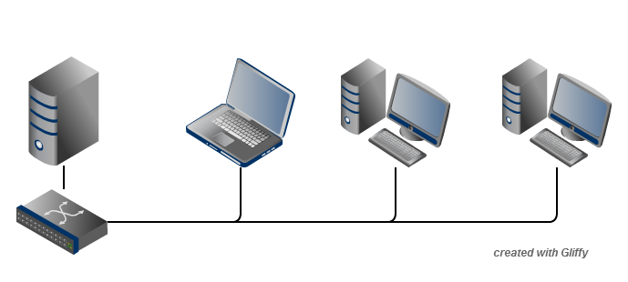

The Administrator/Installer tasks are hereby listed:

* Install the Java Runtime Environment 1.6 or higher (1.6 is recommended for fully compliance, and it’s the only one that supports high dpi monitors)
* Install the MySQL server on a computer that will act as the OH “server” part
* Copy the OpenHospital application on every client (it may be used on the server too)
* Configure each OpenHospital copy to point the server (using the hostname or the IP address)

For Java Runtime Environment installation refer to next chapter link:#3-1-1-java-runtime-environment[Java Runtime Environment] and to online documentation.

For MySQL installation and DB creation refer to chapter link:#3-1-2-mysql-server-and-openhospital-db[MySQL Server and OH DB] and to online documentation.

For OpenHospital installation on every client, as told, is enough to copy and extract the zip file.

For OpenHospital configuration refer to chapter link:#5-configuration-files[Configuration files].

==== 3.1.1 Java Runtime Environment

Depending on the operating system you have, there are different ways to install a Java Virtual Machine and the Java Runtime Environment.

For instance, on a Microsoft Windows® system you have to download and execute a setup file, while in Linux based systems you have to type only one command in a terminal.

*_NB:_* _OpenHospital requires a JRE 1.6 or higher to work properly. Anyway, at the time of writing this document, *only JRE 1.6 32bit* has been tested and it is fully compliant with all OpenHospital features, especially the ones hardware related (such as Webcam and SMS)._

==== 3.1.2 MySQL Server and OpenHospital DB

Depending on the operating system you have, there are several software to download to install and manage a MySQL server. In most cases it will consist to download a standard installation file of the software, with some aspects to pay attention during the installation process.

For instance, on a Microsoft Windows® system you will have MySQL Workbench® as a client, while in Linux based systems you may have MySQL Administrator and MySQL Query Browser to perform the same tasks or still MySQL Workbench on new distros.

Anyway, the best approach for installation is to use the command-line mysql client which come up with essentially the same commands and syntax for every platform.

===== 3.1.2.1 MySQL Server installation

For the download and installation of a MySQL Server on your server machine we invite you to refer to latest online documentation at the moment of reading this document.

Anyway, the main aspects the Administrator have to pay attention are:

* *on a Linux machine*: during the installation it will asked for a “root” password; very important to choose it carefully and to keep it safely in an installation document. If the password is not asked during installation an empty password will be automatically set for the root user.
* *on a Windows machine*: during the installation it will asked for several configuration options; the best configuration will be (it could differ a bit):

* *Custom Installation*
* Install all components except Developer ones
* Select *Detailed Configuration*
* Select *Server Machine*
* Select *Multifunctional Database*
* Set a minimum of concurrent connection as the number of clients multiplied by two
* Select *Enable TCP/IP Networking* and write down the *Port Number* in an installation document
* Select UTF8 as default charset for *Best Support For Multilingualism*
* Select *Install As Window Service*
* Select *Include Bin Directory In Windows PATH*
* Select *Modify Security Settings*, choose the *root password* and write it down in an installation document

Once the installation has been completed, we are ready for the OpenHospital DB creation. To check if the server is active and running, we can open a terminal window (command prompt) and type the following command:

*# mysql –u root -p*

*Enter password: *****

The terminal should reply with the MySQL client command line prompt:

*mysql>*

that means that we successfully connected to MySQL Server just installed with the root user and it is waiting for our commands.

image:extracted-media/media/image9.png[image,width=645,height=113]

====== 3.1.2.1.1 Networking

_On Linux systems, MySQL server must be configured to be enabled in networking; this can be achieved by changing its config file “my.cnf” and commenting out this parameter:_

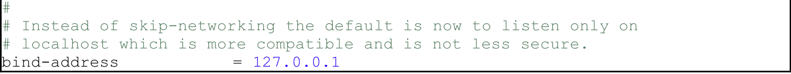

_to_

====== 3.1.2.1.2 Performances

_More performance in production environment can be achieved by changing following parameters in MySQL config file “my.cnf”:_

image:extracted-media/media/image12.png[image,width=646,height=85]

_to_

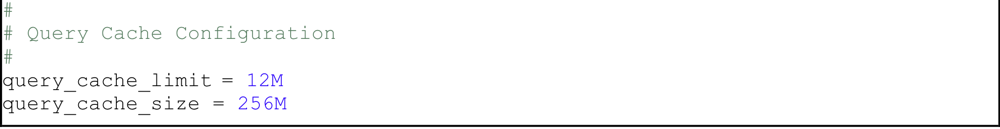

====== 3.1.2.1.3 Table name cases ([.underline]#before to create the DB#)

_In the time the software has been developed by the community concerning less the underlying OS used by each developer. MySQL is case-sensitive on Unix platforms and case-insensitive on Microsoft ones, so some scripts working on Windows may not work on Linux._

_For this reason, if the DB have to be shared between different systems it could be advisable to change following parameter in MySQL config file “my.cnf” of each system, as in http://dev.mysql.com/doc/refman/5.0/en/identifier-case-sensitivity.html_

===== 3.1.2.2 Create OpenHospital DB

In order to create the OpenHospital database everything we need is the set of SQL script files contained in the OpenHospital ([.underline]#non-portable#) zip file in the folder mysql/.

If we specified to *Include Bin Directory In Windows PATH* during the installation process (in Linux is always true) we can run the MySQL client everywhere in our system, otherwise go back to that chapter and read the *_NB_* note in the box.

Open a terminal in the folder mysql/ (e.g.):

*C:\WINDOWS\system32> cd D:\OpenHospital_1_8_3\mysql*

*D:\OpenHospital_1_8_3\mysql>*

and run the following commands (e.g.):

*D:\OpenHospital_1_8_3\mysql> mysql –u root -p*

*Enter password: *****

Using the ‘root’ password you have chosen during the installation process. The terminal should reply with the MySQL client command line prompt:

*mysql>*

We launch the main script “create_all_en.sql” with the command:

*mysql> source create_all_en.sql*

image:extracted-media/media/image16.png[image,width=645,height=70]

The server starts to process the scripts and after some instants it will be ready again for new prompt. The DB has been created and we can check it with command:

`mysql> show databases;`
`+--------------------+`
`| Database           |`
`+--------------------+`
`| information_schema |`
`| mysql              |`
`| oh                 |`
`| performance_schema |`
`+--------------------+`

The script has created the structure of the DB, populated with some default data and created the “isf” user with password “isf123”.

The ‘isf’ user, different from the ‘root’ one, is the user that the OpenHospital software will use to connect to the DB and its password can be changed at any time with the command:

*mysql>SET PASSWORD FOR isf'@'%' = PASSWORD('new-password-here');*

*Query OK, 1 row affected (0.00 sec)*

*Rows matched: 1 Changed: 1 Warnings: 0*

And then:

*mysql>FLUSH PRIVILEGES;*

*Query OK, 0 rows affected (0.00 sec)*

When we are through, we exit the MySQL client command line with the command:

*mysql>quit;*

==== 3.1.3 Configure OpenHospital

OpenHospital comes with several configuration files called “properties files”. The one we need to modify in order to let OpenHospital to find its database is the _database.properties, h8.properties_ and _log4j.properties_ files, located in the “resource” folder rsc/.

We have to specify:

* the *IP address* of the machine where the MySQL Server has been installed and containing the OpenHospital database. Replace “localhost” with the IP address (e.g. 192.168.1.100)
* the “isf” user *password*, if changed from “isf123”
* the MySQL Server *Port Number*, if changed from “3306”

_*[.underline]#NB#*: These settings have to be put on every OpenHospital copy, it’s to say, on every client._

More information in chapter link:#5-2-database-properties[database.properties] and link:#5-3-log4j-properties[log4j.properties].

==== 3.1.4 Run OpenHospital

We are ready now to run the OpenHospital software by executing the proper launcher:

* *on a Linux machine*: startup.sh
* *on a Windows machine*: startup.cmd

If everything is ok you should see the OpenHospital main splash screen:

And then the main Menu:

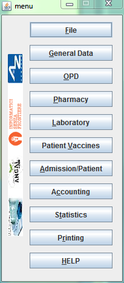

You may create a shortcut (link) to the executable script on the Desktop, the Programs Menu or wherever you need by using the provided icon “oh.ico” that you find in the package.

=== 3.2 Portable OpenHospital

OpenHospital, since version 1.2.0, has been distributed in a portable format.

Since OpenHospital is a Java software, is portable by definition. With the term “portable” here we refer to the possibility to have a copy self-contained of the software that includes Java, MySQL Server and the DB, that can also be copied and run everywhere, carrying together all the inserted data.

Since JRE and MySQL are not platform-independent but comes with several version depending on the platform, we have so:

* *Portable OpenHospital for Linux* platforms (embedding Java1.6 and MySQL5 for Linux)
* *Portable OpenHospital for Windows* platforms (embedding Java1.6 and MySQL5 for Windows)

Once downloaded the needed version you may start it by launching the related script inside the package:

* *oh.sh* in the Linux version
* *autorun.bat* in the Windows version

No others configurations are needed.

=== 3.3 Backup & Restore

==== 3.3.1 Backup of data (Database)

There are several ways to Backup & Restore *data* with MySQL. We suggest to use a common MySQL client such as MySQL Workbench® (e.g.):

From https://stackoverflow.com/a/18379189:

[arabic]
. Click on Management tab at left side in Navigator Panel
. Click on Data Export Option
. Select Schema
. Select Tables
. Select required option from dropdown below the tables list as per your requirement
. Select Include Create schema checkbox
. Click on Advance option
. Select Complete insert checkbox in Inserts Panel
. Start Export

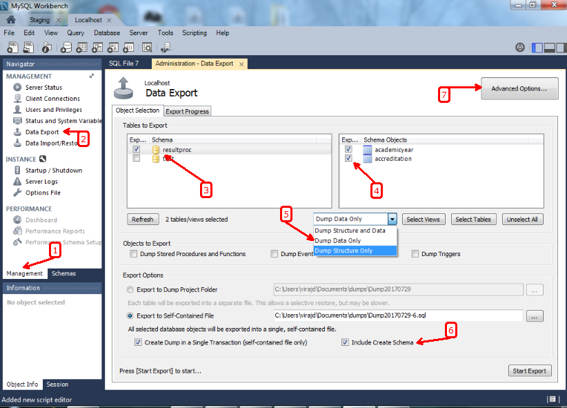

==== 3.3.2 Restore of data (Database)

In order to restore data with MySQL Workbench® (e.g.):

[arabic]
. Under *Server Administration* on the Home window select the server instance you want to restore database to (Create *New Server Instance* if doing it first time).
. Click on *Manage Import/Export*
. Click on *Data Import/Restore* on the left side of the screen.
. Select *Import from Self-Contained File* radio button (right side of screen)
. Select the path of .sql
. Click *Start Import* button at the right bottom corner of window.

==== 3.3.3 Backup of code and settings (Software)

Backup of the software *code and settings* is needed only if you change it from the “official versions” in order to correctly perform any future Update process (see. Update OpenHospital)

== 4 Folders

OpenHospital has an internal folder tree hereby briefly explained:

* *bin* – contains the Java *binaries* (compiled software)
* *bundle* – contains the *language* files
* *doc* – contains *documents* like version changelogs and manuals
* *lib* – contains the Java *libraries* needed to run the software
* *mysql* – contains the scripts and configurations for MySQL DB
* *rpt* – contains the JasperReports® *reports* used in OpenHospital
* *rpt/PDF* – contains the reports generated by OpenHospital in PDF format
* *rsc* – contains the *resources* of OpenHospital, like configuration files and other stuff
* *rsc/icons* – contains the *icons* used in OpenHospital for windows and buttons
* *rsc/images* – contains the *images* used in OpenHospital
* *logs* – contains the log files useful for debugging (after first run)

These folders are organized differently depending on the version.

=== 4.1 Folder tree in OpenHospital

In OpenHospital zip file you will find the following folder tree structure in the downloaded archive, where *_<version>_* is replaced with the current OpenHospital version:

* *OpenHospital-_<version>_*/
** *bin*
** *bundle*
** *doc*
** *lib*
** *mysql*
** *rpt*
** *rsc*
** startup.cmd *Launcher for Windows*
** startup.sh *Launcher for Linux*
** SetupGSM.cmd *Utility for Windows*
** SetupGSM.sh *Utility for Linux*
** oh.ico - icon image for launcher
** LICENSE - GNU GENERAL PUBLIC LICENSE V3
** CHANGELOG - Last version brief changelog

=== 4.2 Folder tree in Portable OpenHospital for Linux (32 and 64bit)

In Portable OpenHospital for Linux you will find the following folder tree structure in the downloaded archive, where *_<version>_* is replaced with the current OpenHospital version and *_<arch>_* with the OS architecture (x32 or x64):

* *poh-linux-_<arch>_-0.0.5-core-_<version>_*/
** dicom_storage/ - folder for DICOM files when added to the patient clinical sheet
** etc/ - working folder
** jre1.6.0_45/ - Java Virtual Machine
** mysql-5.0.51a-linux-i686/ - MySQL Server and MySQL DB
** *oh/ the OpenHospital subdolder structure*
** tmp/ - working folder
** var/ - working folder
** CHANGELOG - Last version brief changelog
** database.sql (DB inizialization script, automatically removed after first run)
** LICENSE - GNU GENERAL PUBLIC LICENSE V3
** oh.ico - icon image for launcher
** *oh.sh Launcher for Portable-Linux*
** POH-linux-changelog.md (changelog portable-linux)
** POH-README.md (README portable-linux)

=== 4.3 Folder tree in Portable OpenHospital for Windows (32bit)

In Portable OpenHospital for Windows you will find the following folder tree structure in the downloaded archive, where *_<version>_* is replaced with the current OpenHospital version:

* *poh-win32-0.0.5-core-_<version>_*/
** dicom_storage/ - folder for DICOM files when added to the patient clinical sheet
** jre6/ - Java Virtual Machine
** modified/ - working folder
** mysql/ - MySQL Server and MySQL DB
** *oh/ the OpenHospital subdolder structure*
** tmp/ - working folder
** CHANGELOG - Last version brief changelog
** database.sql (DB inizialization script, automatically removed after first run)
** LICENSE - GNU GENERAL PUBLIC LICENSE V3
** *oh.bat Launcher for Windows*
** oh.ico - icon image for launcher
** POH-README.md (README portable-windows)
** POH-win-changelog.md (changelog portable-windows)

== 5 Configuration Files

Some behaviors of OpenHospital depend by settings set in some text files called “properties files”. OpenHospital 1.8 comes with 6 main properties files:

* *oh/rsc/*
** *database.properties* – for OpenHospital database connection
** *dicom.properties* – for the DICOM viewer module
** *examination.properties* – contains the settings for the ‘examination’ module
** *generalData.properties* – for OpenHospital configuration options
** *h8.properties* – for OpenHospital modules that use Hibernate (like ‘examination’)
** *log4j.properties* – for the logging system
** *sms.properties* – for SMS Manager module
** *txtPrinter.properties*– for the text printing system
** *xmpp.properties* – for the Xmpp Server

Furthermore, there are other configurations files that are not meant to be modified by the user:

* *resolutions.xml* – for store locally the information about webcams
* *version.properties* – that contains the current OpenHospital version

Every configuration file works only [.underline]#locally# and is meant to pilot [.underline]#only a single instance# of OpenHospital application.

This means that if we have many clients running OpenHospital they may run differently according to their own configuration files.

_*[.underline]#NB#*: every change to these files need an application restart in order to see the modifications applied_

In following chapters, we will see all these properties files and all their feature in details.

=== 5.1 generalData.properties

OpenHospital 1.7 comes with the generalData.properties file set as follow by default:

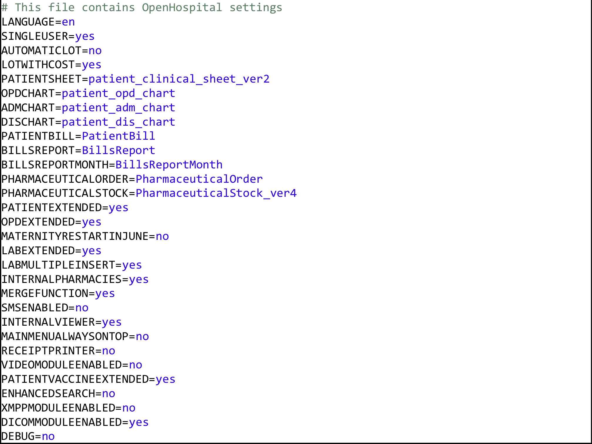

Every line is composed by key (capitalized) and a value (in blue) as follow:

key = value

Furthermore, values can be:

* *Boolean*: yes | no or true | false
* *String*: usually a filename or a country code (ISO 3166-1)

In following chapters, we will see the meaning of each of them.

==== 5.1.1 LANGUAGE

The following table shows the default value and the allowed ones:

[cols=",,",options="header",]
|===
|key |default value |allowed values
|LANGUAGE |en |ar, en, it, fr, es, de, sw
|===

OpenHospital 1.8 comes with seven translations, identified by the international country code:

* en – English
* it – Italian
* fr – French
* es – Spanish
* de–German
* sw– Swahili
* ar– Arabic

You can change the language used in the application simply by editing *_generalData.properties_* and setting this key. If a not allowed value is set, the local computer language will be applied.

_*[.underline]#NB#*: An application restart is required in order to see the modification applied._

==== 5.1.2 SINGLEUSER

The following table shows the default value and the allowed ones:

[cols=",,",options="header",]
|===
|key |default value |allowed values
|SINGLEUSER |yes |yes, no
|===

OpenHospital, since its first version, allow a multi-user usage. It means that is possible to define different users, arrange them by group and set different rights in application usage; for instance, a user “receptionist” may be able to register a new patient but not to prescribe a therapy.

OpenHospital has a predefined user called “admin” that have all rights to access all functionality in the application. When SINGLEUSER is set to YES (default) the program start with this user and all the functionalities are available.

If SINGLEUSER is set to NO the following login window will appear when start the program:

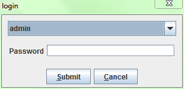

The default password for “admin” user is “admin”. By typing his password in the white field and by pressing *[.underline]##S##ubmit*, you will see the main *_Menu_* with all functionalities enabled.

Once you’re logged in as “admin” user you can define users and group (see link:#_Users_and_Groups[Users and Groups (Users)]), or just stay with only that as a simple form of data protection.

_*[.underline]#NB#*: despite this setting works only locally the users and groups defined will work for every client connected to the server; anyway, is possible to avoid login simply by acting on this parameter._

*[.underline]#Disclaimer#*: [.underline]#data security must never be left solely to application but it must be ensured by a proper network architecture and by a rigid configuration of the clients.#

==== 5.1.3 AUTOMATICLOT

The following table shows the default value and the allowed ones:

[cols=",,",options="header",]
|===
|key |default value |allowed values
|AUTOMATICLOT |no |yes, no
|===

OpenHospital, since its first version, allow an automatic management of lots in the main pharmacy. It means that is possible to work in the pharmacy without taking care about lot definitions in loading the store and just specify preparation and expiring date for each charging movement (see *6.2.2.2Insert stock movement* in the _User’s Guide_).

For discharging movement, the lot is automatically calculated according to the nearest expiring date of lots. If the quantity to discharge is higher than the quantity of the first selected lot, more than one discharging operation can be generated.

By default, AUTOMATICLOT is set to NO. Anyway, is possible to set it anytime to YES to enable it.

_*[.underline]#NB#*: An application restart is required in order to see the modification applied._

==== 5.1.4 LOTWITHCOST

The following table shows the default value and the allowed ones:

[cols=",,",options="header",]
|===
|key |default value |allowed values
|LOTWITHCOST |yes |yes, no
|===

OpenHospital, since version 1.8, allows managing the cost of medicals in the main pharmacy. (see *6.2.2.2 Insert stock charging movement* in the _User’s Guide_).

_*[.underline]#NB#*: An application restart is required in order to see the modification applied._

==== 5.1.5 PATIENTSHEET

The following table shows the default value and the allowed ones:

[cols=",,",options="header",]
|===
|key |default value |allowed values
|PATIENTSHEET |patient_clinical_sheet |any kind of .jasper file name
|===

OpenHospital, since its first version, allows to produce a report about the clinical history of a patient (see *10.9 Clinical Sheet* in the _User’s Guide_).

By default, PATIENTSHEET is set to patient_clinical_sheet that is the filename of the related report to use for the Clinical Sheet functionality. Anyway, is possible to use a different report by installing it in the report folder (see link:#6-Reports[Reports]) and by changing this parameter.

_*[.underline]#NB#*: An application restart is required in order to see the modification applied._

==== 5.1.6 OPDCHART

The following table shows the default value and the allowed ones:

[cols=",,",options="header",]
|===
|key |default value |allowed values
|OPDCHART |patient_opd_chart |any kind of .jasper file name
|===

OpenHospital, since its version 1.8, allows to produce a report about the OPD chart of a patient (see *10.9 Clinical Sheet* in the _User’s Guide_).

By default, OPDCHART is set to patient_opd_chart that is the filename of the related report to use for the Clinical Sheet functionality *OPD Chart*. Anyway, is possible to use a different report by installing it in the report folder (see link:#6-Reports[Reports]) and by changing this parameter.

_*[.underline]#NB#*: An application restart is required in order to see the modification applied._

==== 5.1.7 ADMCHART

The following table shows the default value and the allowed ones:

[cols=",,",options="header",]
|===
|key |default value |allowed values
|ADMCHART |patient_adm_chart |any kind of .jasper file name
|===

OpenHospital, since its version 1.8, allows to produce a report about the Admission of a patient (see *10.9 Clinical Sheet* in the _User’s Guide_).

By default, ADMCHART is set to patient_adm_chart that is the filename of the related report to use for the Clinical Sheet functionality *Admission Chart*. Anyway, is possible to use a different report by installing it in the report folder (see link:#6-Reports[Reports]) and by changing this parameter.

_*[.underline]#NB#*: An application restart is required in order to see the modification applied._

==== 5.1.8 DISCHART

The following table shows the default value and the allowed ones:

[cols=",,",options="header",]
|===
|key |default value |allowed values
|DISCHART |patient_dis_chart |any kind of .jasper file name
|===

OpenHospital, since its version 1.8, allows to produce a report about the Discharge of a patient (see *10.9 Clinical Sheet* in the _User’s Guide_).

By default, DISCHART is set to patient_dis_chart that is the filename of the related report to use for the Clinical Sheet functionality *Discharge Chart*. Anyway, is possible to use a different report by installing it in the report folder (see link:#6-Reports[Reports]) and by changing this parameter.

_*[.underline]#NB#*: An application restart is required in order to see the modification applied._

==== 5.1.9 PATIENTBILL

The following table shows the default value and the allowed ones:

[cols=",,",options="header",]
|===
|key |default value |allowed values
|PATIENTBILL |PatientBill |any kind of .jasper file name
|===

OpenHospital, since version 1.6.0, allows to manage patient bills and to produce an A4 format breakdown with his/her items and payments (see *8.2 Functions of Accounting* in the _User’s Guide_)

By default, PATIENTBILL is set to PatientBill that is the filename of the related report to use for the bill printing functionality. Anyway, is possible to use a different report by installing it in the report folder (see link:#6-Reports[Reports]) and by changing this parameter.

_*[.underline]#NB#*: An application restart is required in order to see the modification applied._

==== 5.1.10 BILLSREPORT

The following table shows the default value and the allowed ones:

[cols=",,",options="header",]
|===
|key |default value |allowed values
|BILLSREPORT |BillsReport |any kind of .jasper file name
|===

OpenHospital, since version 1.6.0, allows to manage patient bills and to produce a report about all bills paid (or not paid) within a span of time (see *8.2 Functions of Accounting* in the _User’s Guide_)

By default, BILLSREPORT is set to BillsReport that is the filename of the related report to use for the account printing functionality. Anyway, is possible to use a different report by installing it in the report folder (see link:#6-Reports[Reports]) and by changing this parameter.

_*[.underline]#NB#*: An application restart is required in order to see the modification applied._

==== 5.1.11 BILLSREPORTMONTH

The following table shows the default value and the allowed ones:

[cols=",,",options="header",]
|===
|key |default value |allowed values
|BILLSREPORTMONTH |BillsReportMonth |any kind of .jasper file name
|===

OpenHospital, since version 1.6.0, allows to manage patient bills and to produce a report about all bills paid (or not paid) monthly (see**8.2 Functions of Accounting** in the _User’s Guide_).

By default, BILLSREPORTMONTH is set to BillsReportMonth that is the filename of the related report to use for the account printing functionality. Anyway, is possible to use a different report by installing it in the report folder (see link:#6-Reports[Reports]) and by changing this parameter.

_*[.underline]#NB#*: An application restart is required in order to see the modification applied._

==== 5.1.12 PHARMACEUTICALORDER

The following table shows the default value and the allowed ones:

[cols=",,",options="header",]
|===
|key |default value |allowed values
|PHARMACEUTICALORDER |PharmaceuticalOrder |any kind of .jasper file name
|===

OpenHospital, since version 1.7.0, allows to produce a report for the Pharmacy Stock critical levels, that help to know which pharmaceuticals are going to end and which ones need to be ordered (see *6.1 Pharmaceuticals* in the _User’s Guide_).

By default, PHARMACEUTICALORDER is set to PharmaceuticalOrder that is the filename of the related report to use for the pharmacy printing functionality. Anyway, is possible to use a different report by installing it in the report folder (see link:#6-Reports[Reports]) and by changing this parameter.

_*[.underline]#NB#*: An application restart is required in order to see the modification applied._

==== 5.1.13 PHARMACEUTICALSTOCK

The following table shows the default value and the allowed ones:

[cols=",,",options="header",]
|===
|key |default value |allowed values
|PHARMACEUTICALSTOCK |PharmaceuticalStock |any kind of .jasper file name
|===

OpenHospital, since version 1.7.0, allows to produce a report for the Pharmacy Stock Status, that help to know which pharmaceuticals are currently stored (see *6.1 Pharmaceuticals* in the _User’s Guide_).

By default, PHARMACEUTICALSTOCK is set to PharmaceuticalStock that is the filename of the related report to use for the pharmacy printing functionality. Anyway, is possible to use a different report by installing it in the report folder (see link:#6-Reports[Reports]) and by changing this parameter.

_*[.underline]#NB#*: An application restart is required in order to see the modification applied._

==== 5.1.14 PATIENTEXTENDED

The following table shows the default value and the allowed ones:

[cols=",,",options="header",]
|===
|key |default value |allowed values
|PATIENTEXTENDED |yes |yes, no
|===

OpenHospital, since version 1.3.1, allows register patient with a big set of information. This set of information are meant to “extend” the ones collected since version 1.2.1 (see *10.4Insert a new Patient Extended* in the _User’s Guide_).

By default, PATIENTEXTENDED is set to yes. Anyway, is possible to set it to no in order to reduce the amount of data to be collected and so reduce the workload for the staff involved in data entry.

_*[.underline]#NB#*: An application restart is required in order to see the modification applied._

==== 5.1.15 OPDEXTENDED

The following table shows the default value and the allowed ones:

[cols=",,",options="header",]
|===
|key |default value |allowed values
|OPDEXTENDED |yes |yes, no
|===

OpenHospital, since version 1.3.1, allows to link every OPD visit to a registered patient in order to have a comprehensive clinical history. For each visit the user will be asked to select a registered patient or to register a new one, so from that moment the visit will be attached to his/her history (see *5.3 OPD Extended* and *10.9 Clinical Sheet* in the _User’s Guide_).

By default, OPDEXTENDED is set to yes. Anyway, is possible to set it to no in order to reduce the amount of data to be collected (only age and sex, no patient registration) and so reduce the workload for the staff involved in data entry.

_*[.underline]#NB#*: An application restart is required in order to see the modification applied._

==== 5.1.16 MATERNITYRESTARTINJUNE

The following table shows the default value and the allowed ones:

[cols=",,",options="header",]
|===
|key |default value |allowed values
|MATERNITYRESTARTINJUNE |no |yes, no
|===

OpenHospital, since version 1.3.1, allows to change the way the admissions in Maternity ward are counted within the year; in OpenHospital the first admission of the year for every ward has progressive number 1 (one) and it increments itself automatically up to the end of the year; in some facilities this is partially true and the progressive numbering starts from June only for the Maternity ward. With this option we obtain exactly this behavior.

By default, MATERNITYRESTARTINJUNE is set to no.

_*[.underline]#NB#*: An application restart is required in order to see the modification applied._

==== 5.1.17 LABEXTENDED

The following table shows the default value and the allowed ones:

[cols=",,",options="header",]
|===
|key |default value |allowed values
|LABEXTENDED |yes |yes, no
|===

OpenHospital, since version 1.4.1, allows to force every laboratory exam to be linked to a registered patient, in order to have a comprehensive clinical history. For each exam the user will be asked to select a registered patient so from that moment the exam will be attached to his/her history (see *7.3.2 New Laboratory Exam* in the _User’s Guide_).

By default, LABEXTENDED is set to yes. Anyway, is possible to set it to no in order to reduce the amount of data to be collected (only name, age and sex, no patient registration) and so reduce the workload for the staff involved in data entry.

_*[.underline]#NB#*: An application restart is required in order to see the modification applied._

==== 5.1.18 LABMULTIPLEINSERT

The following table shows the default value and the allowed ones:

[cols=",,",options="header",]
|===
|key |default value |allowed values
|LABMULTIPLEINSERT |yes |yes, no
|===

OpenHospital, since version 1.4.1, allows to insert multiple laboratory tests per patient at a time in order to avoid the repetitive operation of selecting a patient or writing his/her name; the LABEXTENDED option must be set to yes too (see *7.3.3 Laboratory Multiple Insert* in the _User’s Guide_).

By default, LABMULTIPLEINSERT is set to yes, but if LABEXTENDED is set to no it will be just ignored.

_*[.underline]#NB#*: An application restart is required in order to see the modification applied._

==== 5.1.19 INTERNALPHARMACIES

The following table shows the default value and the allowed ones:

[cols=",,",options="header",]
|===
|key |default value |allowed values
|INTERNALPHARMACIES |yes |yes, no
|===

OpenHospital, since version 1.4.1, allows to register all giving to patients within a ward. Activating this option, the Pharmaceutical Stock Ward functionality will be available in the application (see *6.3 Pharmaceuticals Stock Ward* in the _User’s Guide_)

By default, INTERNALPHARMACIES is set to yes.

_*[.underline]#NB#*: An application restart is required in order to see the modification applied._

==== 5.1.20 MERGEFUNCTION

The following table shows the default value and the allowed ones:

[cols=",,",options="header",]
|===
|key |default value |allowed values
|MERGEFUNCTION |no |yes, no
|===

OpenHospital, since version 1.4.1, allows to merge two patient’s history in only one. This is particularly useful in case of double registration that have collected different information during the time. Activating this option, the Merge functionality will be available in the Admission/Patient module (see *10.11 Merge function* in the _User’s Guide_).

By default, MERGEFUNCTION is set to no.

_*[.underline]#NB#*: An application restart is required in order to see the modification applied._

==== 5.1.21 INTERNALVIEWER

The following table shows the default value and the allowed ones:

[cols=",,",options="header",]
|===
|key |default value |allowed values
|INTERNALVIEWER |yes a|
yes,

any executable filename in the path or with absolute path

|===

OpenHospital, since version 1.4.1, allows to use a different PDF reader for generated reports. If this parameter is set to yes, the Jasper PDF Viewer will be used (see *11.2 Report Launcher* in the _User’s Guide_). If we want to use an external PDF viewer, we may put its executable filename but we must be sure that it is available in the desktop environment.

*Example in Windows:*

INTERNALVIEWER=AcroRd32.exe

INTERNALVIEWER= C:\\Program Files (x86)\\Adobe\\Reader 10.0\\Reader\\AcroRd32.exe

_*[.underline]#NB#*: Please note the double file & folder separator “_\\_”._

*Example in Linux:*

INTERNALVIEWER=evince

By default, INTERNALVIEWER is set to yes.

_*[.underline]#NB#*: An application restart is required in order to see the modification applied._

==== 5.1.22 SMSENABLED

The following table shows the default value and the allowed ones:

[cols=",,",options="header",]
|===
|key |default value |allowed values
|SMSENABLED |no |yes, no
|===

OpenHospital, since version 1.5, allows to set this parameter that will be used to set some information ready for SMS notification to the patients. Enabling or disabling this option will only affect the possibility to set or not a therapy as notifiable (see *10.10.7 Notify & SMS* in the _User’s Guide_)

By default, SMSENABLED is set to no.

===== 5.1.22.1 Configuration

In order to setup a GSM device, you must set as GSM mode in the related sms.properties file (see link:#5-7-sms-properties[sms.properties]) and then set up the related GSM.properties file (see link:#5-7-1-gsm-properties[GSM.properties]).

The settings in the GSM.properties file should work with the majority of GSM devices (like phones, smartphones, usb modems, etc…) and only the PORT parameter should be changed accordingly with the SERIAL port used by your system to address the device once plugged in the system.

If you’re sure the PORT is correct but still OpenHospital is not communicating with the device (we suggest to switch to DEBUG log level – or lower - during this setup – see link:#5-6-log4j-properties[log4j.properties]) you might use the SetupGSM utility in your OpenHospital root folder (see link:#folders[Folders])

===== 5.1.22.2 SetupGSM

In order to use the SetupGSM utility just follow these instructions:

[arabic]
. plug your device in your system and be sure the system recognizes it, load a proper driver for it and assign a serial port (COM)
. Launch the utility: the utility will scan all plugged devices and will try to recognize the modem (or phone) within them
. If the device is recognized as modem you will be prompted for a confirm message as the follow  

image:extracted-media/media/image25.png[image,width=293,height=120]

. If the name of the device is the one meant to be used with the system then just click “yes”, otherwise click “no” and the scan will continue
. Once you click “yes” the GSM.properties file will be automatically modified by the utility

==== 5.1.23 MAINMENUALWAYSONTOP

The following table shows the default value and the allowed ones:

[cols=",,",options="header",]
|===
|key |default value |allowed values
|MAINMENUALWAYSONTOP |no |yes, no
|===

OpenHospital, since version 1.5, allows to keep the main menu always on top so it cannot be overlapped by other windows.

By default, MAINMENUALWAYSONTOP is set to no.

_*[.underline]#NB#*: An application restart is required in order to see the modification applied._

==== 5.1.24 RECEIPTPRINTER

The following table shows the default value and the allowed ones:

[cols=",,",options="header",]
|===
|key |default value |allowed values
|RECEIPTPRINTER |no |yes, no
|===

OpenHospital, since version 1.5, allows to drive text or ZPL printers with aim of printing simple receipts in Accounting module (see *8.2.1.10 Print receipt* function in _User’s Guide_). Once this option has been activated, some parameters have to be set in *txtPrinter.properties file* in order to adjust the output with the printer connected to the system (see link:#5-8-txtprinter-properties[txtPrinter.properties] in this document).

By default, RECEIPTPRINTER is set to no.

_*[.underline]#NB#*: The text printer must be set as default printer._

_*[.underline]#NB#*: An application restart is required in order to see the modification applied._

==== 5.1.25 VIDEOMODULEENABLED

The following table shows the default value and the allowed ones:

[cols=",,",options="header",]
|===
|key |default value |allowed values
|VIDEOMODULEENABLED |no |yes, no
|===

OpenHospital, since version 1.5, allows to drive any webcam with the aim of shooting patients’ passports in Admission/Patient module (see *10.4.3 Patient Photo* function in _User’s Guide_). Once this option has been activated the related button *New Photo* in *New Patient Extended* window will be available to start and use the webcam.

By default, VIDEOMODULEENABLED is set to no.

_*[.underline]#NB#*: An application restart is required in order to see the modification applied._

==== 5.1.26 PATIENTVACCINEEXTENDED

The following table shows the default value and the allowed ones:

[cols=",,",options="header",]
|===
|key |default value |allowed values
|PATIENTVACCINEEXTENDED |yes |yes, no
|===

OpenHospital, since version 1.6, allows to register vaccines given to patients (see *9 Vaccines* in the User’s Guide). This option allows to toggle the patient’s full name in the *_Patient vaccines browsing_* window.

By default, PATIENTVACCINEEXTENDED is set to yes.

_*[.underline]#NB#*: An application restart is required in order to see the modification applied._

==== 5.1.27 ENHANCEDSEARCH

The following table shows the default value and the allowed ones:

[cols=",,",options="header",]
|===
|key |default value |allowed values
|ENHANCEDSEARCH |no |yes, no
|===

OpenHospital, since version 1.6, allows to optimize memory usage when the number of registered patients becomes huge (see *10.2.2 Search patient Enhanced* in the User’s Guide). With the enhanced search only, the patient matching a search criterion will be loaded in the memory, otherwise all patients registered in the system will be loaded in the *_Patients browser_* window.

By default, ENHANCEDSEARCH is set to no. Anyway, is possible to toggle this option anytime to reduce the amount of memory needed by the computer or the server.

_*[.underline]#NB#*: An application restart is required in order to see the modification applied._

==== 5.1.28 XMPPMODULEENABLED

The following table shows the default value and the allowed ones:

[cols=",,",options="header",]
|===
|key |default value |allowed values
|XMPPMODULEENABLED |no |yes, no
|===

OpenHospital, since version 1.7, embeds a new technology that allow users logged in the application to chat and share information related to the hospital activities (see *13 Communication* in the User’s Guide); the SINGLEUSER option must be set to no too. If this option is active, OpenHospital will look for an XMPP Server at startup time. The *xmpp.properties* will be used to point the server that must be installed on the computer or on the OH Server by the System Administrator (see link:#5-9-xmpp-properties[xmpp.properties] in this document).

By default, XMPPMODULEENABLED is set to no, but if SINGLEUSER is set to yes it will be just ignored.

_*[.underline]#NB#*: An application restart is required in order to see the modification applied._

==== 5.1.29 DICOMMODULEENABLED

The following table shows the default value and the allowed ones:

[cols=",,",options="header",]
|===
|key |default value |allowed values
|DICOMMODULEENABLED |no |yes, no
|===

OpenHospital, since version 1.8, embeds a new feature that allows to attach DICOM files to patient’s clinical sheet. When this option is enabled, a button *DICOM* appears in the patient Clinical sheet module.

By default, DICOMMODULEENABLED is set to no.

_*[.underline]#NB#*: An application restart is required in order to see the modification applied._

==== 5.1.30 DEBUG

The following table shows the default value and the allowed ones:

[cols=",,",options="header",]
|===
|key |default value |allowed values
|DEBUG |no |yes, no
|===

OpenHospital, since version 1.7, allows to run itself in debug mode that could be useful to understand what is happening behind the user graphical interface. At the moment this option will affect only the video module, that means that in place of the normal *New Patient Extended* window (see *10.4.3 Patient Photo* function in _User’s Guide_), it will open the new special window showed below:

image:extracted-media/media/image26.png[New Patient Extended_photo_debug.PNG,width=645,height=535]

From this window is possible to have more information about webcams connected to the system and try different resolutions in order to find the best one or more information about a problem.

Once produced a photo, OpenHospital will remember the last setting used in the future.

By default, DEBUG is set to no.

_*[.underline]#NB#*: An application restart is required in order to see the modification applied._

==== 5.1.31 ALLOWMULTIPLEOPENEDBILL

The following table shows the default value and the allowed ones:

[cols=",,",options="header",]
|===
|key |default value |allowed values
|ALLOWMULTIPLEOPENEDBILL |no |yes, no
|===

OpenHospital, since version 1.9, allows a patient to have multiple opened bills(invoices). If this option is enabled, when creating a new bill for a patient, if that patient already has an opened bill
it would be asked to confirm the creation of another one.

By default, ALLOWMULTIPLEOPENEDBILL is set to no.

_*[.underline]#NB#*: An application restart is required in order to see the modification applied._

==== 5.1.32 OPENEDBILLSREPORT

The following table shows the default value and the allowed ones:

[cols=",,",options="header",]
|===
|key |default value |allowed values
|OPENEDBILLSREPORT |OH023_BillsReportMonth |OH023_BillsReportMonth
|===

OpenHospital, since version 1.9, allows a to print the list of opened bills. That parameter contains the jasper report file name to print 
the list of opened bills. 

By default, OPENEDBILLSREPORT is set to OH023_BillsReportMonth. 

_*[.underline]#NB#*: An application restart is required in order to see the modification applied._

==== 5.1.33 ALLOWPRINTOPENEDBILL

The following table shows the default value and the allowed ones:

[cols=",,",options="header",]
|===
|key |default value |allowed values
|ALLOWPRINTOPENEDBILL |no |yes, no
|===

OpenHospital, since version 1.9, allows a to print the receipt of single opened invoice. when that parameter is enabled, in Accounting module
under pending tab one can selected an opened bill and get the receipt by clicking in Receipt button in buttons panel.

By default, ALLOWPRINTOPENEDBILL is set to no. 

_*[.underline]#NB#*: An application restart is required in order to see the modification applied._

=== 5.2 database.properties

OpenHospital 1.7 and above comes with the database.properties file set as follow by default:

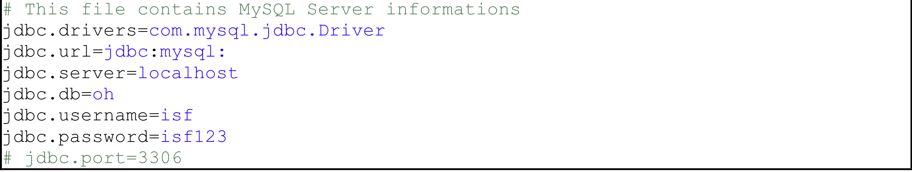

First two parameters are not meant to be modified by the User, neither by the Administrator:

* *jdbc.drivers*: the java library used to connect to a MySQL Server
* *jdbc.url*: the address to point a MySQL Server
* Then we have five parameters which may need to be set according to your network settings instead:
* *jdbc.server*: the IP address of the server where the MySQL Server is installed; localhost means the same computer where this file is located; others values can be: +
_127.0.0.1_ – loopback network +
_192.168.0.100_ – an example of private IP address (LAN) +
_217.147.110.117_ – an example of public IP address (WAN)
* *jdbc.db*: the name of the OpenHospital database
* *jdbc.username*: the MySQL user allowed to connect and operate on the database
* *jdbc.password*: the user password
* *jdbc.port*: the TCP port where the MySQL Server is listening; by default, this port is 3306 but can be changed if needed; anyway, must reflect the MySQL Server settings

The full address for the db will then result as:

jdbc:mysql://localhost/oh

_*[.underline]#NB#*: An application restart is required in order to see the modification applied. +
NB: Same settings have to be applied in log4.properties (since OpenHospital 1.7.0) and h8.properties (since OpenHospital 1.8.0); see link:#5-6-log4j-properties[log4j.properties] _and_ h8.properties _chapters in this manual._

=== 5.3 dicom.properties

OpenHospital 1.8 and above comes with the dicom.properties file set as follow by default:

* *dicom.manager.impl*: the java class that implement org.isf.dicom.manager.DicomManagerIntf and that will manage the DICOM persistence operation. This property can take two values
* org.isf.dicom.HybernateDicomManager : The dicom File is stored in the database
* org.isf.dicom.FileSystemDicomManager : The dicom file is stored in the file system
* *dicom.storage.filesystem:* is the value of the first parameter is org.isf.dicom.FileSystemDicomManager, this property tell OpenHospital about the path where the DICOM files will be stored.

=== 5.4 examination.properties

OpenHospital 1.8 comes with the examination.properties file used in the examination module. The file is set as follow by default:

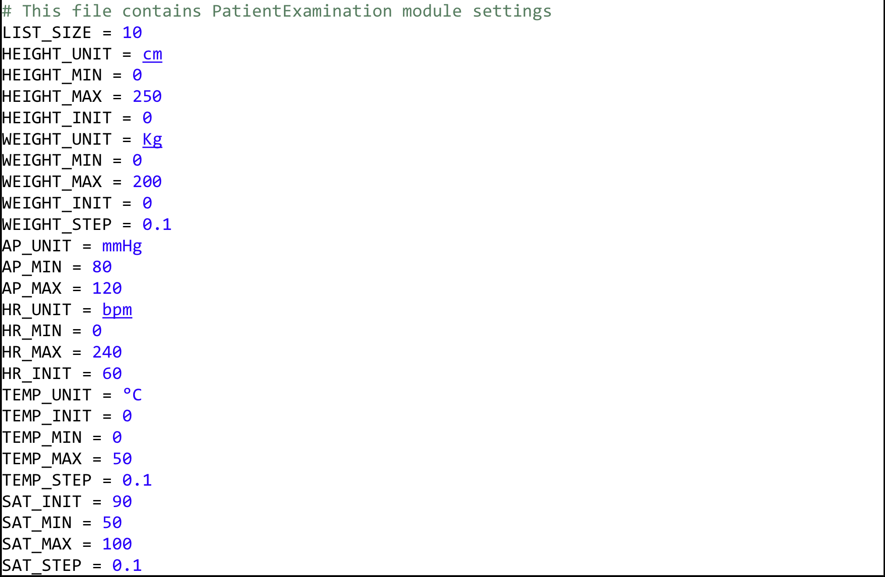

* *LIST_SIZE*: the maximum number of examinations that can be view in the history. Must be less than or equal to 10.
* *HEIGHT_UNIT:* the Height unit
* *HEIGHT_MIN:* the height minimum value, use to initialize the height slider in the *_Examination_* window.
* *HEIGHT_MAX:* the height maximum value, use to initialize the height slider in the *_Examination_* window.
* *HEIGHT_INIT:* the height initial value.
* *HEIGHT_STEP:* the step used when moving the height slider
* *WEIGHT_UNIT:* the Weight unit
* *WEIGHT_MIN:* the Weight minimum value, use to initialize the Weight slider in the *_Examination_* window.
* *WEIGHT_MAX:* the Weight maximum value, use to initialize the Weight slider in the *_Examination_* window.
* *WEIGHT_INIT:* the Weight initial value.
* *AP_UNIT:* the Arterial pressure unit
* *AP_MIN:* the Arterial pressure minimum value
* *AP_MAX:* the Arterial pressure maximum value
* *HR_UNIT:* the Heart rate unit
* *HR_MIN:* the Heart rate minimum value
* *HR_MAX:* the Heart rate maximum value
* *HR_INIT:* the Heart rate initial value
* *TEMP_UNIT:* the temperature unit
* *TEMP_INIT:* the temperature initial value
* *TEMP_MIN:* the temperature minimum value
* *TEMP_MAX:* the temperature maximum value
* *TEMP_STEP:* the temperature step used when moving the slider
* *SAT_INIT:* the saturation initial value
* *SAT_MIN:* the saturation minimum value
* *SAT_MAX:* the saturation maximum value
* *SAT_STEP:* the saturation step used when moving the slider
* [#_log4j.properties_1 .anchor]##

=== 5.5 h8.properties

OpenHospital 1.8.0 and above comes with the h8.properties file set as follow by default:

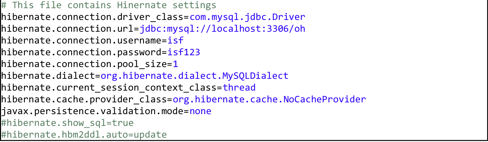

This file is not meant to be modified by the User.

Nevertheless the hibernet.connection parameters must be set properly, according with database.properties (see link:#5-2-database-properties[database.properties]), by editing the following lines (in *red* the most important parameters):

_*[.underline]#NB#*: An application restart is required in order to see the modification applied._

=== 5.6 log4j.properties

OpenHospital 1.7 and above comes with the log4j.properties file set as follow by default:

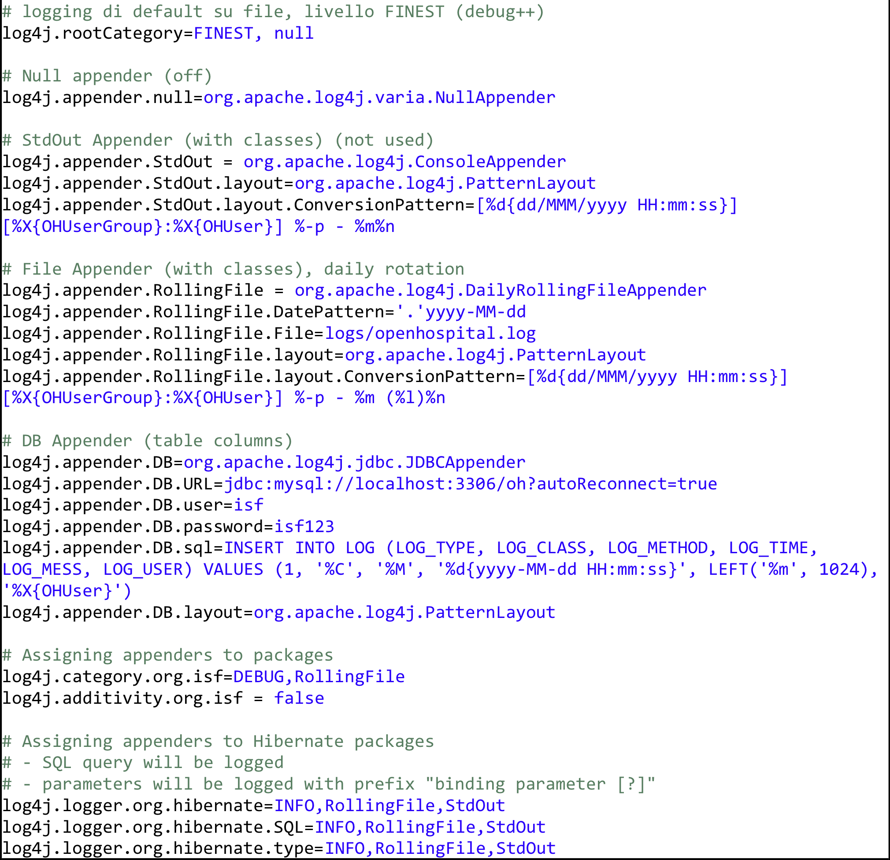

This file is not meant to be modified by the User.

Once the system is up and running, the log level can be reduced from "DEBUG" to "INFO", so the size of the log files and the tables are significantly reduced:

image:extracted-media/media/image33.png[image,width=645,height=17]

On the contrary, in case of malfunctions of the application, the log level can be increased to "TRACE", in this way will be shown more details on the operation of the application:

You can even enable the log DB, by adding the respective *appender* if needed:

You can also decide to log only in the standard output (the console window) with:

The DB appender configuration must be set properly, according with database.properties (see link:#5-2-database-properties[database.properties]), by editing the following lines (in *red* the most important parameters):

_*[.underline]#NB#*: An application restart is required in order to see the modification applied._

=== 5.7 sms.properties

OpenHospital 1.8 comes with the sms.properties file set as follow by default:

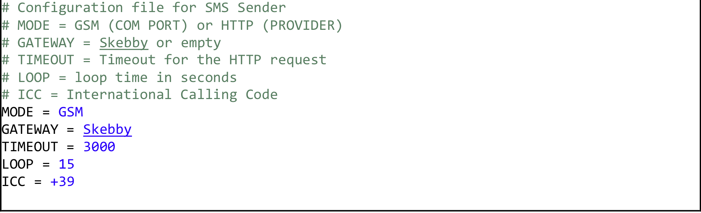

* *MODE*: the SMS sender mode. Can take two values:
** *GSM*: need a GSM modem connected to a COM port. The administrator should configure the SMSGateway/GSM.properties file to set the suitable PORT
** *HTTP*: need a HTTP API provider.
* *GATEWAY:* HTTP gateway to use. Required when the MODE is set to GSM.
* *TIMEOUT:* timeout for the HTTP request. Required when MODE is set to HTTP.
* *LOOP:* Delay used by the sender to fetch new SMS operations to proceed. The value is in second.
* *ICC:* the International Country Code that need to be added to the phone numbers that require it.

==== 5.7.1 GSM.properties

OpenHospital 1.8 comes with the GSM.properties file set as follow by default:

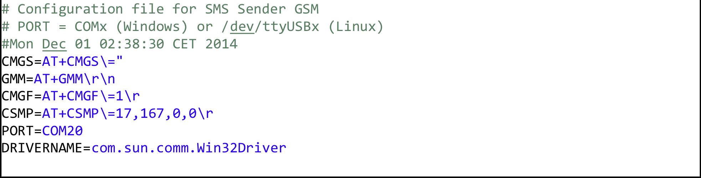

Only the PORT property needs to be modified.

* *PORT:* COM port where the modem is connected.

==== 5.7.2 Skebby.properties

OpenHospital 1.8 comes with the Skebby.properties file set as follow by default:

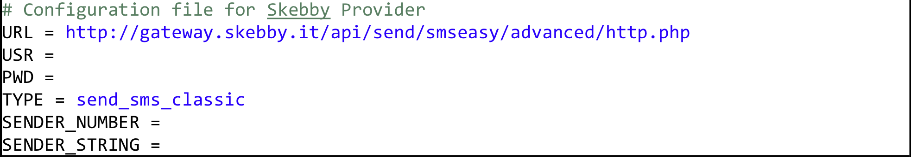

This serve for the implementation of the Skebby HTTP API for sending SMS.

* *URL:* Url of the Skebby http API.
* *USR:* the username needs for the authentication on the Skebby server
* *PWD:* password for the authentication on the Skebby server
* *TYPE:* SMS type, require by Skebby. You can just leave the default value.
* *SENDER_NUMBER:* Sender number.
* *SENDER_STRING:* Sender string, that will replace the sender number in the phone of the recipient.

===  5.8 txtPrinter.properties

OpenHospital 1.7 and above comes with the txtPrinter.properties file set as follow by default:

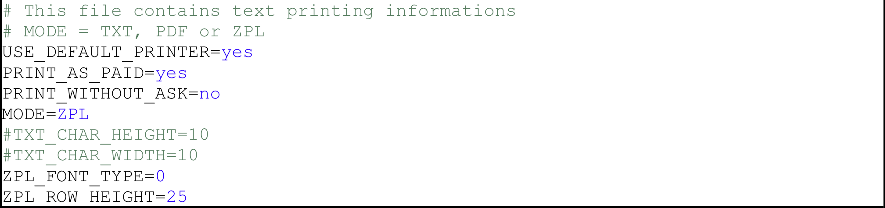

This file will be used only if the RECEIPTPRINTER flag is enabled (see link:#5-1-24receiptprinter[RECEIPTPRINTER] in this document)

This file has seven parameters, hereby explained:

* *USE_DEFAULT_PRINTER*: if it is set to yes OpenHospital will use the default printer, otherwise it will show the system printing dialog so it’s possible to change printer at every print attempt:

image:extracted-media/media/image42.png[image,width=291,height=245]

* *PRINT_AS_PAID*: it will affect the behavior when a Bill is set to PAID in the Accounting module (see *8.2.1.10 Print receipt* function in _User’s Guide_). +
 +
If it is set to yes OpenHospital will try to print a receipt just after a Bill is set as PAID +
** +
**A confirmation window will appear:

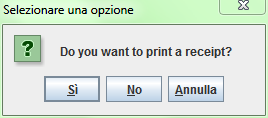

Otherwise you must do it after, by press *[.underline]##E##dit Bill* button on the already closed (“C”) bill

* *PRINT_WITHOUT_ASK*: if set to yes OpenHospital will try to print the receipt without confirmation window
* *MODE*: the MODE can take three values:
** *TXT*: we are specifying that the bill will be printed as pure text (no graphics)
** *PDF*: we are specifying that the bill will be printed as PDF
** *ZPL*: we are specifying that the text printer connected to the system works with ZPL language (an EPL evolution for Zebra Label Printer)
* *ZPL_FONT_TYPE*: a 0 (zero) value stands for standard character; you may change this value with “A”, “B”, “C”, etc... according with the device datasheet, in order to obtain a better look
* *ZPL_FONT_SIZE*: an integer value to adjust the character size in order to obtain a better look

The best way to set these parameters according with your device is to set them one by one and check the different results until you reach the best fit.

_*[.underline]#NB#*: An application restart is required in order to see the modification applied._

=== 5.9 xmpp.properties

OpenHospital 1.7 and above comes with the xmpp.properties file set as follow by default:

This file will be used only if the XMPPMODULEENABLED flag is enabled (see link:#5-1-28-xmppmoduleenabled[XMPPMODULEENABLED] in this document)

In order to use the Communication module (see *13 Communication* in the _User’s Guide_) you must install an XMPP Server separately on the OH Server, let’s say side by side with MySQL Server.

The most common XMPP Server is the free and open-source project Ignite Openfire® (http://www.igniterealtime.org/projects/openfire/) available for Linux, Windows and Mac.

Once the XMPP Server is installed, active and running we may set the two parameters in the xmpp.properties file as follow:

* *DOMAIN* – the IP address of the XMPP server (it could be the same of MySQL Server)
* *PORT* – 5222 or another if set differently

_*[.underline]#NB#*: An application restart is required in order to see the modification applied._

==== 5.9.1 OpenFire Settings

The XMPP module needs some knowledge about XMPP protocol and how an XMPP server works.

Every time you log in OH, it will create an OpenFire user with same username&password (even if passwords are saved differently in OH and OpenFire DB). For this reason, OH "admin" user will be in conflict with OpenFire one, so you will not be able to log in as admin and to chat.

_*[.underline]#NB#*: If you need admin user to chat with other users you may consider to create another "superuser" in OH under the "admin" group._

In order to allow users to see each other and communicate via XMPP protocol, they must belong to the same OpenFire "group" and have the other users in their own "_roster_" (you can find "group" and "roster" deep explanation in online docs).

Please follow these settings:

[arabic]
. Install OpenFire server (better if from zip file) on a writable path in your OS
. Set in both OpenFire and xmpp.properties an IP address rather than the FQDN (e.g. 127.0.0.1)
. Set OpenFire to use Embedded DB
. Create a group "OH" in OpenFire server and enable the "Contact List (Roster) Sharing"
. Add new users automatically created from OH to the "OH" group
. You may consider to use OpenFire plugin for automatically add new users to a group (e.g. registration plugin http://www.igniterealtime.org/projects/openfire/plugins/registration.jar)

=== 5.10 Bundles

Bundles are the language (or translation) files provided with OpenHospital. As told in link:#5-1-1-language[LANGUAGE] chapter, OpenHospital 1.7 comes with different available languages in folder bundles/ within the package file:

*language_XY.properties*

where XY is an international country code.

Since they are property files, every language file is made by hundreds of key = value couple too.

Special characters are coded in the UNICODE coding system with 4 bytes, like:

U+00E1 = \u00E1 = á

U+00E8 = \u00E8 = è

U+00F6 = \u00F6 = ö

…

==== 5.10.1 New Translations

In order to create a new translation or to fix some labels in the OpenHospital is enough to create a copy of the English one, rename it with the new country code in place of the “XY” in the filename, and start translating with a simple text editor.

For instance, if you want to create an Arab translation, you may create a new bundle from the English one:

*language_en.propertieslanguage_ar.properties*

Then you can edit the Arab file and set the LANGUAGE parameter to *ar* to start testing your translation.[#_Users_and_Groups .anchor]##

== 6 Reports

Reports in OpenHospital are produced with JasperReports® technology that allow to design a report in a WYSIWYG (What You See Is What You Get) way, connect it to a datasource (DB), test it, modify it and then compile it to use it in the application software.

OpenHospital reports are all contained in reports rpt/ folder (see link:#folders[Folders] in this document). Each report consists of two files:

* a .*jrxml* file: JasperReport XML file, that can be modified with a proper editor
* a .*jasper* file: Jasper file, that is the compiled version that can be run in OpenHospital; this file is produced on the jrxml base
* some reports could have also one or more *.properties* file that works for the localization, it means that the report has been translated to appear in more languages (default is English)

The Jasper editor to create and modify Jasper reports is iReport®, a free and open-source software.

With iReport® is possible to edit OpenHospital reports and re-compile them in order to be used in OpenHospital application.

=== 6.1 Compatibility: iReport® 3.0.0

In order to have compliant and fully-working reports for OpenHospital we suggest to use iReport® version 3.0.0 (Classic).

=== 6.2 Links

JasperReports® - http://www.jaspersoft.com/

iReport® - http://community.jaspersoft.com/project/ireport-designer

iReport® 3.0.0 (Classic) - http://sourceforge.net/projects/ireport/files/iReport%20(classic)/

== 7 Installing OpenHospital 1.8 in Eclipse EE

Assuming Eclipse EE, MySQL and the Java Virtual Machine (JVM) have already been installed on the computer, this chapter will focus on the installation of the 1.8 version on Eclipse J2EE (or Eclipse EE) environment (for never versions procedures are the same). +
The Eclipse version used in this chapter is the Luna EE 4.4.2, downloadable from http://www.eclipse.org/downloads/packages/eclipse-ide-java-ee-developers/lunasr2.

The installation of OH comprises of three main steps:

[arabic]
. Checkout the project from CVS
. Add libraries to the project
. Run project

=== 7.1 Create a Project

==== 7.1.1 Create a project from a new CVS repository

[upperalpha]
. Select File -> New -> Other from Eclipse’s menu. Select CVS -> CVS Repository Location from the “New” window. Click on “Next” button to show the “Add CVS repository” window. +
 +
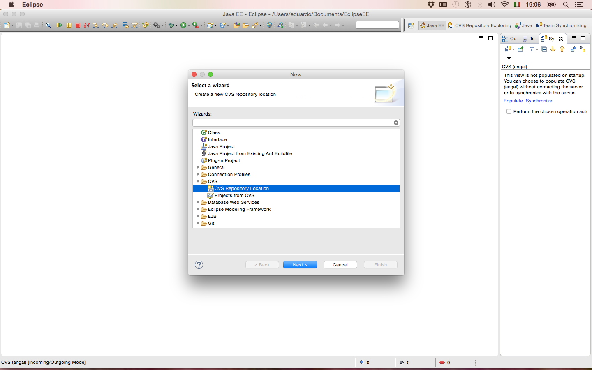

[upperalpha, start=2]
. Fill the “Host” field with http://openhospital.cvs.sourceforge.net[[.underline]#openhospital.cvs.sourceforge.net#] and the “Repository path” field with ”/cvsroot/openhospital”. Select “pserver” as connection type and “anonymous” as user, then click on “Next” button. +
 +
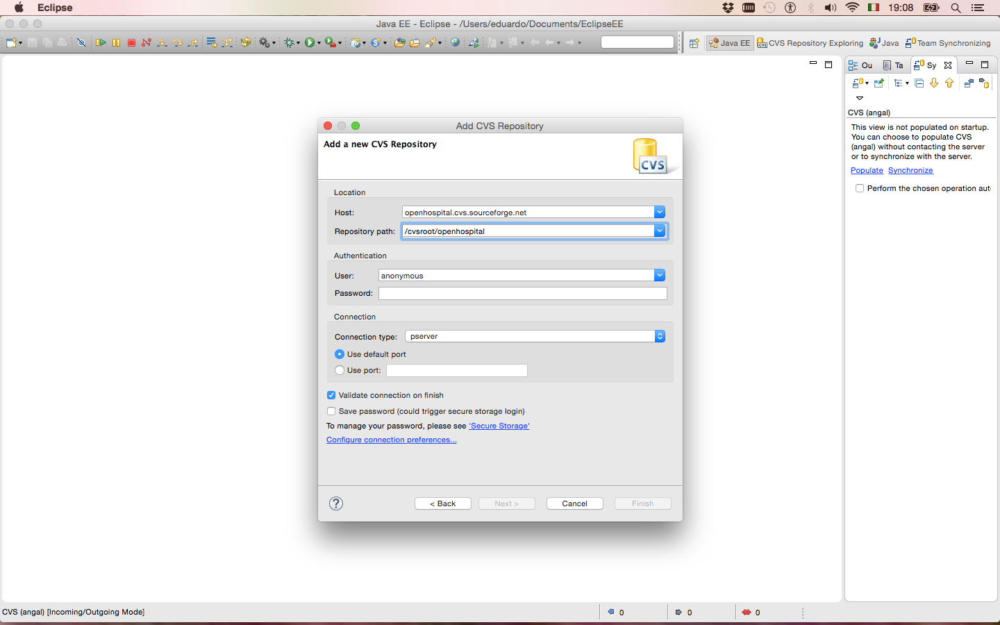

[upperalpha, start=3]
. A “Confirm Open Perspective” window is shown. Click “Yes” to confirm “CVS Repository Exploring” as CVS’s perspective. +
 +
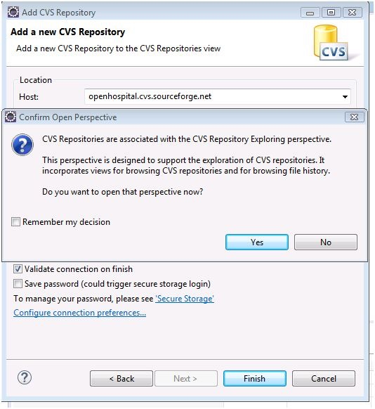
. As this window shows, the CVS has been installed. Click “Window” on the Eclipse menu, then choose Show View -> Other, then select CVS -> CVS Repositories from the “Show View” window to see the CVSs installed on Eclipse. Chapter 7.1.2 explains how to complete project creation. +
 +
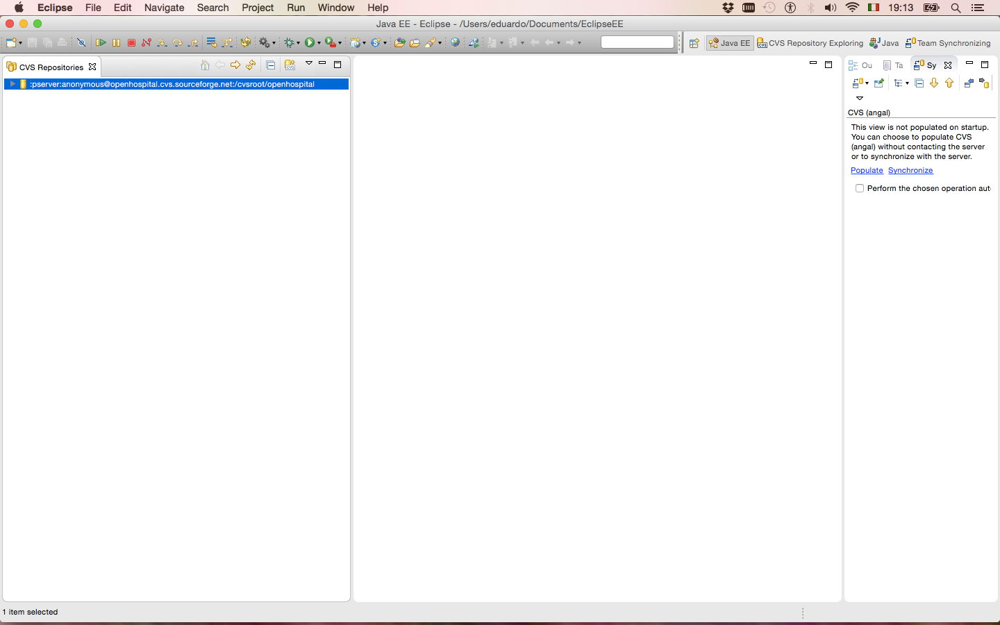

==== 7.1.2 Create a project from existing CVS repository

[upperalpha]
. Select File -> New -> Other from Eclipse’s menu. Select CVS -> Projects CVS from the “New” window, then click on “Next” button. +
 +
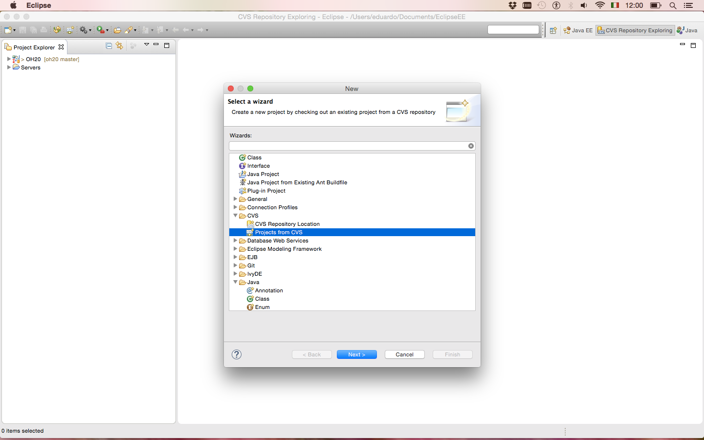
. Select “Use existing repository location”, choose “/cvsroot/openhospital” and click “Next”. +
 +
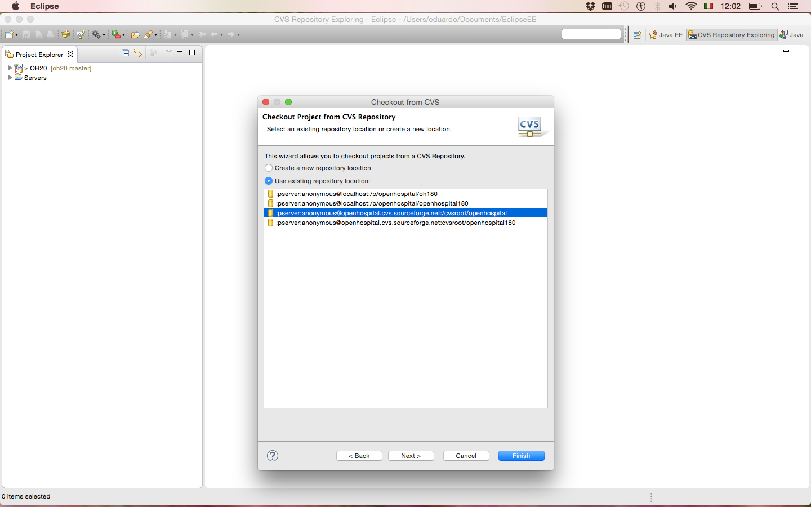
. Choose “Use an existing module…”. Select “angal” from the list below, then click “Next”. +
 +
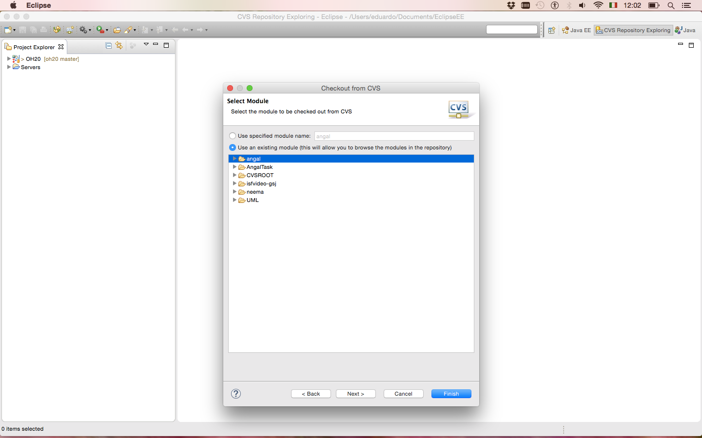
. A “Check Out As” window is shown. Select radio button “Check out as a project in the workspace” and fill the “Project Name” field with the project’s name. Eclipse allows the user to assign the name of the projects. Any project can be checked out more than once, assigning each time a different name. On this example, the project is named “angal”. Check the “Checkout subfolders” button and then click “Next”. +
 +
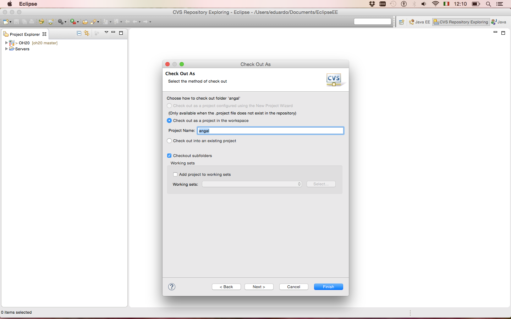
. Eclipse shows the default workspace folder. To work on a different folder, uncheck “Use default workspace location”, and choose the desired path, either typing it on the “Location” field or clicking “Browse” to select the folder. Once the workspace has been chosen, click “Next”. +
 +
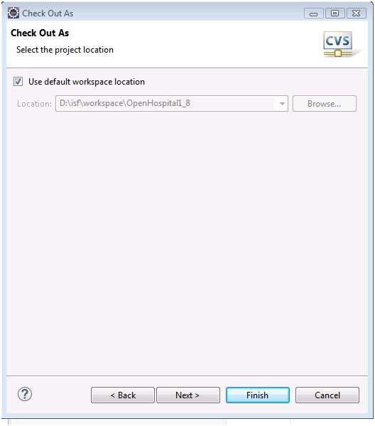
. Click on “Refresh Tags” to update “Branch” and “Version” tags. Click on the triangle near “Version” to expand the tag, choose the oh_1_8_0 version and close the window by clicking on “Finish”. This will checkout (download) the related version. +
 +
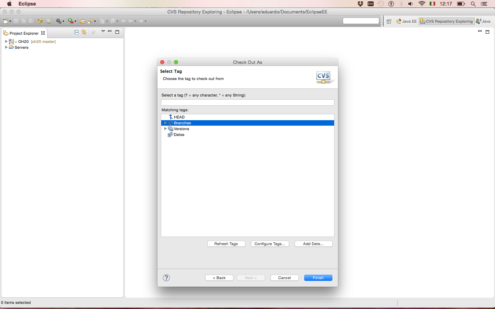
. Now the project files will be synced with the CVS. A slider shows the progression, and once the synchronization is complete, the files will be loaded in the “angal” project. To visualize projects on Eclipse, select Window -> Show View -> Project Explorer from the main menu. +
 +
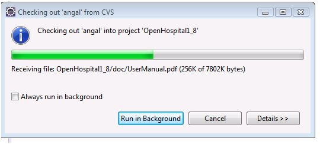

=== 7.2 Add Libraries to the Project

[upperalpha]
. A red “X” is shown on “angal” project because the JVM has not already been linked to the project. Right-click on project’s name and select “Properties” from the pop-up menu.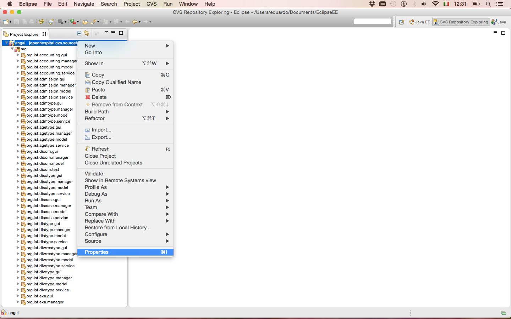

[upperalpha, start=2]
. The “Properties for angal” window is shown. Select “Java build path” from the list on the left side. Four tabs - “Source”, “Projects”, “Libraries”, “Order and Export” - are shown on the top of the window. Select “Libraries” tab, then click “Add Library”.

[upperalpha, start=3]
. A new “Add Library” window opens. Select “JRE System Library” and click “Next”. +
 +
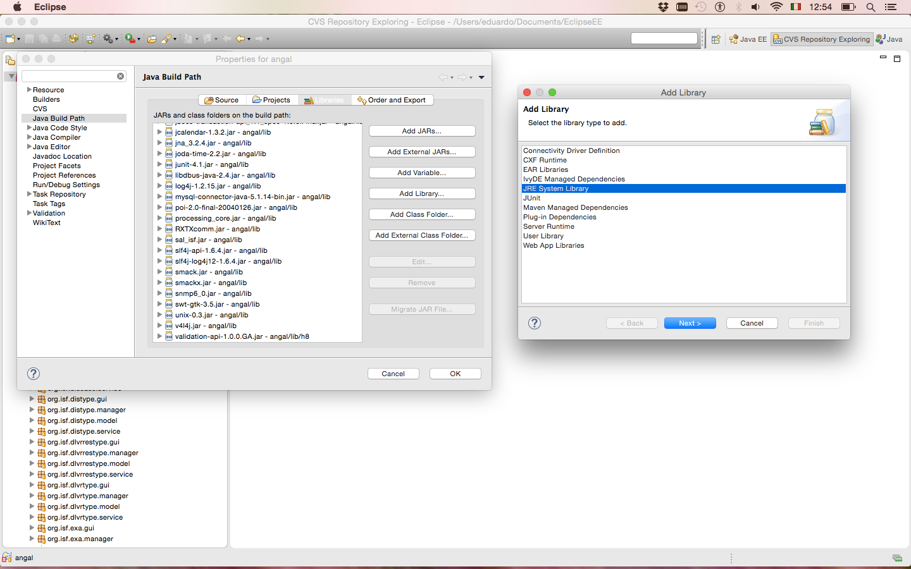

[upperalpha, start=4]
. If JRE 1.6 or higher is already installed on the computer, “Workspace default JRE” can be selected, otherwise choose either “Execution environment” or “Alternate JRE” and select the JRE version from the drop-down menu. Click “Finish” to close the window. The library is added to the .jar files and the class folders in the build path. +
 +
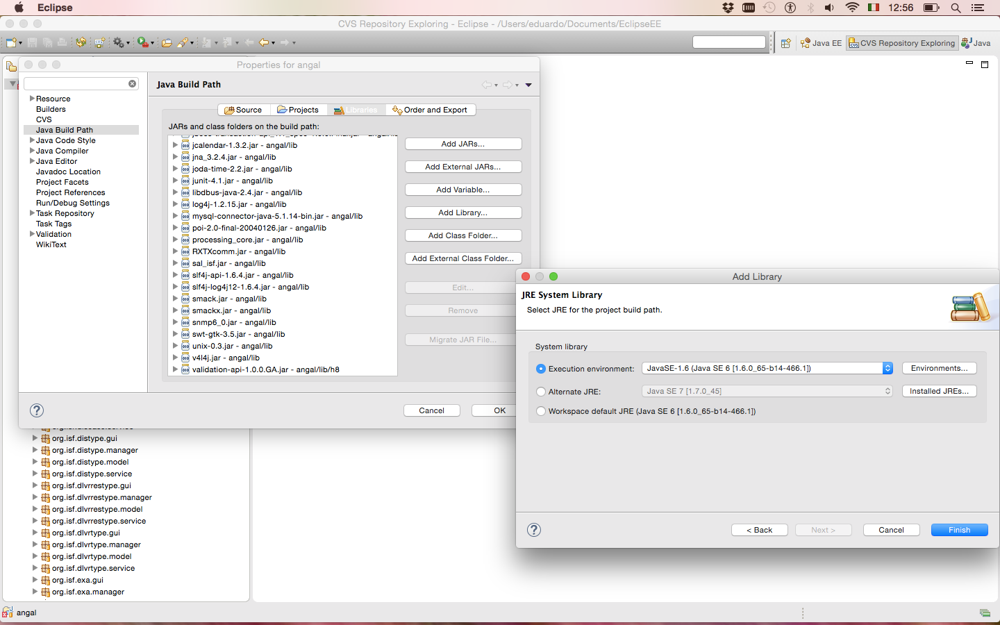

[upperalpha, start=5]
. Click “OK” on the “Properties” window to close it. The “X” disappears from the project as the JVM has been linked to. It may be replaced with a yellow warning triangle with an exclamation mark on it. Warnings won’t influence on current project execution.
. In order to launch the project, you need also to add as “Class Folder” the folder “bundle” and “rpt” that will be requested at runtime

Before running the project, an update with the existing CVS might be required. Right click on project’s name, then select Team -> Synchronize with Repository. +
 +
_*NB:* Since version 1.8.3, the code is available on GIT over the SourceForge website at this link:_

https://sourceforge.net/p/openhospital/openhospital/ci/master/tree/[_https://sourceforge.net/p/openhospital/openhospital/ci/master/tree/]

_Please use EGit (Eclipse Plugin for Git) in order to clone the code on your Eclipse)_

[upperalpha, start=7]
. 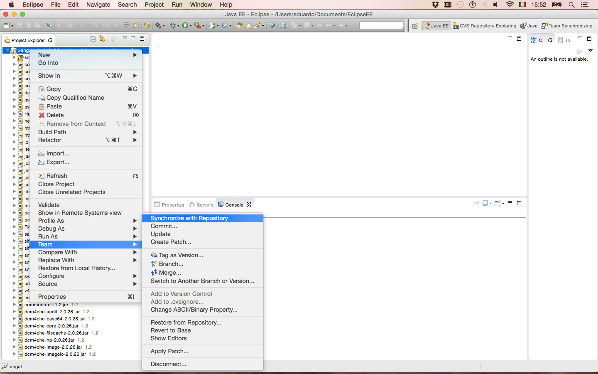
. Click “Yes” on the “Confirm Open Perspective” window to allow the perspective sync the project. +
 +
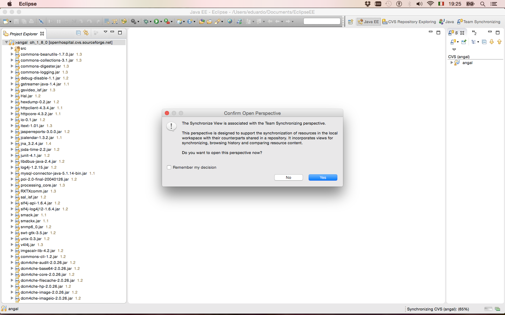

=== 7. 3 Run the Project

[.underline]#Before to run the project, the DB must be created as explained in chapter 3.1.2# [.underline]####MySQL Server and OpenHospital DB

[upperalpha]
. OH’s advanced features require “native” libraries, with the same language of the computer’s operative system. Right-click on project’s name, then select Run As -> Run Configurations. +
 +
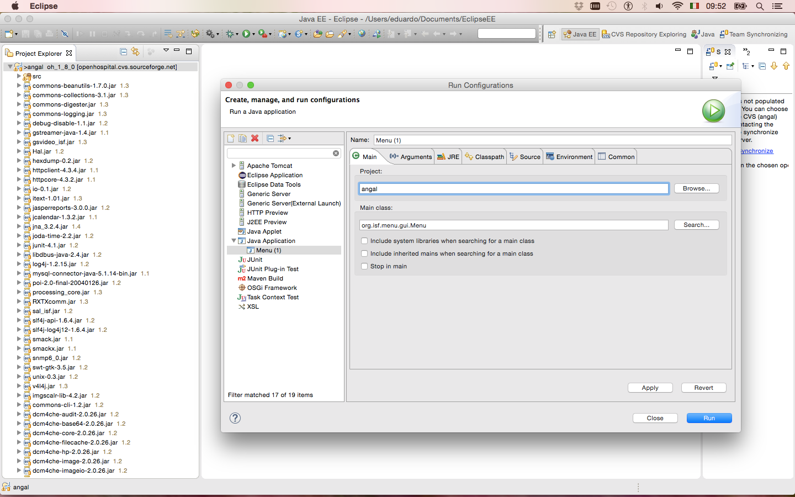

[upperalpha, start=2]
. A “Run Configurations” window opens. Choose Java Application -> <application’s name> - Menu (1) on this example. Select the “Main” tab, write “angal” on the “Project” field and check if the “Main class” is org.isf.menu.gui.Menu.
. Select the “Arguments” tab and fill the “VM arguments” path typing: +
-Dsun.java2d.dpiaware=false -Djava.library.path=lib\native\<OS name> +
 +
OS name can be “Mac_OS_X”, “Solaris”, “Linux”, “Win64” (for 64-bit Windows) or “Windows” (for 32-bit Windows) according with the folders schema you find in the related folder “native”. Click on “Run” to close the window and run the application. +
image:extracted-media/media/image63.png[image,width=604,height=337]

[upperalpha, start=6]
. Now that the run configuration settings have been selected, OH can be launched by just clicking on the “Run” button (shown below by an arrow). +
 +
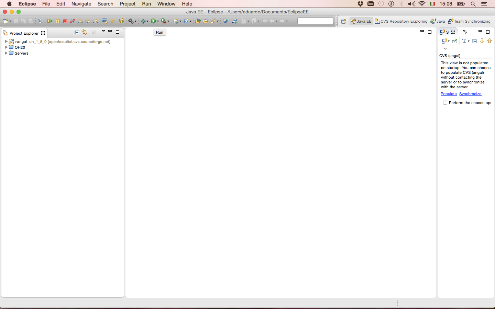 +
image:extracted-media/media/image65.png[image,width=604,height=377]
. Because of default settings, OH’s first run will not show the login window. The system is set in “single user” mode as default. Proof is the “SINGLEUSER=yes” string on the third row of the generalData.properties file. This is way different in the real world, where OH must be accessible to the administrator and logged users only. Click on the triangle near to the project’s name, do the same on the “rsc” subfolder and then double-click on the generalData.properties file. +
 +
image:extracted-media/media/image66.png[image,width=604,height=273]
. Replace “yes” with “no” on the “SINGLEUSER” row. Press CTRL+S (or Command+S on Mac) to save the change.
. After the splash window, a “login” window opens. Click on the drop-down menu to choose the role. To access as administrator, select “admin” and type the password. Default is “admin”. The administrator has the right to register users as guests. Guests have to choose “guest” from the drop-down menu and then type their password. +
 +
image:extracted-media/media/image67.png[image,width=604,height=377] +
 +
If the password is not correct, an error message is shown, asking the user to try again.
. In order to better understand the processes underneath the software you may also enable the “Standard Output” in log4j.properties as explained in chapter link:#5-6-log4j-properties[log4j.properties].

== 8 Update OpenHospital

=== 8.1 Update OpenHospital (non-portable)

_*[.underline]#NB#*: Following instructions only applies between “official releases” downloaded from SourceForge website._

New releases, as well as this Manual and User Manual, are regularly released on SourceForge platform at the link: +
https://sourceforge.net/projects/openhospital/files/

There are two type of releases:

[arabic]
. Major Releases: the first or second number changes (e.g. **1.**7.3 -> **1.**8.0)
. Minor Releases: only the third number changes (e.g. **1.8.**1 -> **1.8.**2)

*Minor Releases*:

Changes are in the CHANGELOG file

Minor Releases (if not otherwise specified) don’t need changes to the DB, so you can replace you working copy on each client with the new one and connect it to the same DB (see database.properties, link:#5-6-log4j-properties[log4j.properties] and h8.properties).

Only pay attention to keep files that have been changed, especially configuration settings (see Configuration Files). The most common way is to backup your working copy and re-apply those settings in the new one (see Backup of code and settings (Software)).

*Major Releases*:

Changes are in the CHANGELOG file

Major Releases includes always changes to the DB, and these changes are given by the different scripts included in the mysql folder (e.g.):

[cols=",",options="header",]
|===
|*OpenHospital_1_7_3.zip* |*OpenHospital_1_8_0.zip*
|*OpenHospital_1_7_3/mysql/* |*OpenHospital_1_8_0/mysql/*
a|
…

step_30_help_manual.sql

step_31_alter_tables_innodb.sql

step_32_convert_birthdate_to_date.sql

step_33_grants_on_patientfolder.sql

a|
…

step_30_help_manual.sql

step_31_alter_tables_innodb.sql

step_32_convert_birthdate_to_date.sql

step_33_grants_on_patientfolder.sql

*step_34_slim_opd_table.sql*

*step_35_doctors_log.sql*

*step_36_patientexamination_and_rollback_step23.sql*

*step_37_suppliers_table.sql*

*step_38_dicom.sql*

*step_39_patientfolder_submenu.sql*

*step_40_sms_module.sql*

*step_41_common_bundles.sql*

*step_42_procedure_accounting.sql*

*step_43_no_payments_fix.sql*

*step_44_lot_cost.sql*

*step_45_new_pharmacy_alter_table.sql*

*step_46_patients_birthdate.sql*

*step_47_ipd_out_disease.sql*

*step_48_male_female_wards.sql*

*step_49_encrypt_passwords.sql*

*step_50_medical_ward_permissions.sql*

*step_51_rectify_medical_ward.sql*

*step_52_therapy_model_changes.sql*

*step_53_sms_module_extension.sql*

*step_54_enable_sms_on_visits.sql*

|===

So, the update process will be as follow:

[arabic]
. Close the program if still running
. Backup you current DB for safety (see Backup & Restore)
. Open a terminal in the folder mysql/ (e.g.):
+
*C:\WINDOWS\system32> cd D:\OpenHospital_1_8_0\mysql*
+
*D:\OpenHospital_1_8_0\mysql> +
*
. and run the following commands (e.g.):
+
*D:\OpenHospital_1_8_3\mysql> mysql –u root -p*
+
*Enter password: **** +
*
. Using the ‘root’ password you have chosen during the installation process. The terminal should reply with the MySQL client command line prompt:
+
*mysql> +
*
. We launch one by one all the scripts which differs from previous version command:
+
*mysql> source step_34_slim_opd_table.sql*
+
*mysql> source step_35_doctors_log.sql*
+
*mysql> source step_36_patientexamination_and_rollback_step23.sql*
+
*mysql> source step_37_suppliers_table.sql*
+
*mysql> source step_38_dicom.sql*
+
*mysql> source step_39_patientfolder_submenu.sql*
+
*... +
*
. Take notes if any error message occurs and report to: +
https://sourceforge.net/p/openhospital/support-requests/
. If everything is done OK, replace you working copy on each client with the new one and connect it to the same DB (see database.properties, log4j.properties and h8.properties). Only pay attention to keep files that have been changed, especially configuration settings (see Configuration Files). The most common way is to backup your working copy and re-apply those settings in the new one (see Backup of code and settings (Software)).
. Start the program and check from log files (OpenHospita_1_8_0/logs) the new version running and no error messages.

=== 8.2 Update OpenHospital “portable”

_*NB*: OpenHospital portable is not meant to be used in production environment so, if you want to update a portable version in order to keep the previous data, we strongly suggest to switch to a fully installation as follow:_

[arabic]
. MySQL Server installation
. Start OpenHospital portable and while running (port 3307):
[loweralpha]
.. Backup of data (Database)
. Close OpenHospital portable
. Restore of data (Database)
. Change settings to point to the new database (see database.properties, h8.properties and log4j.properties)

In order to update the OpenHospital “portable” version without perform a full installation, please contact us at: info@informaticisenzafrontiere.org

Specifing:

* Brief history of your installation and use of OpenHospital
* OpenHospital version used and version you need
* Country and language used
* The https://goo.gl/forms/rXgcYTWpAyp9Eyqw1[OpenHospital Assessment online-form] filled.
