= Users’s Guide 1.8.4
:icons: font
:stem:
:toc: left
:toclevels: 4
:url-docs: https://asciidoctor.org/docs
:url-gem: https://rubygems.org/gems/asciidoctor

User’s Guide

== OpenHospital

== 1 Abstract

This application is the first of a set of software products that ISFfootnote:[Informatici Senza Frontiere = Computer scientists without frontiers] has developed to support the management and the activities of the St. Luke Hospital in Angal (Uganda). After that mission, the St. Luke Hospital has become only the first one of a long list of hospitals that found this software useful.

All the work was realized as an open-sourcefootnote:[Open-source = software for which the original *source code* is made available to anyone free of charge.] project using only open-source development software.

This application software consists of the following parts:

* Pharmacy management
* Laboratory management
* OPD management
* Patient admission and discharge management
* Pregnancy management
* Malnutrition control management
* Vaccines database
* Patient billing support
* Therapy management
* Internal communication
* Statistics and printing

This document describes how all the above-mentioned items work and gives you some suggestions on the correct use of the program.

The reader will not find in this manual the information he needs for the installation of the application software or for administrative purposes; to have such information you should consult our Administrator’s Guide, supplied with the application software.

== 2 Introduction

The aim of this program is to manage, in the simplest manner, the hospital administrative operations like registering patients and laboratory analysis, and to produce statistics for the health ministry. In the following chapters the users will find all the information they need in order to use properly the program.

== 3 Useful Information before reading this user manual.

=== 3.1 Help

* The *[.underline]##H##ELP* function available on the bottom of the main MENU of OpenHospital allows you to access [.underline]#offline# this document.

=== 3.2 Legenda

In this document will be used following conventions:

* When in the text of this document you find a word written in bold and highlighted in grey *–* like *[.underline]##P##harmacy* or *[.underline]##N##ew –* it indicates a function of the application and it is also called “button”. *[.underline]##P##harmacy* is a button.

* When you find a text written in bold Italic (as an example *_Laboratory browsing)_* it indicates the screen with name “Laboratory browsing” (see example below). Each screen of the application is called window. *_Laboratory browsing_* is a window.
* When you find a text written in bold as - *Search patient visits –* it indicates a function of the application, or an area of the window (as an example *Data table*).

* Each button has always one letter with an underscore. You can select the functionality offered by the button pressing the “Alt” key and at the same time the “underscored” key (in the example of *[.underline]##P##harmacy* you have to press “Alt” and “P”)*.* This behaviour is common all over the application and allows the user to operate (almost) without the use of the mouse. In the entire document “Alt” key and the “P” key will be indicated as “Alt + P”.

image:extracted-media/media/image2.png[../../Screen%20Shot%202019-07-26%20at%2015.14.49.png,width=599,height=434]

* Each screen of the application is called “window”. Most complex windows of the application are composed by more than one area. Areas can be *Selection panel*, *Data table* and *Buttons panel* (see *_Laboratory browsing_* window below)

image:extracted-media/media/image3.png[../../Screen%20Shot%202019-07-26%20at%2015.15.43.png,width=642,height=464]

* Highlight of a record. To highlight a record (it is a line on a *Data table*) you have to click with the mouse on the record. The record (all the line) will be highlighted in blue. This is valid all over the application (see example below):

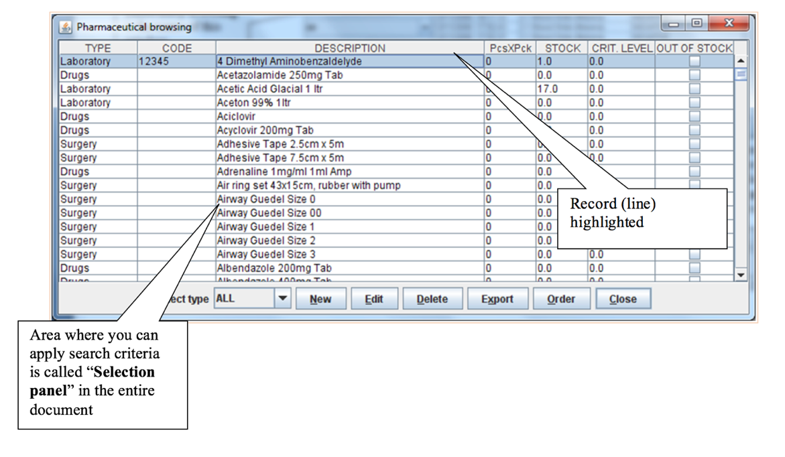

==  4 Run the application

After double-clicking the program icon on your desktop, you will see an information image (splash image) for a few seconds and then the main _menu_ of the OpenHospital application will appear.

image:extracted-media/media/image5.png[image,width=192,height=390]

From a menu you can get to another menu of deeper level, as in the example below. From the main *_menu_* you get the *_General data_* menu, or you can directly go in a function of the application (see the following example with the browser *_OPD Out Patient Department_*.

image:extracted-media/media/image6.png[../../Screen%20Shot%202019-07-26%20at%2015.19.33.png,width=602,height=370]

or you can directly go in a function of the application, as following example:

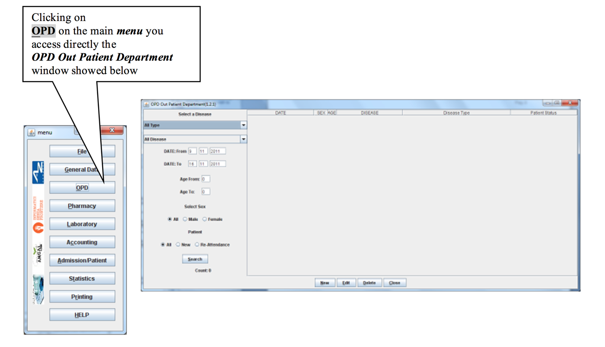

== 5 Outpatient Department Management ([.underline]##O##PD)

=== 5.1 Main Characteristics

Out Patient Department functionalities allow to record Ambulatory Patient visits, search, review, edit and eventually delete visits, and allows queries necessary for statistical purposes.

Click on *[.underline]##O##PD* button or press “Alt + O” in the main *_menu_* to access OPD function.

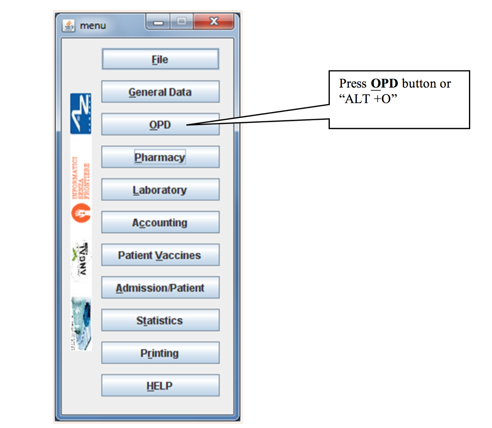

=== 5.2 Functions of Out Patient Department

All functions available under *[.underline]##O##PD* are accessible from the window *_OPD Out Patient Department_* showed below.

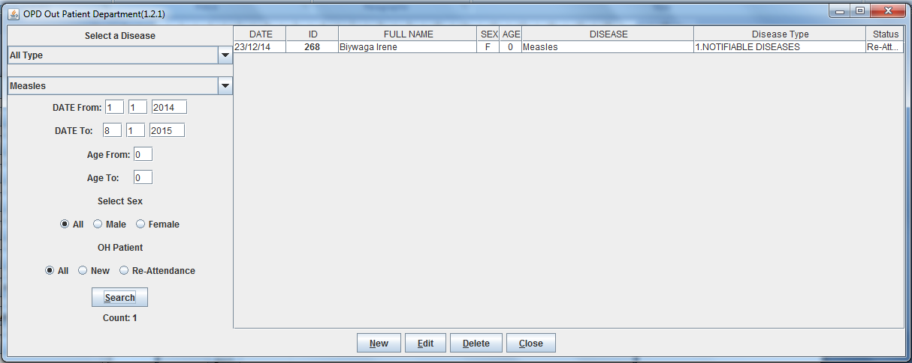

The following functions are available from the *Buttons Panel* of the window *_OPD Out Patient Department_:*

* *[.underline]##N##ew* to create a new patient visit
* *[.underline]##E##dit* to modify an already stored patient visit
* *[.underline]##D##elete* to delete a patient visit
* *[.underline]##C##lose* to exit from the function *_OPD Out Patient Department_*

Furthermore, a search function (*[.underline]##S##earch*) is available using the *Selection Panel* on the left of the window.

==== 5.2.1 Search patient visits ([.underline]##S##earch)

Queries about Ambulatory Patient Visits can be done using the search criteria available on the *Selection Panel* area of the window (left side of the window).

Doing the selection, data about patients can be selected by choosing specific fields among the following ones:

* *Disease type.* You can select one or all disease types
* *Disease.* You can select one or all the diseases
* **Date. “**DATE From” and “DATE To” allow the selection of all the visits performed over the requested period
* **Age. “**Age From” and “Age To” allow the selection of all the patients by age
* *Sex.* Allow the selection of all the patients by sex: All / Male / Female
* *Type of patient.* Allow the selection of all the visits by attendance: All / New / Re-Attendance
* *Count.* Counter at the bottom counts for you how many visits match your criteria after pressing the *[.underline]##S##earch* button.

After having chosen press *[.underline]##S##earch* button. The system will show on the *Data table* area results of the search applying criteria requested by you.

In the example hereinafter all the visits of patients with Asthma disease admitted in the period from 2006-11-01 until 2006-11-15 of all the ages, all sex, all patient types are showed.

image:extracted-media/media/image10.png[image,width=642,height=337]

==== 5.2.2 Create a new patient visit ([.underline]##N##ew)

Press *[.underline]##N##ew* button in the *_OPD Out Patient Department_* window to access the *_New OPD registration_* window showed below.

image:extracted-media/media/image11.png[image,width=391,height=435]

To record a visit, enter the following fields:

* *Type of attendance.* This field is not meant to distinguish whether an individual is new or not in the ambulatory (absolutely first time he/she enters the ambulatory). The NEW ATTENDANCE is devoted to cases when Patient (at his first or n-th time in the ambulatory it does not care here) comes to the Ambulatory to report a new health issue / new disease for which no care has already been addressed and recorded. The re-attendance is – on the contrary – the case of records created when a Patient comes back to the Ambulatory in order to follow-up a past new attendance when he/she received cares and previous instructions to recover. _ +
 +
Example: a Patient comes to the ambulatory because he/she reports a cut ==> this event is recorded as NEW ATTENDANCE and Doctor sutures the wound and invites Patient to come back ten days later; then same patient comes back after ten days to have his/her stitches removed: a new OPD record is then created but with no NEW ATTENDANCE flag set. +
_
* *Date of the visit*. Date in which Patient is met for recorded activity.
* *Disease Type:* By selecting a _DiseaseType_ the first diagnosis list will contain only its related diseases. Second and third list will still contain all diseases. +
 +
_*[.underline]#NB#*: Disease Types can be defined by the Administrator._ _Ask to your Administrator how to do it or see link:#14-general-data-general-data[General Data] in this document. +
_
* *Diagnosis.* Maximum three diseases can be diagnosed per each attendance (“new attendance” or “re-attendance” it does not care in this context). Normally patient reports at least one visit reason but it may happen that during same visit the Doctor finds other concurrent pathologies thus here possibility is given to record till maximum three (the first being the only one mandatory). +
It is possible to filter in order to find diseases more easily. To do so, you will need to enter a text fragment in the search field that is part of the disease name. The closer the search text comes to the name of the disease being searched, the more precise the search is. +
 +
_*[.underline]#NB#*: in the *OPD Out Patient Department* window only first diagnosis and its type will be show, anyway all data are stored and processed in reports and searching._
* *Patient age*. Validity range is 0-200.
* *Patient sex*. Male/female

When you finish entering data in the *Buttons Panel* you have the following choices:

* *[.underline]##O##k* to confirm and record patient visits
* *[.underline]##C##ancel* to close the window and to return to the Menu

==== 5.2.3 Modify a recorded patient visit ([.underline]##E##dit)

First of all, to modify a visit you have to highlight it in the *_OPD Out Patient Department_* window. Once you’ve done this, press the *[.underline]##E##dit* button. When the *_Edit OPD registration_* window showed below appears, the record is available for changes. All data can be changed.

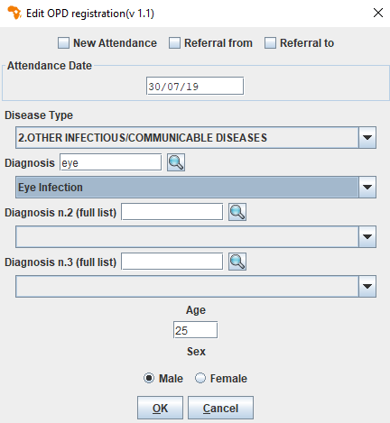

When you finish entering data in the *Buttons Panel* you have the following choices:

* *[.underline]##O##k* to confirm new values (all the previous values will be lost)
* *[.underline]##C##ancel* to close the window and to return to the *_OPD Out Patient Department_* window without applying any change.

==== 5.2.4 Delete a recorded patient visit ([.underline]##D##elete)

First of all, to delete a stored visit you have to highlight it in the *_OPD Out Patient Department_* window. Secondly press the *[.underline]##D##elete* button. The highlighted record will be showed as in the *_New Hospital_* window below. Now the record can be deleted. Deleted records won’t be available anymore.

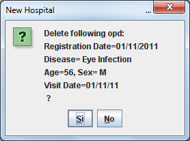

In the *Buttons Panel* you have the following choices:

* *[.underline]##S##i* to confirm the record deletion
* *[.underline]##N##o* to close the window and return to the previous window without delete the record

=== 5.3 OPD Extended (OPD v1.3)

Since OpenHospital version 1.3.1 you can extend the OPD functionality by changing the _OPDEXTENDED_ flag in the configuration file. Ask to your Administrator how to do it or read the _Administrator’s Guide_.

==== 5.3.1 New features

Press *[.underline]##N##ew* button in the *_OPD Out Patient Department_* window to access the *_New OPD registration (1.3)_* window showed below.

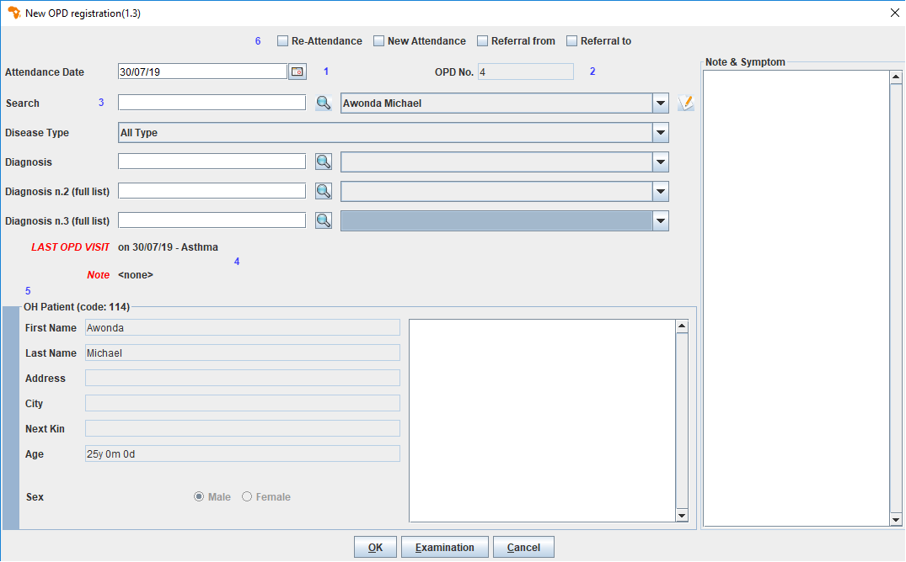

The OPD Extended module affords the following improvements:

* Calendar to choose the visit date (1);
* OPD number now is visible (2):it is the progressive number per year automatically set by the system, anyway you may change it if needed. The OPD number MUST be unique for each year;
* Registered Patient (3): before to choose a disease, you MUST select a patient first from the drop-down list; you can even fast search the patient with the search field nearby by typing part of its name or code; this will improve reliability for reports and statistics, thus service to the patients by knowing his/her history.
* one time the patient is selected and previous OPD visit is found from the program, special fields will be populated with the most recent visit of the patient (4), thus his/her personal data (5), re-attendance checkbox will be selected automatically (6);
* in case you want to insert a new attendance for this patient you can check the "new attendance" check box on and proceed normally;
* in case of editing an old OPD it is possible to change everything except the patient, which the OPD refers to, and the "new-attendance" check box;
* in case the selected patient needs to update his/her personal data, you can do it by clicking on the Edit icon image:extracted-media/media/image15.png[edit_button.png,width=26,height=26] near his/her name; a new window will appear with the patient personal information to let you change them;
* in case the patient is not yet registered, the *_<new patient>_* entry can be selected to let you register the new patient; after registration you will be direct back to the OPD window and the new patient will be selected.
* If the user is enabled by the admin (see *_15._* *_Users & Groups_* ([.underline]#File# -> _[.underline]#Users#_)), you will see also the “Examination” button function (see *_10.5.2_* *Patient examination*)

== 6 Pharmacy ([.underline]##P##harmacy)

By pressing *[.underline]##P##harmacy* from the main menu, you access the Pharmacy menu. From this menu you have the following functions available: *[.underline]##P##harmaceuticals* and *[.underline]##P##harmaceuticals Stock*, *[.underline]##P##harmaceuticals Stock Ward.*

image:extracted-media/media/image16.png[../../Screen%20Shot%202019-07-26%20at%2015.23.44.png,width=641,height=433]

_*[.underline]#NB#:* Pharmaceuticals Stock Ward functionality can be disabled by changing the INTERNALPHARMACIES flag in the configuration file**.** Ask to your Administrator how to do it or read the Administrator’s Guide._

=== 6.1 Pharmaceuticals ([.underline]##P##harmaceuticals)

==== 6.1.1 Main Characteristics

Pharmaceutical functions allow you to insert, to modify and to delete pharmaceuticals. Moreover, it provides important information about pharmaceuticals:

* the current quantity lying in the stock
* the limit quantity that defines when a pharmaceutical is going out of stock
* if the pharmaceutical is out of stock
* the expiring drugs within today or a period

Note: in OpenHospital to identify pharmaceuticals sometimes is used the word “pharmaceutical” and in others the synonymous “Medical”.

==== 6.1.2 Functions of pharmaceuticals

To access the functions of Pharmaceuticals, press *[.underline]##P##harmaceuticals* on the Pharmacy menu.

All functions available under Pharmaceuticals are accessible from the *_Pharmaceutical browsing window_* showed below. It displays all the pharmaceuticals available in the hospital.

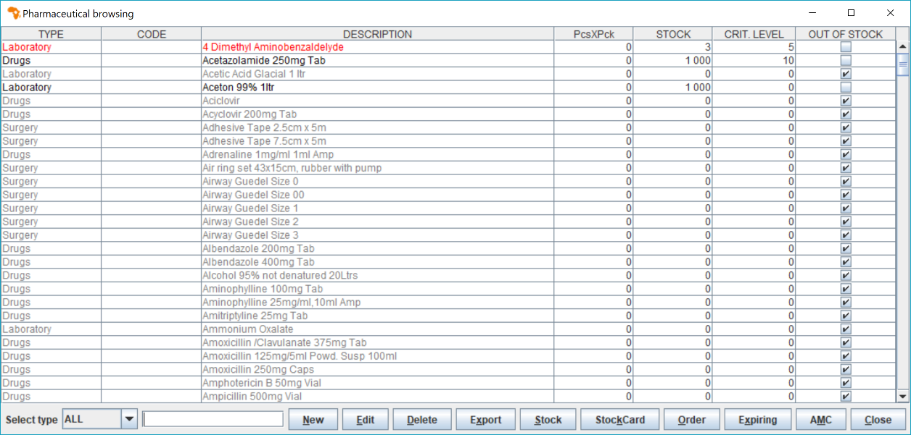

If the pharmaceutical quantity is under the critical level it will be shown in RED.

If the pharmaceutical quantity is zero it will be shown in GRAY and the square in the last column will be checked.

The following functions are accessible from the *Buttons Panel* of the *_Pharmaceutical browsing window_*:

* *[.underline]##N##ew* to register a new pharmaceutical
* *[.underline]##E##dit* to modify an already registered pharmaceutical.
* *[.underline]##D##elete* to delete a pharmaceutical.
* *[.underline]##E##xport* to export the pharmaceuticals to a CSV file (Excel)
* *[.underline]##S##tock* to show the report of stock quantities
* *Stoc[.underline]##k##Card* to show the movements history for a certain pharmaceutical (you must select it in the list first)
* *[.underline]##O##rder* to show the list of pharmaceuticals that have to be ordered.
* *[.underline]##E##xpiring* to show the list of pharmaceuticals that are going to expire (today, next month, within two months, within three months, or within another month to be specified)
* *A[.underline]##M##C* to show the Average Monthly Consumption
* *[.underline]##C##lose* to exit from the *Pharmaceuticals browsing*

On the left a particular combo box is placed. According to its selection, the table will display pharmaceutical of a specific type. By default, it's selected on the ALL option. Another empty field just aside the combo box, will allow to search a certain pharmaceutical (DESCRIPTION) by typing a keyword.

Since version 1.8.4, it is possible to sort the table by any of the column header by double clicking on its column name. Filtered type (combo box), searched keys (the aside field) and sorting are reflected in the STOCK report.

===== 6.1.2.1 Insert a new pharmaceutical ([.underline]##N##ew)

Press *[.underline]##N##ew* button in the *_Pharmaceutical browsing_* window to access the *_New medical record_* window showed below.

To insert a new pharmaceutical, enter the following fields:

* *Type* (for instance, Drugs or Chemical) +
 +
_*[.underline]#NB#*: Types can be defined by the Administrator._ _Ask to your Administrator how to do it see link:#14-general-data-general-data[General Data] in this document +
_
* *Code*: code that identify univocally your pharmaceutical for fast searching
* *Description*: the description of the pharmaceutical
* *PcsXPck*: Pieces per packet (if more than 1)
* *Critical level*: the minimum quantity required in stock

image:extracted-media/media/image18.png[image,width=350,height=263]

When you finish entering data in the *Buttons Panel* you have the following choices:

* *[.underline]##O##k* to confirm data
* *[.underline]##C##ancel* to close the window and to return to the Menu

===== 6.1.2.2 Modify an existing pharmaceutical ([.underline]##E##dit)

Press *[.underline]##E##dit* button in the *_Pharmaceutical browsing_* window to access the *_Editing medical record_* window showed below. You can modify all data unless “Type”

image:extracted-media/media/image19.png[image,width=350,height=280]

When you finish entering data in the *Buttons Panel* you have the following choices:

* *[.underline]##O##k* to confirm data
* *[.underline]##C##ancel* to close the window and to return to the Menu

===== 6.1.2.3 Delete a pharmaceutical ([.underline]##D##elete)

In order to delete a pharmaceutical, you have to highlight it before. Secondly press the *Dele[.underline]##t##e* button. *_The Edit Medical Record window_* appears.

image:extracted-media/media/image20.png[image,width=308,height=128]

In the *Buttons Panel* you have the following choices:

* *[.underline]##Y##es* to confirm the record deletion
* *[.underline]##N##o* to close the window and return to the previous window without deleting the record

===== 6.1.2.4 Export the list of pharmaceuticals ([.underline]##E##xport)

Use this function to export on excel the list of pharmaceuticals showed in the *_Pharmaceutical browsing_* window.

Press *[.underline]##E##xport* button in the *_Pharmaceutical browsing_* window to access the *_Save_* window showed below. It will be in the language of your computer, no matter the language used in OpenHospital.

Then you can start the export of the list of pharmaceuticals.

In the *_Save_* window you have to:

* select the directory of your file system where you want to store the file

* input the name you want to give to the file (Filename)

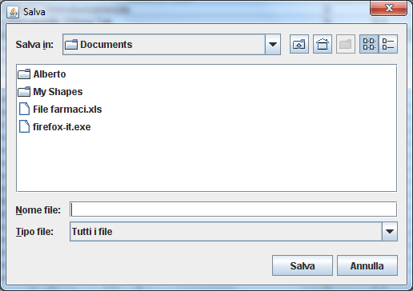

===== 6.1.2.5 Stock report ([.underline]##S##TOCK)

Press *[.underline]##S##TOCK* button in the *_Pharmaceutical browsing_* window to produce the report of pharmaceuticals in the stock grouped by _IN STOCK_ and _OUT OF STOCK_.

===== 6.1.2.6 Order of pharmaceuticals ([.underline]##O##rder)

Press *[.underline]##O##rder* button in the *_Pharmaceutical browsing_* window to produce the list of pharmaceuticals remaining in stock and the ones to be reordered according with their critical level.

===== 6.1.2.7 Order of pharmaceuticals ([.underline]##E##xpiring)

Press *[.underline]##E##xpiring* button in the *_Pharmaceutical browsing_* window to produce the list of pharmaceuticals that are going to expire grouped by type and lot.

=== 6.2 Pharmaceutical Stock (Pharmaceutical [.underline]##S##tock)

==== 6.2.1 Main Characteristics

The Pharmaceutical Stock feature helps you to store and trace every stock movement that has been made. Every movement is identified by the following data:

* date of the movement
* type of the movement, that is, if it’s a charging or discharging one
* the ward that the movement refers to. This characteristic is needed for discharging movements only. In fact, it’s important to know in which ward pharmaceuticals have been used, otherwise this field will appear empty
* the quantity
* the pharmaceutical (which in turn relates to different categories: Laboratory, Surgery, Drugs or Chemical)
* the lot which the movement is referred to. Actually, there are some pharmaceuticals that may not have a lot related (for example ‘Gloves’), so you can omit this field. But it’s recommended to store even the lot (if it exists), because every lot has its own peculiarity:
** a name (that can be its code)
** a preparation date
** a due date
+
In this way you can find which movement refers to the pharmaceuticals that are expiring, or pharmaceuticals prepared in a specific date, or how many movements have been registered about that lot, and so on.
* the supplier of the pharmaceutical. This characteristic is needed for charging movements only. This field will appear empty in other cases

==== 6.2.2 Functions of Pharmaceuticals Stock 

To access the functions of Pharmaceuticals, press *Pharmaceutical [.underline]##S##tock* on the Pharmacy menu showed below.

image:extracted-media/media/image22.png[image,width=220,height=182]

The window *_Stock movement browser_* showed below will be opened. All functions available under Pharmaceutical Stock are accessible from the *_Stock movement browser_* window.

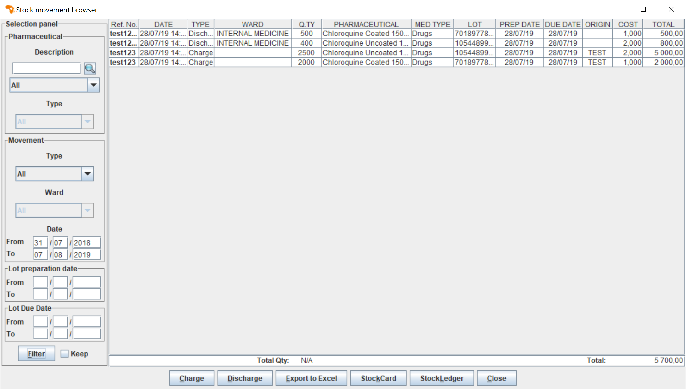

The following functions are available from the *Buttons Panel* of the window *_Stock movement browser_:*

* *[.underline]##C##harge* you use it to record a new charge movement
* *[.underline]##D##ischarge* you use it to record a new discharge movement
* *[.underline]##E##xport to excel* to export pharmaceuticals stock movements

* *Stoc[.underline]##k## Card* to show the movements history for a certain pharmaceutical (can be directly selected by the list otherwise will be requested)

* *[.underline]##C##lose* button, to exit from the *_Stock Movement Browser_* window

As you can see, there’s no “Delete” button as you’re not allowed to delete a movement; but if a mistake occurs - for example you’ve inserted the wrong quantity of a pharmaceutical in charge – you must just insert the new movement to correct the mistake – a discharge movement in this example.

Furthermore, a search function (*[.underline]##F##ilter)* is available using the Selection panel on the left of the window.

===== 6.2.2.1 Search pharmaceuticals stock movements ([.underline]##F##ilter)

image:extracted-media/media/image24.png[image,width=169,height=507]

Using *_Stock Movement Browser_* search function, you can filter and show on the window useful information such as:

* how many boxes of pharmaceutical remains in the stock
* which movements have been made in a specific day
* in which ward a specific pharmaceutical has been discharged
* if there are any pharmaceutical expired

Queries about movements of pharmaceuticals can be done using the search criteria available on the *Selection panel* area of the *_Stock movement browser_* window (left side of the browser). Results of your search are showed on the *Data table* area.

The selection panel is used to select a group of movements according to specific filters. You set a filter using the tools contained in the selection panel.

Filters refer to three different objects: the *Pharmaceutical*, the *Movement*, and the *Lot preparation and Lot due date*.

As far as a *Pharmaceutical* is concerned, user can choose its:

* description, that is its name
* type: Laboratory, Surgery, Chemical and Drugs

In order to avoid conflicts, you can change one of these options only. So, when the description combo box is active, the other one is not, and vice versa.

As far as *Movement* are concerned, user can choose its:

* *_Type_*: it specifies if it’s a charge or a discharge one. If you select the discharge option, then the ward combo box gets enabled. The ward combo box allows you to find any discharging movements that refer to a specific ward.
* *_Date_*: you can choose a time frame between ‘Date from’ and ‘Data to’. The date tools consist of three blank areas, which (from left to right) refer to day, month and year. As you have inserted a value on a blank area, he can move to the next one by typing the “Tab” button on the keyboard. As the window is loaded, the date is set in such a way to cover the last week by default.

Finally, as far as *Lot preparation* and *Lot due date* you can search movements that refer to specific lots by inserting:

* the lot preparation date: you have to choose a valid time span (between ‘Preparation Date From’ and ‘Preparation Date To’)
* the due date; it behaves like the lot preparation tool and the movement date tool.

Each filter can be combined with another, allowing you to obtain many possibilities.

After have chosen, press *[.underline]##F##ilter* button. The system will show on the *Data table* area results of the search applying criteria requested by you.

===== 6.2.2.2 Insert stock charging movement ([.underline]##C##harge)

To insert charging movements, you have to Press *[.underline]##C##harge* in the *_Stock movement browser_* window. The *_Stock movement_* window showed below appears. You can enter charge movements.

image:extracted-media/media/image25.png[ChargingMvt.PNG,width=512,height=384]

Since OpenHospital 1.8, you can perform more than one charging movement at a time. The window is composed with two areas: a *Panel* and a *Grid.*

The panel contains following fields:

* *Date*: date of the movement
* *Charge Type*: charge
* *Supplier*: origin of the pharmaceutical
* *Reference No*: reference of the operation

The Grid should be field with pharmaceutical involved in the charging movement. To field the Grid, you have to use the field above the grid to select pharmaceutical. Focus the field, enter the code or the description of the pharmaceutical and press *ENTER.* This will open the *_Choose a medical_* window.

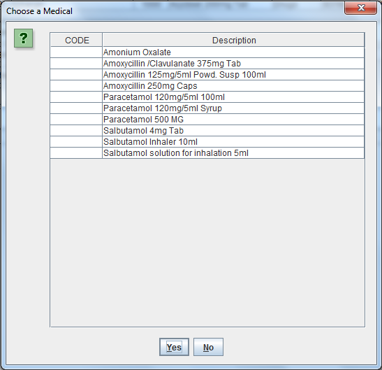

Select the desired medical and click *[.underline]##Y##es*. This will open the *_Input_* window where you will enter the quantity of the medical.

image:extracted-media/media/image27.png[quantityInput.PNG,width=310,height=135]

Then press *Ok.* If there is existing lot in the system, the *_Existing lot_* window will appear.

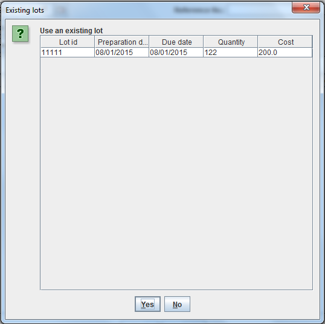

If you want to use an existing Lot, you select the existing lot and click *Yes*. Else you click *No* and the *_Lot information_* window will appear with following fields:

* *Lot No:* The lot code
* *Preparation date:* The preparation date
* *Expiring date:* The expiring date

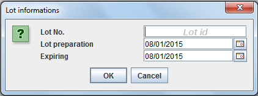

Fill them and press *Ok*. The *_Input_* window will appear and you will fill the unit cost.

image:extracted-media/media/image30.png[UnitCost Input.PNG,width=310,height=137]

Then click *Ok* to insert the medical line in the grid.

Click *Save* button to save the charge movement.

_*[.underline]#NB#*: The Lot definition can be set as automatic by changing the flag AUTOMATICALOT_ _in configuration file, so every new charging movement will automatically create a new lot; anyway, the Expiring Date must always be provided._ _Ask to your Administrator how to do it or read the Administrator’s Guide._

_*[.underline]#NB#*: You can avoid managing medicals cost by setting the LOTWITHCOST to no. Ask your Administrator how to do it or read the Administrator’s guide._

===== 6.2.2.3 Insert stock discharging movement ([.underline]##D##ischarge)

To insert charging movements, you have to Press *[.underline]##D##ischarge* in the *_Stock movement browser_* window. The *_Stock movement_* window showed below appears. You can enter charge movements.

image:extracted-media/media/image31.png[ChargingMvt.PNG,width=463,height=347]

Since OpenHospital 1.8, you can perform more than one discharging movement at a time. The window is composed with two areas: a *Panel* and a *Grid.*

The panel contains following fields:

* *Date*: date of the movement
* *Discharge Type*: Discharge
* *Destination*: Ward where the discharged medical will be affected.
* *Reference No*: reference of the operation

The Grid should be field with pharmaceuticals involved in the discharging movement. To field the Grid, you have to use the field above the grid to select pharmaceutical. Focus the field, enter the code or the description of the pharmaceutical and press *ENTER.* This will open the *_Choose a medical_* window.

Select the desired medical and click *[.underline]##Y##es*. This will open the *_Input_* window where you will enter the quantity of the medical. You have the remaining stock on the window.

image:extracted-media/media/image32.png[quantityInput.PNG,width=268,height=135]

Then press *Ok.* The *_Lot information_* window will appear.

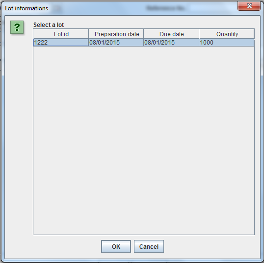

You select the existing lot and click *Yes*. Then click *Ok* to insert the medical line in the grid.

Click *Save* button to save the discharge movement.

_*[.underline]#NB#*: The Lot definition can be set as automatic by changing the flag AUTOMATICALOT_ _in configuration file, so every new discharging movement will automatically select a suitable lot for the operation according to the expiring date. If the first selected lot is does not contain enough quantity to serve the discharging movement, several discharging movements may be generated._ _Ask to your Administrator how to do it or read the Administrator’s Guide._

=== 6.3 Pharmaceuticals Stock Ward (Pharmaceuticals Stock [.underline]##W##ard)

==== 6.3.1 Main Characteristics

The Pharmaceutical Stock Ward feature allows the management of the pharmacy at ward level.

*Pharmaceuticals Stock [.underline]##W##ard* functionality can be enabled or disabled by changing the _INTERNALPHARMACIES_ flag in the configuration file**.** Ask to your Administrator how to do it or read the _Administrator’s Guide_.

image:extracted-media/media/image22.png[image,width=220,height=182]

==== 6.3.2 Functions of Pharmaceuticals Stock Ward 

To access the functions of Pharmaceuticals, press *Pharmaceutical Stock [.underline]##W##ard* on the Pharmacy menu showed below.

The window *_Ward pharmacy_* showed below will be opened. All functions available under Pharmaceutical Stock are accessible from the *_Ward pharmacy_* window selecting one *WARD* on the top left of the window.

image:extracted-media/media/image34.png[image,width=616,height=347]

After the selection of the ward (INTERNAL MEDICINE in the example) the *_Ward pharmacy_* window appears as showed below and you can start the management of the ward pharmacy of the INTERNAL MEDICINE ward.

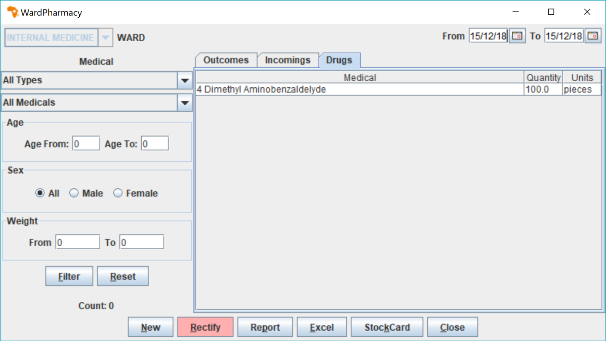

These functionalities are available in the window

* *[.underline]##N##ew*: Create a new discharging movement to patient
* *[.underline]##R##ectify*: to rectify the quantity lying in stock (6.3.2.1 Rectify).
* *[.underline]##R##eport*: Print the Ward medical inventory report
* *[.underline]##E##xcel*: Export data to Excel
* *Stoc[.underline]##k## Card* to show the movements history for a certain pharmaceutical (can be directly selected by the list otherwise will be requested)

Differently by *Pharmaceuticals [.underline]##S##tock* functionality, the *Pharmaceutical Stock [.underline]##W##ard* allows an only discharging movement to patients since is an internal management of pharmaceuticals lying in the wards after they have been “charged” by the main pharmacy. But since OpenHospital 1.9, discharging movement from ward to ward is also possible.

The *_Ward Pharmacy_* window will show a *Filter Panel* on the left, a *Movements Panel* in the right-centre and a *Button Panel* at the bottom.

===== 6.3.2.1 Rectify (Rectify)

Since OpenHospital 1.8, it is possible to rectify the quantity lying in stock in the Ward Pharmacy. This can be necessary when a drug is damaged or stolen. To do this, click the Rectify button to open the Rectify window.

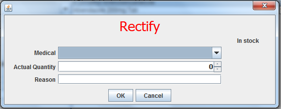

* Select the medical. Once done, the quantity lying in stock is displayed.
* Modify the *actual quantity*
* Enter the reason of the rectification

Click *Ok* to save the rectification or Cancel to abort.

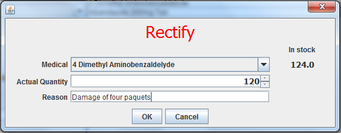

===== 6.3.2.2 Search Ward Pharmacy movements ([.underline]##F##ilter)

image:extracted-media/media/image38.png[WardPharmacy_filter.PNG,width=173,height=259]

The *Filter Panel* allows you to filter registered movement by:

* Medical
* Age
* Sex
* Weight

The counter at the bottom will automatically count how many movements’ matches your filtering criteria after clicking the *[.underline]##F##ilter* button.

A *Reset* button will bring back all values in the Filter Panel as in the figure shown.

===== 6.3.2.3 The Movements Panel

The Movements Panel is made by three tabs:

* *Outcomes*: shows all the movements registered between the dates in *From* and *To* fields in the top of the window. By default, *From* and *To* dates are set on the date of today. Every movement is identified by following fields:
** *Date*: the date of the movement
** *Patient:* the patient the movement is related to, with his/her age, sex and weight (ND if the weight has not been defined at the registration moment)
** *Medical*: the drug subject of the movement
** *Quantity*: the quantity subject of the movement
* *Incomes*: shows all incomings from the main pharmacy, it’s to say all discharging movements registered in *_Pharmaceutical Stock_* window related to selected ward
* *Drugs*: the number of drugs remaining in the selected ward as a result of all incoming minus all out comings.

===== 6.3.2.4 Inserting a new Ward Pharmacy Movement ([.underline]##N##ew)

To insert ward pharmacy movements, you have to press [.underline]##N##ew in the *_Ward Pharmacy_* window. The *_New / Edit_* window showed below appears.

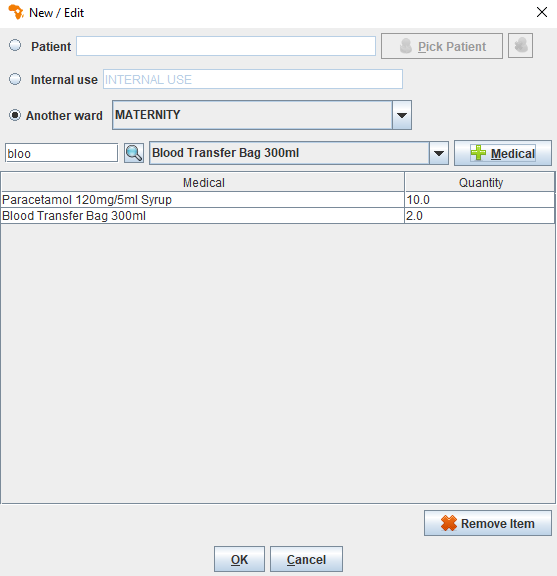

As told before, only discharging movements are allowed in this functionality. So, the solely information required are the follow:

* *Patient* or *Internal Use* or *Another ward*: you may select an already registered patient by clicking on *[.underline]##P##ick Patient* button so the movement will be associated to his/her ID or select *Internal Use* and type a description to specify that the movement is not related to a patient. You may also select *Another ward* and choose the destination ward from the list provided.
* *Medicals*: by pressing *[.underline]##M##edical* button you will be asked for the drug to give to that patient; a first window will appear to let you select the drug (the only ones you may have in the ward as a result of a previous discharging movement in the *_Pharmaceutical Stock Browser_*) and a second one to let you specify the quantity; multiply of half-piece are allowed.

image:extracted-media/media/image40.png[WardPharmacy_medical.PNG,width=273,height=129]image:extracted-media/media/image41.png[WardPharmacy_quantity.PNG,width=231,height=139]

Before to press the *[.underline]##O##K* button, you may insert as many Medicals you need, it will show a correspondent number of movements in the *Outcomes* tab of the *Movement Panel* in the *_Ward Pharmacy_* window. These movements will also be visible in the *Incomes* tab of the *Movement Panel* in the *_Ward Pharmacy_* window of the receiving ward, in case of discharging to another ward.

== 7 Laboratory ([.underline]##L##aboratory)

=== 7.1 Main Characteristics 

With Laboratory’s features the user can manage the laboratory exams.

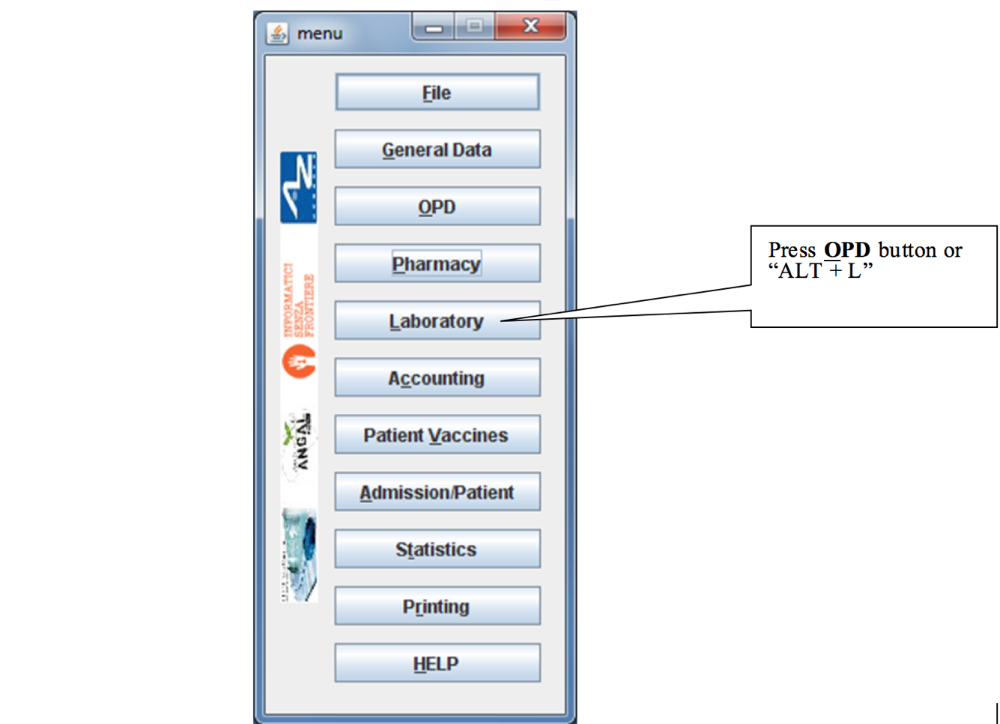

It is possible to create, modify or delete exams.

* Insert a new Laboratory exam
* Delete (or edit) an existing exam
* Select some exams with the Filter Button (user can select the exam’s name, the exam’s result and the date between the exam was made)

=== 7.2 Functions of Laboratory

*_To access the Laboratory’s functions press_ [.underline]##L##aboratory* *_on the main menu of OpenHospital. The Laboratory browsing_* window appears.

All functions available under *[.underline]##L##aboratory* are accessible from the *_Laboratory browsing_* window showed below. By default, the system shows all the laboratory exams recorded.

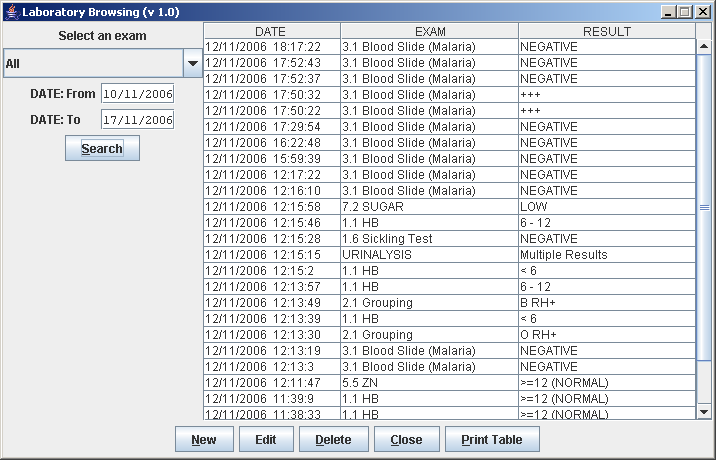

Data that identify laboratory exams are the following:

* *Date*: indicates date and time when the exam was entered
* *Exam:* description of the exam
* *Result*: result of the exam

To access the other functions of laboratory in the *Buttons Panel* you have the following choices:

* *New* to enter a new laboratory exam
* *[.underline]##E##dit* to modify an existing laboratory exam
* *[.underline]##D##elete*, to delete an existing laboratory exam
* *[.underline]##C##lose* to close the window and return to the Menu
* *[.underline]##P##rint table* to print the list of laboratory exams showed in the table

Furthermore, a search function (*[.underline]##S##earch)* is available using the Selection panel on the left of the window.

==== 7.2.1 Search of Laboratory exams ([.underline]##S##earch)

Search function allows you to select and show laboratory exams on the *Data table* of the *_Laboratory browsing_* window.

In the example hereinafter, all types of exams executed from 10.11.2006 until 17.11.2006 are showed in *Data table*.

Data about exams can be selected by choosing specific fields among the following:

* *Select an exam:* Values admitted are:

____
ALL, exams of all types are showed

Single exam, only the exams of the selected type are showed
____

* **Date: “**DATE From” and “DATE To” allow the selection of all the exam executed in the requested period

After the selection press *[.underline]##S##earch* button; the system will show on the table results of the search applying the criteria requested.

==== 7.2.2 Create a new laboratory exam ([.underline]##N##ew)

Press *[.underline]##N##ew* button in the *_Laboratory browsing_* window: The *_New Laboratory exam_* window showed below appears:

image:extracted-media/media/image44.png[image,width=395,height=433]

To record the visit, enter the following fields:

* *Data*: date of the exam, the application propose the current date
* *Material*: choose from the available values the material used in the exam
* *Exam*: choose the exam
* *Patient in*: it activates itself if the selected patient is currently admitted, anyway is possible to change it if needed.
* *Select a patient*: you select the patient that does the exam. The field is not mandatory and therefore you can input an exam by typing patient’s information in the following fields.
* *Name*: First and last name of the patient _(automatically filled if a patient is selected)_
* *Age*: age of the patient (range 0-200) _(automatically filled if a patient is selected)_
* *Sex*: value M for male, value F for female _(automatically filled if a patient is selected)_
* *Note*: free description
* *Result*: according with the chosen exam you will see in this panel a range of available results to select.

===== 7.2.2.1 Results

In OpenHospital you have basically two kind of possible results for each exam:

* *Single Result*: where you can select only one result among a list
* *Multiple Results*: where you may specify many results among a list of positive/negative values

image:extracted-media/media/image45.png[Laboratory_new_proc1.PNG,width=309,height=340]image:extracted-media/media/image46.png[Laboratory_new_proc2.PNG,width=309,height=341]

_*[.underline]#NB#*: Exams, Exam Types and Results as well, can be defined by the Administrator._ _Ask to your Administrator how to do it or see link:#14-general-data-general-data[General Data] in this document._

When you finish entering data in the *Buttons Panel* you have the following choices:

* *[.underline]##O##k* to confirm and record data
* *[.underline]##C##ancel* to close the window and return to the Menu without record data

==== 7.2.3 Modify a laboratory exam ([.underline]##E##dit)

To modify an exam, you have to highlight it first in the *_Laboratory browsing_* window. Once highlighted, press *[.underline]##E##dit* button to enter the *_Edit Laboratory_* exam window showed below. Now the record is available for changes. With this function you can modify all data of the exam and you can input the result of the exam too.

image:extracted-media/media/image47.png[image,width=394,height=432]

==== 7.2.4 Delete Laboratory Exam ([.underline]##D##elete)

To delete an exam, you have to highlight it first in the *_Laboratory browsing_* window. Once highlighted, press *[.underline]##D##elete* button to see the confirmation window showed below.

image:extracted-media/media/image48.png[image,width=240,height=174]

=== 7.3 Laboratory Extended (v.1.1)

Since OpenHospital version 1.3.1 you can extend the _New Laboratory_ functionality by change the _LABEXTENDED_ flag in the configuration file. Ask to your Administrator how to do it.

==== 7.3.1 New Laboratory Browsing (v 1.1.)

The new window will appear like the following:

image:extracted-media/media/image49.png[image,width=642,height=309]

The only difference is the new column about the name of the patient for a fast research.

==== 7.3.2 New Laboratory Exam (v. 2.0)

The new *_Laboratory Exam_* window is now strictly related to the patient, it’s to say that the exam must be assigned to a patient previously registered in the DB.

Before to close the window with the exam result you must have selected a patient from the list; the fields below will give you a slight patient details summary.

A search field can be used to fast search the patient by typing part of his/her name or his/her OpenHospital code (which is specified in the Patient window, see *_Patient Extended_*).

The New Laboratory Exam window (thus the Edit one) will appear like the following:

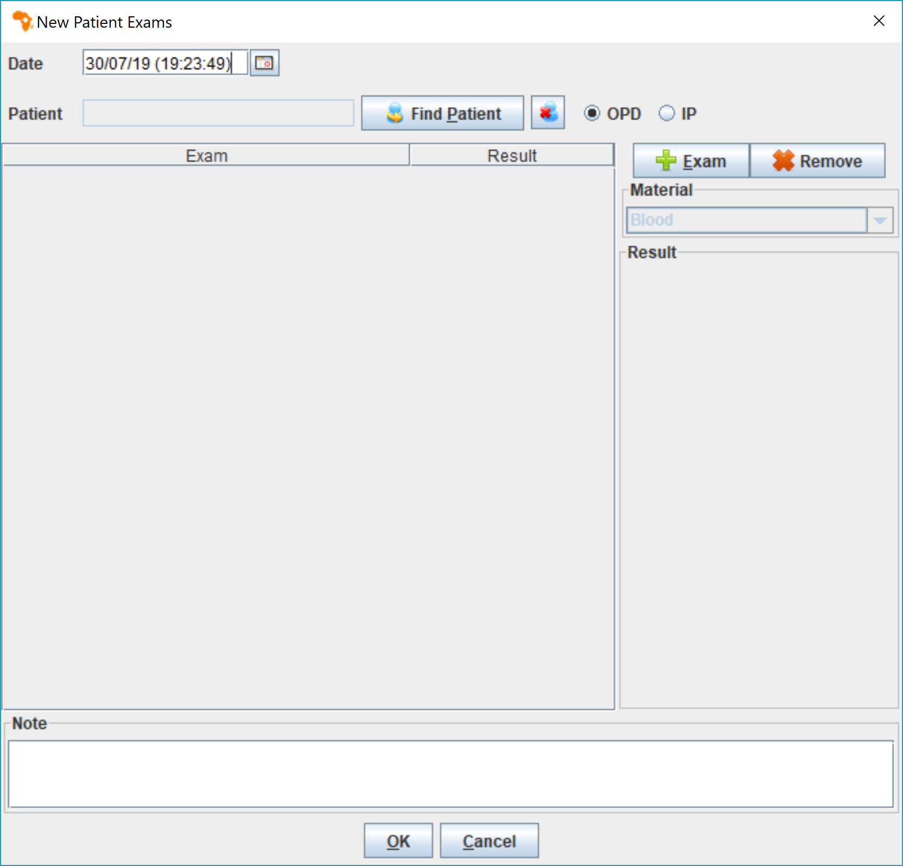

The *Patient’s data panel* cannot be modified except *Note Field* and only shows the information related to the selected Patient.

==== 7.3.3 Laboratory Multiple Insert

Since OpenHospital version 1.4.1 you can extend the _New Laboratory_ functionality by change the _LABMULTIPLEINSERT_ flag in the configuration file. The flag _LABEXTENDED_ have to be enabled too. Ask to your Administrator how to do it.

The New Laboratory Multiple allows multiple exam insertion for each patient, avoiding repeating the new laboratory exam procedure (*[.underline]##N##ew*) for every exam for the same patient.

===== 7.3.3.1 New Patient Exam ([.underline]##N##ew)

Press *[.underline]##N##ew* button in the *_Laboratory browsing_* window: The *_New Patient exam_* window showed below appears.

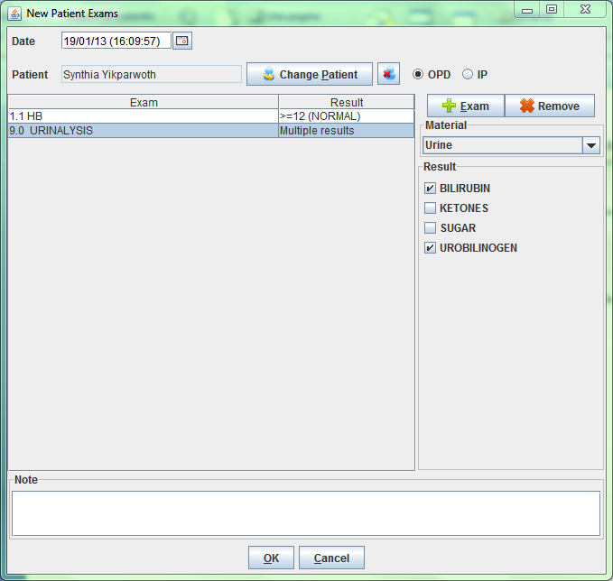

To record the visit, enter the following fields:

* *Data*: date of the exam, the application propose the current date
* *Patient*: select a patient by pressing the *Find [.underline]##P##atient* button
* *OPD/IPD*: the window automatically will check if the patient is admitted or not in the hospital; anyway, is possible to change it if needed
* *[.underline]##E##xam*: choose the exam; a first window will ask you the material, then a second one the exam, finally a third one will ask you the result is the exam allow only a single result, otherwise the list of multiple results will be showed on the right, together with the chosen material.
* *Note*: free description for each exam

_*[.underline]#NB#*: At any time, before to press OK, you can modify every exam by clicking it on the list and changing material, results and note in the relative panels._

_ +
_

== 8 Accounting (A[.underline]##c##counting)

=== 8.1 Main Characteristics

Accounting is the function that you have to use to manage the billing process. You can enter the bill of pharmaceuticals, operations, exams or other costs of a patient. For the time being the billing process is not linked with other functions of *OpenHospital* and therefore the application does not propose the billing item based on the therapy followed by the patient: [.underline]#the user has to input all the items.#

Accounting function furthermore allows to manage the payment of bills (total or partial) and to produce reports.

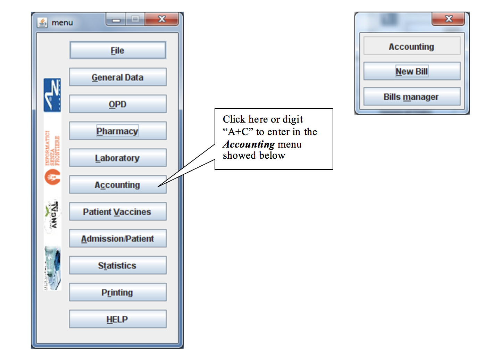

=== 8.2 Functions of Accounting

All functions available under *A[.underline]##c##counting* are accessible from the *_Patients Bills Management_* window showed below. To access the *_Patients bills Management_* window press *[.underline]##B##ills Manager* on the *_Accounting_* menu.

By default, the window shows in the *Data table* all the bills of today (current day).

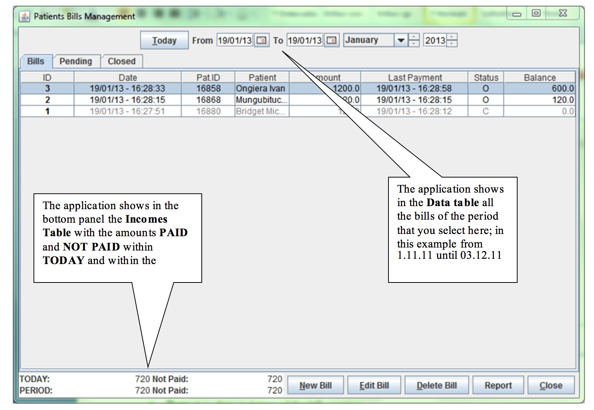

For each bill the following data are shown on *Data table:*

* *ID:* it is the number of the bill (created automatically by the application)
* *Date:* it is date and time of the bill creation
* *Pat ID:* it is the patient ID (created automatically by the application at the registration time)
* *Patient:* it is the patient name
* *Amount:* it is the total amount of the bill
* *Last payment:* it is date and time of the last payment
* *Status:* it is the status of the bill; values are: ”O” (open) if not fully paid; ”C” (closed) if fully paid
* *Balance:* it is the bill amount not paid yet

The following functions are accessible from the *Buttons Panel* of the *_Patients Bills Management_* window**:**

* *[.underline]##T##oday* (button on top of the window) to show on *Data table* only the bills of the current day
* *[.underline]##N##ew Bill* to insert a new bill
* *[.underline]##E##dit Bill* to modify an already stored bill if its status is “O” (Open)
* *[.underline]##D##elete Bill* to delete an already stored bill
* *Report* to print a variety of reports
* *[.underline]##C##lose* to exit from the function *_Patients Bills Management_* and return to the *Accounting* menu

Furthermore, the *_Patients Bills Management_* window shows an *Incomes Table* with follow information:

* *First Row*: the *PAID* and *UNPAID* within *Today*
* *Second Row*: the *PAID* and *UNPAID* within the visualized *Period*

==== 8.2.1 Insert a new bill ([.underline]##N##ew Bill)

You can use the *New Patient Bill* function to register a new bill of a patient. Press *[.underline]##N##ew Bill* button in the *_Patients Bills Management_* window to access the *_New Patient Bill_* window showed below.

The bill is not saved until you do not confirm it with the *[.underline]##S##AVE* function (see description below).

Before entering in the description of the function we provide you the description of the contents of the window *_New Patient Bill._*

The *_New Patient Bill_* window is composed by three areas: the *Bill Panel* on the top, the *Item Panel* in the centre, the *Payments* *Panel* on the bottom and the *Buttons panel* on the right.

Bills are composed by items. A bill item is a cost related to either a pharmaceutical or an operation or an exam or others/custom costs.

Data showed on the *Bill Panel* area are:

* *Date*: it is the date and time of the bill
* *Patient*: it is the patient associated with the bill
* *List*: it is the PriceList that will be used for this bill +
 +
_*[.underline]#NB#*: PriceLists can be defined by the Administrator._ _Ask to your Administrator how to do it or see link:#14-general-data-general-data[General Data] in this document._

Data showed on the *Item Panel* area are:

* *Item, Qty, Amount*: they are the description of the bill entry, the selected quantity and the amount; the amount is calculated as the unitary cost of the item multiplied by the quantity;
* *TOTAL*: it is the total amount of the bill +
 +
_*[.underline]#NB#*: Prices, or unitary costs, can be defined by the Administrator._ _Ask to your Administrator how to do it or see link:#14-general-data-general-data[General Data] in this document._

Data showed on *The Payments* area are:

* *Date*: it is the date and time of the payment
* *Amount*: it is the amount of the payment
* *BALANCE*: it is the not yet paid amount of the bill (difference between the Total (*) and the sum of the payments)

image:extracted-media/media/image54.png[image,width=484,height=418]

To insert a new bill first of all you have to enter the *Date field*. The application proposes you the current date and time but you can modify both of them.

Then you have to select a patient. To do it, press the *find [.underline]##P##atient* button on top of the screen. The *_Patient Selection_* window showed below appears.

Once you have selected the patient you can start to enter bill entries of the bill.

_*[.underline]#NB#*: If the patient has a pending bill associated it will be recalled to edit it. You cannot start a new bill for a patient before to close the previous one._

There are several types of Bill entry. They are identified by the button on the *Buttons panel* on the right of the window; you have the following choices:

* *[.underline]##M##edical* to enter bill entries of pharmaceuticals
* *[.underline]##O##peration* to enter bill entries of operations
* *[.underline]##E##xam* to enter bill entries of exams
* *[.underline]##O##ther* to enter other prices defined in the PriceList +
** +
_[.underline]#NB#_**__: Types can be defined by the Administrator. Ask to your Administrator how to do it or read the see link:#14-general-data-general-data[General Data] in this document.__
* *[.underline]##C##ustom* to enter custom items defined on the fly

===== 8.2.1.1 Insert a bill entry related to Medicals, Operations or Exams ([.underline]##M##edical, [.underline]##O##peration, [.underline]##E##xam) 

We show here how to insert an bill entry for pharmaceutical (*[.underline]##M##edical*); the function to insert a bill entry for operation (*[.underline]##O##peration)* and exam (*[.underline]##E##xam)* is the same with the only difference that for the last two is not required the quantity (the quantity is always 1).

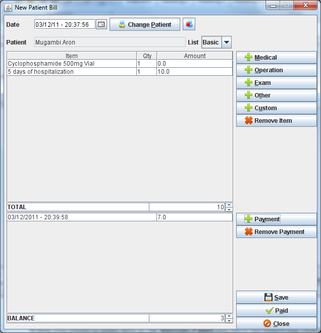

To insert a bill entry, press the *[.underline]##M##edical* button. The *_Medical_* window showed below appears.

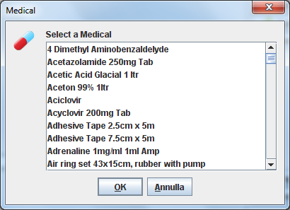

Using the mouse, you have to highlight the required pharmaceutical (medical).

On the *Buttons Panel* of the *_Medical_* window you have the following choices:

* *[.underline]##O##k* to select the highlighted pharmaceutical
* *[.underline]##C##ancel* to return to the *_New patient Bill_* window without selecting any pharmaceutical

If you choose *[.underline]##O##K* the *_Quantity_* window showed below appears and you can select the quantity of pharmaceutical used by the patient.

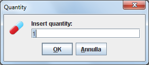

On the *Buttons Panel* of the *_Quantity_* window you have the following choices:

* *[.underline]##O##k* to select the highlighted pharmaceutical and return to the *_New patient Bill_* window
* *[.underline]##C##ancel* to return to the *_New patient Bill_* window without selecting any pharmaceutical

===== 8.2.1.2 Insert a bill entry related to various custom reasons (C[.underline]##u##stom) 

To insert a custom bill entry, you have to press the *C[.underline]##u##stom* button. The application will show the *_Custom item_* window showed below.

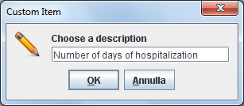

In this window you have to enter a description (in the example below is “number of days of hospitalization”) and then:

On the *Buttons Panel* of the *_Custom item_* window you have the following choices:

* *[.underline]##O##k* to go to another *_Custom item_* window (to enter the quantity, see below)
* *[.underline]##C##ancel* to return to the *_New patient Bill_* window without insert any bill entry

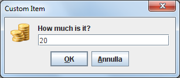

In the *_Custom item_* window, you have to enter the amount related to the bill entry (in the example above is “20” in the local currency, i.e. it is US dollar if the country is USA)

On the *Buttons Panel* of the *_Custom item_* window you have the following choices:

* *[.underline]##O##k* to confirm the bill entry and return in the *_New patient Bill_* window
* *[.underline]##C##ancel* to return to th**e _New patient Bill_** window without insert any bill entry

===== 8.2.1.3 Remove a bill entry of a bill (Remove Item) 

First of all, to remove a bill entry you have to highlight it on the *_New Patient Bill_* window. Once you’ve done this, (pay attention!) pressing the *Remove Item* button, the bill entry is removed. Bill entries can be removed before or after the final saving (see *Save function* described below)

===== 8.2.1.4 Insert a payment (Pa[.underline]##y##ment)

To insert a payment, you have to press the *Pa[.underline]##y##ment* button. The application will show the *_Quantity_* window showed below.

image:extracted-media/media/image60.png[image,width=307,height=134]

You have to insert the amount of the payment. (in the example above is “12” in the local currency, i.e. it is US dollar if the country is USA)

On the *Buttons Panel* of the *_Quantity_* window you have the following choices:

* *[.underline]##O##k* to confirm the payment and return to the *_New patient Bill_* window
* *[.underline]##C##ancel* to return to the *_New patient Bill_* window without insert any payment

===== 8.2.1.5 Insert a refund (Refund)

Sometimes it happens that the cashier has to refund the patient; in this case you will press the *Refund* button that allow you to insert the amount to refund. It will be automatically converted in a negative added to the payments list

===== 8.2.1.6 Payment receipt

Since OpenHospital version 1.8 you can print the Payment receipt any time, once you have made a payment. Click *Payment receipt* button.

===== 8.2.1.7 Remove a payment (Remove Payment) 

First of all, to remove a payment you have to highlight it on the *_New Patient Bill_* window. Once you’ve done this, (pay attention!) pressing the *Remove Payment* button, the payment is removed.

===== 8.2.1.8 Give change… (Give change…) 

Sometimes it could be useful to calculate the balance to give to a patient when he/she is paying his/her bill. By pressing on *Give change...* button you will be asked the cash amount the patient is giving and automatically you will know the amount to give to him/her calculated as a difference between the patient cash and the current bill balance.

===== 8.2.1.9 Save function ([.underline]##S##AVE)

When you have completed the input of data (bill or payments) press the *[.underline]##S##AVE* button on the button panel of the *_New Patient Bill_*.

The application will save the bill and return to the *_Patients bills management_* window; the status of the bill is “O” (Open) until you will set is as PAID (*P[.underline]##a##id*)

===== 8.2.1.10 Paid function (P[.underline]##a##id)

If the patient is going to pay his/her bill totally you can press the *P[.underline]##a##id* button; if balance is not equal to zero it will automatically add a payment in the payments list and set this bill as “C” (Closed).

===== 8.1.2.11 Print receipt function

Since OpenHospital version 1.7 you can print on the fly a receipt when you press the *P[.underline]##a##id* button__. To enable this feature, you must enable the RECEIPTPRINTER__ flag in the configuration file and a proper device must be connected to the system. Ask to your Administrator how to do it or read the _Administrator’s Guide_.

===== 8.2.1.12 Close function ([.underline]##C##lose)

Close function allows you to exit from the *_New Patient Bill_* window without saving changes done**_._** Press the *[.underline]##C##lose* button to access the Close function. The confirmation window showed below appears.

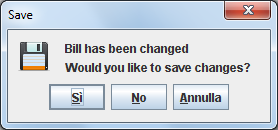

==== 8.2.2 Edit an existing bill ([.underline]##E##dit Bill)

First of all, to modify an existing bill you have to highlight it in the *_Patients Bills Management_* window. Once you’ve done this, press the *[.underline]##E##dit Bill* button. The *_New Patient Bill_* window will appear.

_*[.underline]#NB#*: Only bills with status “O” (Open) can be modified, otherwise an A4 report will be shown._

==== 8.2.3 Delete a bill ([.underline]##D##elete Bill)

First of all, to delete an existing bill you have to highlight it in the *_Patients Bills Management_* window. Once you’ve done this, press the *[.underline]##D##elete Bill* button. The *_Delete_* window will appear.

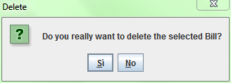

_*[.underline]#NB#*: Generally, this is not allowed to regular users and should be performed only by the Administrator._

==== 8.2.4 Receipt (Receipt)

Since OpenHospital version 1.8 you can print the bill receipt direct from the *_Bill manager_* window. Highlight the bill and click *[.underline]##R##eceipt* button. A proper device must be connected to the system.

==== 8.2.5 Reports (Report)

OpenHospital Accounting module comes with a set of reports hereby listed:

* *Today (Closure)*: report that show the current user incomes
* *Today*: report that show a statement with all paid and unpaid bills within today
* *Period*: report that show a statement with all paid and unpaid bills within the period currently visualized
* *This month*: report that show a statement with all paid and unpaid bill within the current month
* *Other month*: report that show a statement with all paid and unpaid bill within a specified month that will be suddenly asked.

image:extracted-media/media/image63.png[Accounting_report.PNG,width=268,height=129]

For each report, except Today (Closure), you will be asked to choose among two options:

* *Short Report (only BadDebts bills)*: report that show a statement with only the unpaid bills and the total for the others
* *Full Report (all bills)*: report that show a statement with all paid and unpaid bills

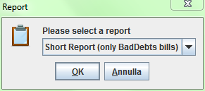

Once the choice has been done, after some instants the JasperViewer® will show the generated report as follow:

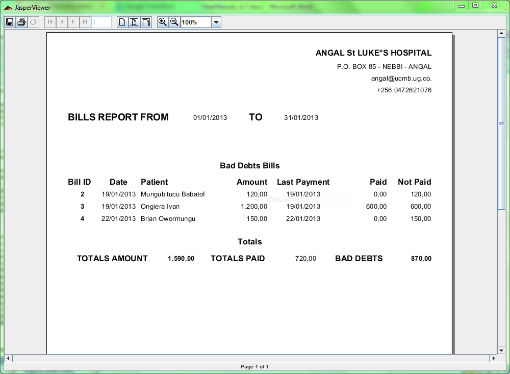

_*[.underline]#NB#*: By default, an internal PDF viewer is used. You can use an external PDF reader by modifying the INTERNALVIEWER flag in the configuration file._ _Ask to your Administrator how to do it or read the Administrator’s Guide._

You can save the report as PDF by clicking on save button (image:extracted-media/media/image66.png[Report_save.PNG,width=21,height=19]) or printing it by clicking on print button (image:extracted-media/media/image67.png[Report_print.PNG,width=21,height=18]).

_*[.underline]#NB#*: A PDF copy of every report is always saved within the folders of OpenHospital._ _Ask to your Administrator how to do it or read the Administrator’s Guide._

=== 8.3 Functions of Accounting in multi-user mode

If in multi-user mode, the Incomes Table will show the only Incomes for logged user, so the window will appear like following:

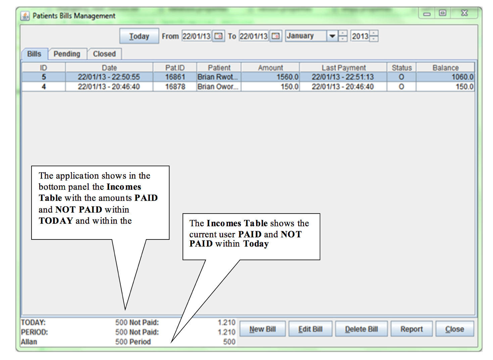

So, the *Incomes Table* will show follow information:

* *First Row*: the *PAID* and *UNPAID* within *Today*
* *Second Row*: the *PAID* and *UNPAID* within the visualized *Period*
* *Third Row*: the *PAID* and *UNPAID* for the current *user* within *Today*

While the admin user will be able to filter all incomes among all users that have been involved in some payments:

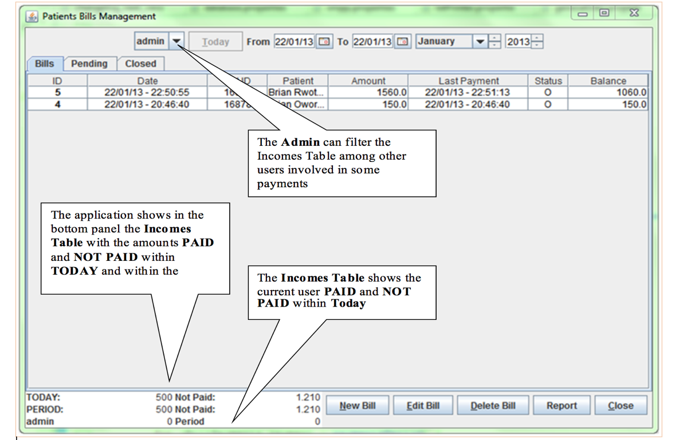

== 9 Vaccines (Patient [.underline]##V##accines)

=== 9.1 Main Characteristics

Vaccines functionality allows managing vaccines for all the patients registered. It is possible to register vaccinations, modify or delete them. A specific search function is also available.

image:extracted-media/media/image70.png[../../Screen%20Shot%202019-07-26%20at%2015.36.39.png,width=642,height=548]

=== 9.2 Functions of Admission/Patients

All functions available under *Patient [.underline]##V##accines* are accessible from the window *_Patient vaccines browsing_* window showed below.

By default, the window shows in *Data table* all the vaccinations currently present in the system.

image:extracted-media/media/image71.png[image,width=594,height=263]

The following functions are accessible from the *Buttons Panel* of the window *_Patient vaccines browsing_* window**:**

* *[.underline]##N##ew* to insert a new vaccination
* *[.underline]##E##dit* to modify an already stored vaccination
* *[.underline]##D##elete* to delete an already stored vaccination
* *[.underline]##C##lose* to exit from the function Patient Vaccines and return to the main menu’

Furthermore, a search function is available using the *Selection panel* on the left of the window.

==== 9.2.1 Search vaccinations 

Queries about vaccinations can be done using the search criteria available on the *Selection panel* area of the window (left side of the window). Results of your search are showed on the *Data table* area.

Doing the selection, data about vaccinations can be selected by choosing specific fields among the following ones:

* *Vaccine type:* by selecting a Vaccine Type you will filter the Vaccine list
* *Vaccine.* You can select one vaccine or the value “All vaccines” +
 +
_*[.underline]#NB#*: VaccineTypes and Vaccines can be defined by the Administrator._ _Ask to your Administrator how to do it or see link:#14-general-data-general-data[General Data] in this document._
* **Date. “**DATE From” and “DATE To” allow the selection of all the vaccinations over the requested period
* **Age. “**Age From” and “Age To” allow the selection of all the patients subject to vaccinations by age
* *Sex.* All / Male / Female

After the selection press *[.underline]##S##earch* button; the system will show on *Data table* results of the search applying the criteria requested.

The function shows in the field “Count:” the number of vaccinations that are showed in *Data Table* (in the example they are 3).

image:extracted-media/media/image72.png[image,width=619,height=245]

====  9.2.2 Insert a new vaccination ([.underline]##N##ew)

You can use this function to register a new Patient vaccination when executed.

Press *[.underline]##N##ew* button in the *_Patient vaccines browsing_* window to access the *_New patient vaccine_* window showed below.

image:extracted-media/media/image73.png[image,width=530,height=360]

To record a new patient vaccination enters the following fields:

* *Date:* the date of the vaccination
* *Progressive:* the progressive number in the year (set automatically by the system)
* *Patient:* You can select the patient entering the *Patient code* or in alternative selecting a patient.
* *Vaccine type:* the Vaccine Type
* *Vaccine:* the Vaccine +
 +
_*[.underline]#NB#*: VaccineTypes and Vaccines can be defined by the Administrator._ _Ask to your Administrator how to do it or see link:#14-general-data-general-data[General Data] in this document._

When you finish entering data in the *Buttons Panel* you have the following choices:

* *[.underline]##O##k* to confirm data and record the Patient vaccination
* *[.underline]##C##ancel* to close the window and to return to the *_Patient vaccines browsing_* window without record the patient vaccination

==== 9.2.3 Modify data of a recorded Patient vaccination ([.underline]##E##dit) 

First of all, to modify data of a Patient vaccination you have to highlight it in the *_Patient vaccines browsing_* window. Once you’ve done this, press the *[.underline]##E##dit* button. When the *_Edit Patient vaccine_* window showed below appears, the record is available for changes. Date, vaccine type and vaccine can be changed.

image:extracted-media/media/image74.png[image,width=444,height=302]

You may change all data except the patient associated with this vaccination.

When you finish entering data in the *Buttons Panel* you have the following choices:

* *[.underline]##O##k* to confirm new values (all the previous values will be lost)
* *[.underline]##C##ancel* to close the window and to return to the Menu without applying any change

==== 9.2.4 Delete a Patient vaccination ([.underline]##D##elete)

First of all, to delete a stored Patient vaccination you have to highlight it in the *_Patient vaccines browsing_* window. Secondly press the *[.underline]##D##elete* button. The confirmation window showed below will appear. The vaccination can then be deleted. Deleted vaccinations won’t be available anymore.

image:extracted-media/media/image75.png[image,width=278,height=187]

=== 9.3 Vaccines Extended (Patient [.underline]##V##accines)

Since OpenHospital version 1.6 you can extend the Vaccine functionality by changing the _PATIENTVACCINEEXTENDED_ flag in the configuration file. Ask to your Administrator how to do it or read the _Administrator’s Guide_.

==== 9.3.1 New Vaccine Browsing (v 1.1.)

The new window will appear like the following:

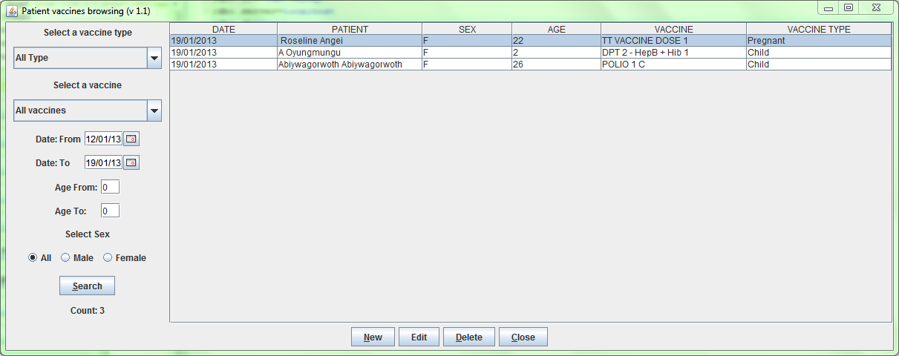

The only difference is the new column about the name of the patient for a fast research.

== 10 Admission/Patient ([.underline]##A##dmission/Patient)

=== 10.1 Main Characteristics

Admission/Patient functionality allows registering a new patient, to modify his/her personal details, to browse his/her history, and to admit him/her in a hospital ward.

image:extracted-media/media/image77.png[../../Screen%20Shot%202019-07-26%20at%2015.40.33.png,width=642,height=455]

_*[.underline]#NB#*: you can also start an OPD registration from here if the OPDEXTENDED flag is set to YES. Ask to your Administrator how to do it or read the Administrator’s Guide._

=== 10.2 Functions of Admission/Patients

All functions available under *[.underline]##A##dmission/Patient* are accessible from the *_Patients browser_* window showed below.

By default, the window shows in *Data table* all the patients currently present in the system.

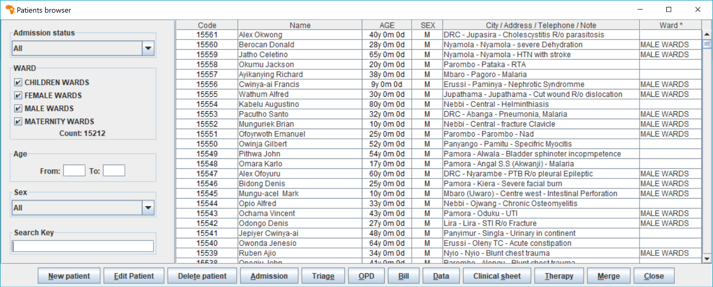

_*[.underline]#NB#*: If the patients list become huge it is possible to experience a slowdown of the system depending on the network settings. It is possible to optimize the use of memory by changing the flag ENHANCEDSEARCH in configuration file._ _Ask to your Administrator how to do it or read the Administrator’s Guide._

The following data are shown in the *_Patients browser_* window:

* *Code*: the patient code (automatically generated by the application
* *Name*: the patient full name
* *Age*: the patient age in years
* *Sex*: the patient sex
* *Address / City / Telephone / Note*: all this information separated by a “-“
* *Ward*: the ward where this patient is currently admitted; this field is blank if the patient is not admitted in the hospital in this moment

The following functions are accessible from the *Buttons Panel* of the window *_Patients browser_* window**:**

* *[.underline]##N##ew Patient* to insert a new patient
* *[.underline]##E##dit Patient* to modify an already stored patient
* *Dele[.underline]##t##e Patient* to delete an already stored patient
* *[.underline]##A##dmission* to manage the admission of the patient in the hospital
* *[.underline]##E##xamination* to manage the patient examination
* *[.underline]##O##PD* to start an OPD visit on the selected patient
* *[.underline]##B##ill* to start a Bill on the selected patient
* *[.underline]##D##ata* to modify data of a patient and to modify the history of his admissions/out of patient visits as well as his/her malnutrition data
* *Clinical [.underline]##s##heet* to analyse the clinical sheet of a patient and print it
* *[.underline]##T##herapy* to manage the therapy of a patient
* *[.underline]##C##lose* to exit from the function Admission/Patients and return to the main menu

_*[.underline]#NB#*: It is possible to have a *[.underline]##M##erge* function that might help in case of double patient registration, by changing the flag MERGEFUNCTION in configuration file._ _Ask to your Administrator how to do it or read the Administrator’s Guide._

Furthermore, a search function is available using the *Selection panel* on the left of the window.

====  10.2.1 Search patient 

Queries about Patients can be done using the search criteria available on the *Selection panel* area of the window (left side of the window). Results of your search are showed on the *Data table* area.

Doing the selection, data about patients can be selected by choosing specific fields among the following ones:

* *Admission status.* Values admitted are:

* *ALL* (all patients are included in the selection)
* *Admitted* (only patients admitted are included in the selection)
* *Not admitted* (only patients not admitted are included in the selection)

* *Ward.* You can select one or more wards between Maternity, Nursery, Surgery, Internal medicine +
 +
_*[.underline]#NB#*: Wards can be defined by the Administrator._ _Ask to your Administrator how to do it or see link:#14-general-data-general-data[General Data] in this document. +
_
* *Age.* You can filter the patients list by age range
* *Sex.* You can filter the patients list by gender
* *Search criteria.* You can digit the complete name of a patient or only same characters: the system will show all the patients that have the entered characters (Examples are: if you enter “solo wa” all patients that have “solo [.underline]#wa#” in the name will be selected, “Solomon Wakunga” but also “Kamwa Solonik” will be showed).

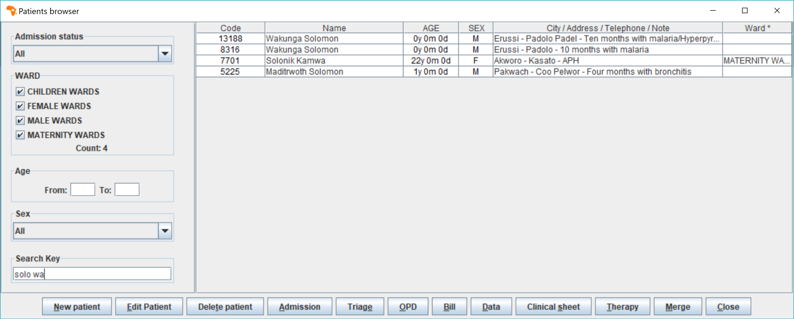

====  10.2.2 Search patient Enhanced

OpenHospital, since version 1.6, allows optimizing memory usage when the number of registered patients becomes huge, by changing the _ENHANCEDSEARCH_ flag in the configuration file. Ask to your Administrator how to do it or read the _Administrator’s Guide_.

Once the enhanced search has been enabled the new *_Patients browser_* window will looks like following one:

image:extracted-media/media/image80.png[image,width=338,height=172]

Initially the list looks empty. In order to show some patient, you must enter a search criterion in *Search Key* field and the press the search (image:extracted-media/media/image81.png[zoom_r_button.png,width=15,height=15]) button and the window will show the only patients matching specified criteria.

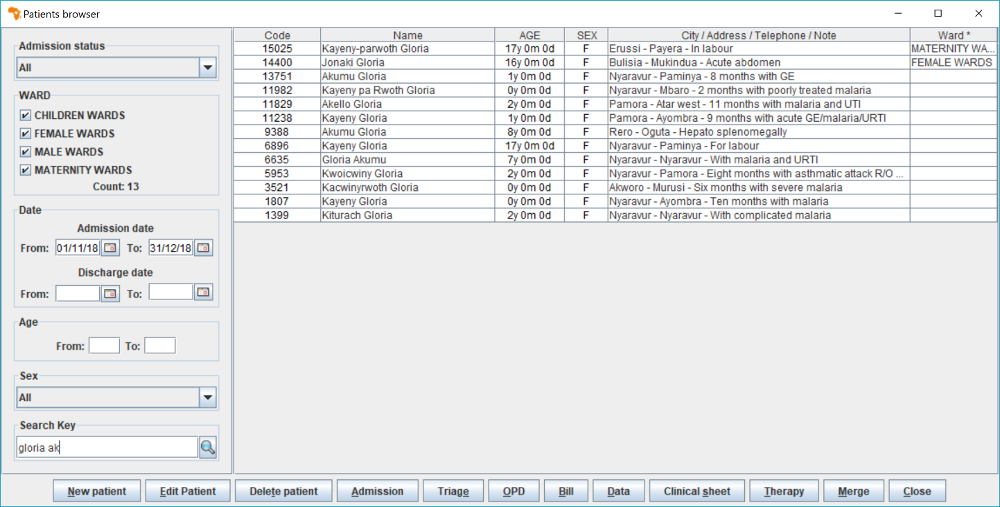

Moreover, further search criterions are added in this modality:

* *Admission date.* To search all patients admitted in between the specified date, regardless if still admitted or not
* *Discharge date.* To search all patients discharged in between the specified date, regardless if admitted again later on

_*[.underline]#NB#*: to show the full patient list again, is enough to press the search button with an empty criterion_

=== 10.3 Insert a new Patient ([.underline]##N##ew Patient)

You can use this function to register a new Patient when she/he is admitted in the Hospital.

Press *[.underline]##N##ew Patient* button in the *_Patients browser_* window to access the *_New Patient_* window showed below.

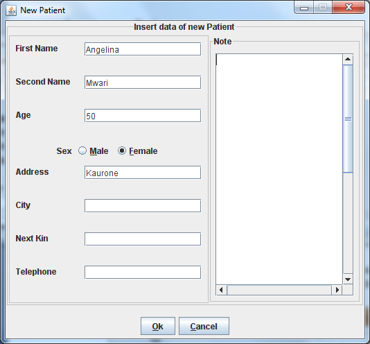

To record a new patient, enter the following fields:

* *First name:* the first name
* *Second name:* the last name or other names
* *Age:* the age in year
* *Patient sex:* Male/female
* *Address:* the address where he/her comes from
* *City:* the city where he/her comes from
* *Next kin:* his/her closest relative
* *Telephone*: his/her telephone number
* *Note:* It is a free text

When you finish entering data in the *Buttons Panel* you have the following choices:

* *[.underline]##O##k* to confirm data and record the Patient
* *[.underline]##C##ancel* to close the window and to return to the *_Patient browser_* window without record the patient

====  10.3.1 Modify data of a recorded Patient ([.underline]##E##dit Patient) 

First of all, to modify data of a Patient you have to highlight it in the *_Patient browser_* window. Once you’ve done this, press the *[.underline]##E##dit Patient* button. When the *_New Patient_* window showed below appears, the record is available for changes. All data can be changed.

When you finish entering data in the *Buttons Panel* you have the following choices:

* *[.underline]##O##k* to confirm new values (all the previous values will be lost)
* *[.underline]##C##ancel* to close the window and to return to the Menu without applying any change

====  10.3.2 Delete a Patient (Dele[.underline]##t##e Patient)

First of all, to delete a stored Patient you have to highlight it in the *_Patients browser_* window. Secondly press the *Dele[.underline]##t##e Patient* button. The name of the Patient will be showed in the *_Delete Patient_* window below. The record can then be deleted. Deleted records won’t be available anymore. _The patient will not completely remove from the system and you can ask to the Administrator to rescue his/her data at any time._

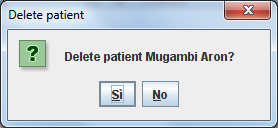

In the *Buttons Panel* you have the following choices:

* *[.underline]##S##i* to confirm the record deletion
* *[.underline]##N##o* to close the window and return to the previous window

=== 10.4 Insert a new Patient Extended ([.underline]##N##ew Patient)

Since OpenHospital version 1.3.1 you can extend the New Patient functionality by changing the _PATIENTEXTENDED_ flag in the configuration file. Ask to your Administrator how to do it or read the _Administrator’s Guide_.

====  10.4.1 New features

The *New Patient Extended* module affords the following improvements:

image:extracted-media/media/image85.png[image,width=642,height=427]

To record a new patient, enter the following fields:

* *Tax Number ID*: is the national ID or other ID you may use to identify univocally the patient
* *Age / BirthDate / Description*: the age can be specified in three different ways: +
 +
image:extracted-media/media/image86.png[New Patient Extended_age.PNG,width=187,height=74]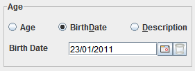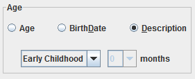 +
 +
In any case it will be converted to an age in years in the *_Patients browser_* window.
* *BloodType*: it can be 0+, A+, B+, AB+, 0-, A-, B-
* *Father*: you can specify the father name and if is still alive
* *Mother*: you can specify the mother name and if is still alive
* *Parents Together*: you can specify if the parents are still together
* *Has Insurance*: you may specify if the patient has a health financial protection
* *Load File*: could be used to load a patient picture (will be cropped squared)

_*[.underline]#NB#*: AgeTypes (Descriptions) can be defined by the Administrator._ _Ask to your Administrator how to do it or see link:#14-general-data-general-data[General Data] in this document._

====  10.4.2 Height and Weight functionality (Height and Weight)

Since OpenHospital 1.8, the height and weight of the patient is no longer registered during patient creation. It is done through the examination module available in the *_Admission browser_* window.

====  10.4.3 Patient Photo (New Photo)

You can extend the New Patient functionality by changing the __VIDEOMODULEENABLED [.underline]# #__flag in the configuration file. Ask to your Administrator how to do it or read the _Administrator’s Guide_.

Once the video module has been enabled the *New Patient Extended* window will looks as follow:

image:extracted-media/media/image86.png[New Patient Extended_photo.PNG,width=587,height=339]

By clicking on *New Photo* button, the webcam should be activated (check any light on the device) and in the template you should see the “eye-view” of the camera.

image:extracted-media/media/image89.png[image,width=591,height=392]

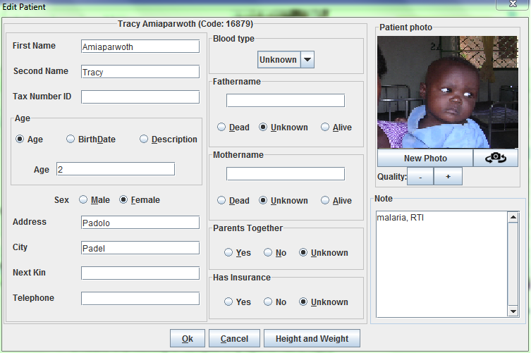

By clicking again on *New Photo* button, you will make a shot ready to be saved in the system attached at the patient information.

===== 10.4.3.1 Camera settings (image:extracted-media/media/image91.png[switchcam.png,width=22,height=12])

If nothing happens when you press on *New Photo* button you can press the *switch camera* button image:extracted-media/media/image91.png[switchcam.png,width=22,height=12] that allows switching among the webcams connected to the computer if more than one; if only one camera is connected to the computer it is useful to reset the camera settings and restart it.

Once the camera is activated and you can see the “eye-view” of the camera, you may press on “+” or “-“ to increase or reduce the image quality.

OpenHospital will try automatically to set the best quality for any webcam connected to the computer and will remember the last settings used.

_*[.underline]#NB#*: If the camera refuse to work is possible to check the problem deeper changing the flag DEBUG in configuration file._ _Ask to your Administrator how to do it or read the Administrator’s Guide._

===  10.5 Admission functions ([.underline]##A##dmission)

The admission functions include the managing of a patient admission, including surgery, delivery, and discharge.

To access the Admission function, first of all you have to highlight the Patient in the *_Patients browser_* window. Secondly press the *[.underline]##A##dmission* button.

If the patient is not admitted then the *_New admission_* window appears.

If the patient is already admitted then the *_Edit admission record_* window appears.

====  10.5.1 Start the admission of a patient ([.underline]##A##dmission)

Once a patient is registered, he/her can be admitted in a hospital ward.

First of all, to insert the admission of a patient you have to highlight the patient in the *_Patients browser_* window. Once you’ve done this, press the *[.underline]##A##dmission* button. The *_New admission_* window showed below appears (if the patient is already admitted the *_Edit admission record_* window appears).

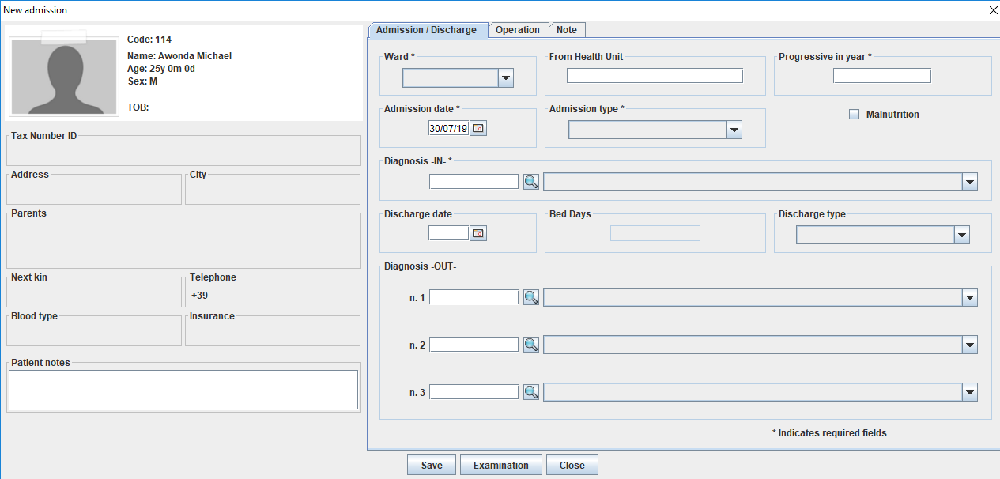

To start an admission, you have to enter the following fields (on the right side of the window):

* *Ward:* the ward where the patient is admitted
* *From health Unit:* (not mandatory) in case of referral you may type the facility where the patient comes from
* *Progressive in year:* is the progressive number per year and per ward automatically set by the system, anyway you may change it if needed
* *Admission date:* the date of admission, automatically set as today
* *Admission type*: the type of admission (i.e. Ambulance, Self, Referral, etc...)
* *Malnutrition* (not mandatory) in case of malnutrition you may check this box so you will manage the malnutrition control from the *_Patient data_* window (see Malnutrition control function).
* *Diagnosis IN:* it is the diagnosis the patient has been admitted with

TIP: It is possible to filter in order to find diseases more easily. To do this, you will need to enter a text fragment in the search fields that is part of the disease name. The closer the search text comes to the name of the disease being searched for, the more precise the search is.

_*[.underline]#NB#*: Wards, AdmissionType and Diagnosis can be defined by the Administrator._ _Ask to your Administrator how to do it or see link:#14-general-data-general-data[General Data] in this document._

_*[.underline]#NB#*: The "Progressive in year" field is automatically populated by the program; in case of maternity the counter can starts from first January or from first June as far as the current normative ask to the health facilities; to change this behaviour please ask to your Administrator to set the MATERNITYRESTARTINJUNE [.underline]# # flag in the configuration file or read the Administrator’s Guide._

When you finish entering data in the *Buttons Panel* you have the following choices:

* *[.underline]##S##ave* to confirm the values on the window
* *[.underline]##C##lose* to close the window and to return to the *_Patient browser_* window without applying any changes
* *[.underline]##E##xamination* to open the *_Examination_* window (See 10.5.2 Patient examination).

Once you press the Save button the *_New admission_* window will close and you will see the status changed in the *_Patients browser_* window as follow figure:

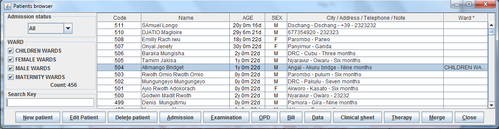

====  10.5.2 Patient examination

Since OpenHospital 1.8, you can register patient general parameters such as weight, height, arterial pressure, heart rate, Temperature and saturation. Open hospital also calculates automatically the patient BMI.

You have two ways to access the module. In the *_Patient browser_* window, highlight the patient and click *[.underline]##E##xamination.* Or in the *_Admission_* window, click the *[.underline]##E##xamination* button bellow. The following window will appear.

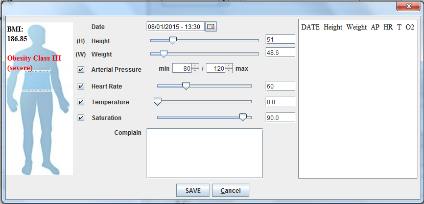

The window is divided into two areas: The panel where you enter information at the left and area where the examination history is displayed at the right.

Then enter following information:

* *Date*: Date of the examination
* *Height*: Patient height
* *Weight*: Patient weight
* *Arterial pressure*: Patient arterial pressure
* *Heart rate*: Patient heart rate
* *Temperature*: Patient temperature
* *Saturation*: Patient saturation
* *Complain*: Any additional note concerning the examination

After typing data, OpenHospital automatically calculate the BMI and display the result on the human figure at the left.

Where everything is correct, click *[.underline]##S##ave* to save the examination.

====  10.5.3 Insert/modify Surgery data

First of all, to insert/modify operations data of a patient admission you have to highlight the patient in the *_Patients browser_* window. Once you’ve done this, press the *[.underline]##A##dmission* button. The *_Edit admission record_* window showed above appears.

You can also insert/modify operations data directly when you are inserting or modifying an admission by selecting the *Operation tab* in the top of the window

Operations data that you can manage are:

* *Operation date:* the operation date
* *Operation type:* the operation type
* *Operation result:* the result of the operation
* *Transfusion Units:* (not mandatory): how many units of blood have been used
* *Remark:* (not mandatory): a comment about the operation

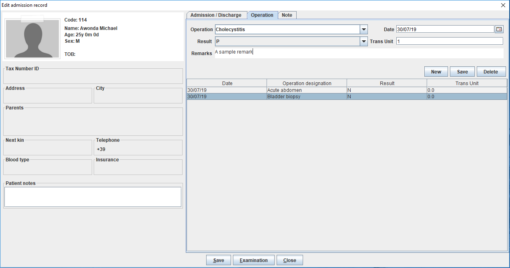

Since OpenHospital version 1.9, it is possible to record several operations at once. The buttons *_New_*, *_Save_* and *_Delete_* at the top right of the table allow you to manipulate the items of the table.

To add a new operation, click on the button *_New_* and enter the data as mentioned above and then click on *_Save_*.

WARNING: Clicking on the button *_Save_* just adds the operation to the table; it is not yet permanently recorded. 

To delete a line from the table, select the line to delete by clicking on it (it automatically highlights), then click on the button *_Delete_*. When you are finished, click on the button *Save* below the table to save your changes.

_*[.underline]#NB#*: OperationType and Operations can be defined by the Administrator._ _Ask to your Administrator how to do it or see link:#14-general-data-general-data[General Data] in this document._

====  10.5.4 Insert/modify Delivery data

If a female patient is admitted, the Maternity ward will be present in the ward list and, by selecting it, the *_Edit admission record_* window will change as showed below:

In the window extension you will be able to specify much information about the Maternity Case, like:

* *Visit*: date: the date of a visit before the delivery, if any
* *Weight*: the weight of the mother before the delivery, if measured
* *Treatment*: the treatment type given to the mother, if any
* *Delivery Date*: the date of delivery
* *Delivery Type*: the type of delivery
* *Delivery Result Type*: the result of the delivery
* *Control dates*: the dates of control after the delivery
* *Abort date*: the date of the abort if the result of the delivery was an abortion

image:extracted-media/media/image96.png[Admission_delivery.PNG,width=642,height=339]

_*[.underline]#NB#*: TreatmentType, DeliveryType and DeliveryResultType can be defined by the Administrator._ _Ask to your Administrator how to do it or see link:#14-general-data-general-data[General Data] in this document._

====  10.5.5 Discharge of a patient ([.underline]##A##dmission)

First of all, to discharge a patient from the hospital you have to highlight the patient in the *_Patients browser_* window. Once you’ve done this, press the *[.underline]##A##dmission* button. The *_Edit admission record_* window showed above appears.

You have to enter the following data:

* *Discharge date:* the date of discharge
* *Discharge type:* the type of discharge
* *Diagnosis OUT:* it is the diagnosis the patient has been discharged with

TIP: As in the case of *_Diagnosis IN_*, it is possible to filter to find diseases more easily.

image:extracted-media/media/image97.png[Admission_discharge.PNG,width=642,height=337]

_*[.underline]#NB#*: DischargeTypes and Diseases can be defined by the Administrator._ _Ask to your Administrator how to do it or see link:#14-general-data-general-data[General Data] in this document._

When you finish entering data in the *Buttons Panel* you have the following choices:

* *[.underline]##S##ave* to confirm the values on the window

*[.underline]##C##lose* to close the window and to return to the *_Patient browser_* window without applying any changes

Once you press the Save button the *_Edit admission record_* window will close and you will see the status changed in the *_Patients browser_* window as follow figure:

image:extracted-media/media/image98.png[Admission Patient_discharged.PNG,width=642,height=168]

===  10.6 OPD ([.underline]##O##PD)

If _OPDEXTENDED_ flag is set as YES in the configuration file (ask to your Administrator) the button *[.underline]##O##PD* in the Admission/Patient window will allow you to start an OPD by selecting the related patient first (see link:#5_2_2_create_a_new_patient_visit_new[Create a new patient visit (New)] for more information)

=== 10.7 Bill ([.underline]##B##ill)

The button *[.underline]##B##ill* in the Admission/Patient window will allow you to start a bill by selecting the related patient first (see link:#8_2_1_insert_a_new_bill_new_bill[Insert a new bill (New Bill)] for more information)

===  10.8 Manage Patient historical data ([.underline]##D##ATA)

This function allows modifying data of a Patient and modify/delete the history of out of patients/admissions of a patient. Malnutrition can also be managed with this function.

To access the Patient historical data function, first of all you have to highlight the Patient in the *_Patient browser_* window. Secondly press the *[.underline]##D##ATA* button. The *_Patient data_* window showed below will appear.

image:extracted-media/media/image99.png[image,width=575,height=423]

The screen is divided in three areas:

* *Patient summary* (on the left)
* *Data table* (on the right)
* *Buttons panel*

The *Patient summary* area shows you a summary of patient data.

*Data table* shows you a summary of all the out-patients (OPD) visits and all the admissions related to the patient.

The following functions are accessible from the *Buttons Panel* of the window *_Patient data:_*

* *[.underline]##E##dit Patient* to modify an already stored patient (it is the same *[.underline]##E##dit* function of the *_Patient browser_* window)
* *[.underline]##E##DIT* to modify data of an admission or an out-patient visit
* *[.underline]##D##ELETE* to delete an already stored admission
* *[.underline]##M##alnutrition control* to create, modify or delete malnutrition control data of a patient
* *[.underline]##C##lose* to exit from the function *_Patient_* *_Data_* and return to the *_Patients browser_* window

====  10.8.1 Modify data of an admission or out-patient visit ([.underline]##E##DIT) 

First of all, to modify data of an admission or out-patient visit you have to highlight it in *Data table* of the *_Patient Data_* window. Once you’ve done this, press the *[.underline]##E##DIT* button. When the *_Edit admission record_* window showed below appears, the record is available for changes. All data can be changed.

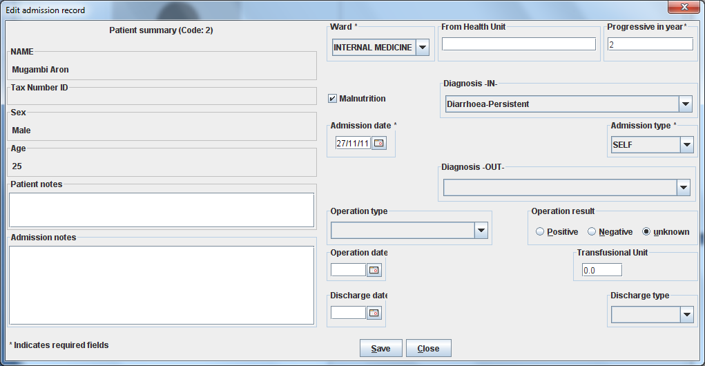

When you finish entering data in the *Buttons Panel* you have the following choices:

* *[.underline]##S##ave* to confirm new values (all the previous values will be lost)
* *[.underline]##C##lose* to close the window and to return to the Menu without applying any changes

====  10.8.2 Delete an admission ([.underline]##D##ELETE)

First of all, to delete a stored admission you have to highlight it in the *_Patient Data_* window. Secondly press the *[.underline]##D##ELETE* button. A confirmation window will appear and it is showed below. Now the admission can be deleted. Deleted admissions won’t be available anymore.

image:extracted-media/media/image101.png[image,width=278,height=128]

In the *Buttons Panel* you have the following choices:

* *[.underline]##S##i* to confirm the record deletion
* *[.underline]##N##o* to close the window and return to the previous screen

====  10.8.3 Manage malnutrition control of a patient ([.underline]##M##alnutrition control)

Malnutrition control function is available for all and only the admissions that have concerns about malnutrition (malnutrition field activated in *_New admission_* window, see next page).

Malnutrition Control function allows you to register specified visits for those patients who need to control his/her Weight/Height index.

To access the Malnutrition control function, first of all you have to highlight the admission in the *_Patient data_* window. Secondly press the *[.underline]##M##alnutrition control* button. The *_Malnutrition browser_* window showed below will appear.

image:extracted-media/media/image102.png[Malnutrition Browser.PNG,width=642,height=288]

From this function you can insert (*New*) a new malnutrition control, modify (*Edit*) or *Delete* an existing malnutrition control already stored.

===== 10.8.3.1 Insert a new control ([.underline]##N##ew)

By pressing the *[.underline]##N##ew* button from the *_Malnutrition Browser_* window, you will access to the *_Malnutrition_* window below:

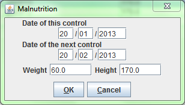

To record a new control, enter the following fields:

* *Date of this control*: the system automatically set the date of today
* *Date of next control*: the date of the next planned control
* *Weight*: the weight of the patient; you may use any kind of measure with decimal notation
* *Height*: the height of the patient; you may use any kind of measure with decimal notation

=== 10.9 Clinical Sheet ([.underline]##C##linical sheet)

The Clinical Sheet functionality is very similar to the *[.underline]##D##ATA* functionality (see *_Patients browser_* window)

To access the Clinical sheet function, first of all you have to highlight the Patient in the *_Patients browser_* window. Secondly press the *[.underline]##C##linical sheet* button. The *_Patient data_* window showed below will appear.

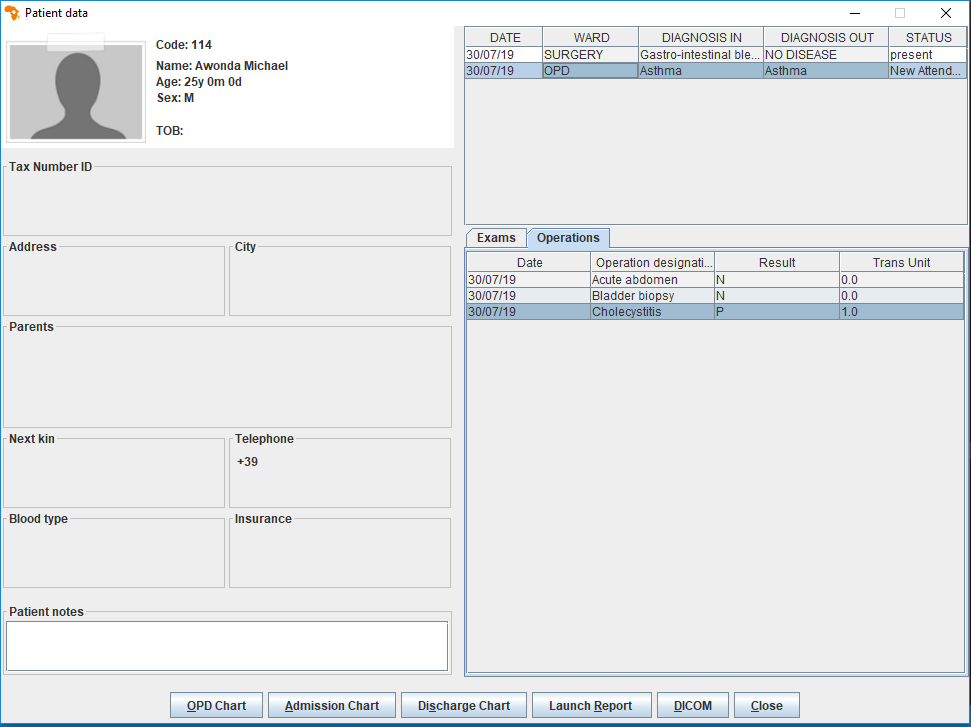

The window doesn't allow you to change data but, for the selected patient, it shows you all the out-patient (OPD) visits, the Admissions, his/her Laboratory exams and the various surgeries he/she underwent; by clicking on a row in the *Data table* on the top of the window, the related laboratory exams will be showed as follow:

* selected row is an Admission: all the exams done between the admission date and the discharge date will be showed in *Data table*, in the *_Exams_* tab
* selected row is an out-patient (OPD) visit: all the exams done after the selected OPD visit until next one (if any) or next admission date (if any) will be showed in the *Data table*, in the *_Exams_* tab

The tab *_Operations_* shows the various operations recorded for the selected patient between the admission date and the discharge date. 

In the *Buttons Panel* you have the following choices:

* *O[.underline]##PD Chart##* to print the OPD chart if the selected row in the grid on top is an OPD visit
* *[.underline]##A##dmission [.underline]#Chart#* to print the Admission chart if the selected row in the grid on top is an Admission
* *D[.underline]##ischarge Chart##* to print the Discharge chart if the selected row in the grid on top is an Admission and the patient is already discharged.
* *[.underline]##L##aunch report* to print the clinical sheet of a patient
* *[.underline]#DICOM#* to launch DICOM viewer
* *[.underline]##C##lose* to close the window and to return to the *_Patient browser_* window without applying any changes

_*NB:* You need to change the DICOM flag in the configuration file to activate the DICOM functionality. Ask to your Administrator how to do it or read the Administrator’s Guide._

====  10.9.1 DICOM ([.underline]#DICOM viewer#)

You need to change the DICOM flag in the configuration file to activate the DICOM functionality. Ask to your Administrator how to do it or read the Administrator’s Guide.

On the patient Data window, click *DICOM* button to access the *_DICOM viewer_* window as shown below.

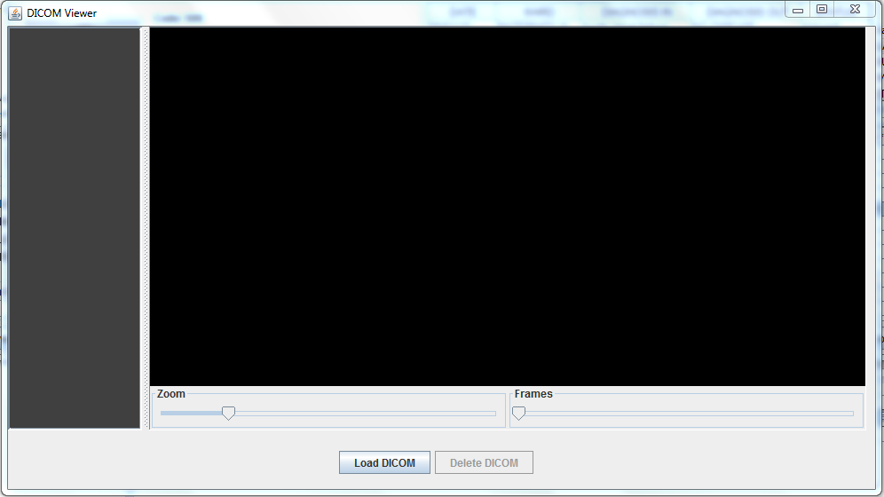

This module allows you to attach DICOM files to the patient’s folder. In order to do this, click *Load DICOM* button. The following window will appear.

image:extracted-media/media/image106.png[Dicom open.PNG,width=517,height=366]

Find the DICOM file on your computer and click *Open DICOM* button to load the file in the *_DICOM viewer_*.

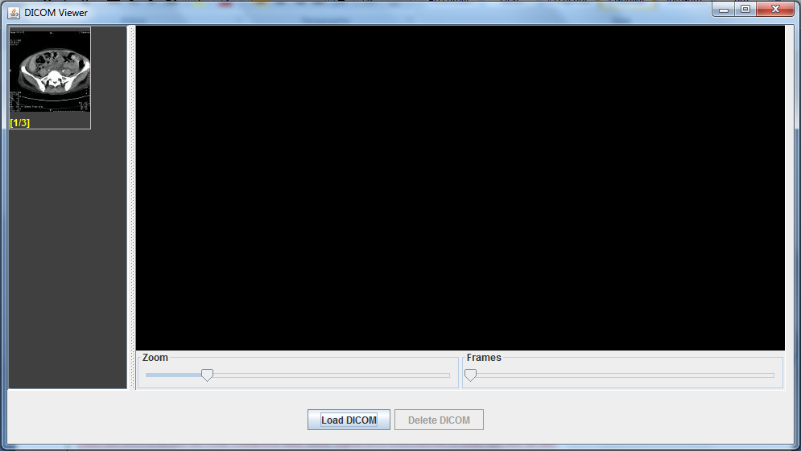

To view the file in the main window, double-click on it.

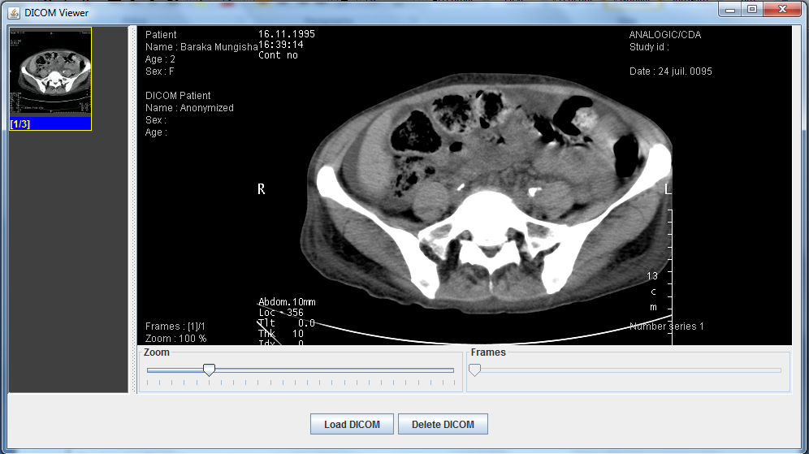

You can use *Zoom* slider to Zoom in or out the image.

You can load more than one DICOM file to a patient folder. You can also delete a DICOM file from the patient folder. You just have to select the file in left view and click *Delete DICOM* button.

=== 10.10 Therapy management ([.underline]##T##herapy)

First of all, to manage the therapy of a patient you have to highlight the patient in the *_Patients browser_* window. Once you’ve done this, press the *[.underline]##T##herapy* button. The specific window for therapy management of the selected patient will appear. The window has no name, we call it *_Therapy_* window.

From the *_Therapy_* window you can insert, modify or remove a therapy.

From the *_Therapy_* window you can insert or remove a scheduled visit.

The window is complex, see the comments below to understand the structure.

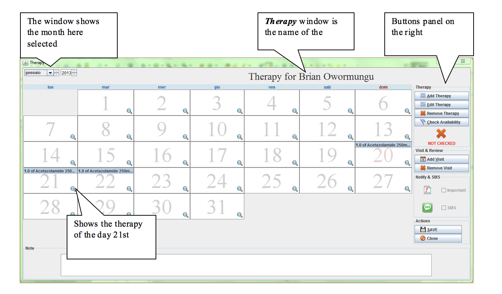

==== 10.10.1 Add a therapy ([.underline]##A##dd Therapy)

To add a new therapy for the patient, press the *[.underline]##A##dd Therapy* button on the right of the window. The *_Therapy entry form_* window showed below will appear.

A therapy defines for every pharmaceutical the quantity, frequency and period of use.

You can add more than one therapy for the same patient. The set of therapies defined for a patient is called “Therapy plan”.

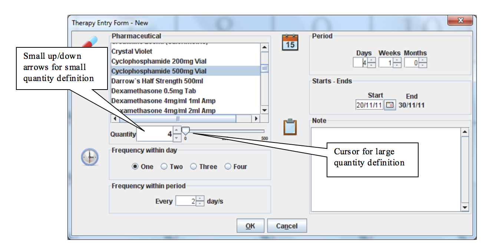

*_[.underline]#NB#_*: To better explain how the function *Add a therapy* works, the *_Therapy_* window below (next page) shows the results of the therapy defined in the *_Therapy entry form_* window above.

To add a therapy, you have to enter the following fields:

* *Pharmaceutical of the therapy*: in the example above _Cyclophosphamide 500mg_ (highlight the desired pharmaceutical)
* *Quantity*: set the quantity; you can define it by clicking on the small up/down arrows (for small quantity) or moving the cursor on the right (for large quantity); in the example above the selected value is “4”
* *Frequency within the day*: set how many times (frequency) the dose has to be given within one day (possible choices are: one, two, three, four); in the example above “One” means once per day
* *Frequency within period*: set the periodicity of the therapy; in the example above every two days (a quantity of 4 _Cyclophosphamide 500mg_ every two day has to be given)
* *Period*: set how long is the therapy, to do it select days, weeks and months; in the example above the therapy is 11 days long (4 days and 1 week)
* *Starts – Ends*: set start and end date of the therapy; in the example the therapy starts on November 20^th^ and finish on November 30^th^
* *Note* (not mandatory): free text available for notes

When you finish entering data in the *Buttons Panel* you have the following choices:

* *[.underline]##O##k* to confirm data of the therapy. The therapy is not saved until you do not confirm it with the *[.underline]##S##AVE* button in the *_Therapy_* window (see *Save function* described below)
* *[.underline]##C##ancel* to close the window and to return to the *_Therapy_* window

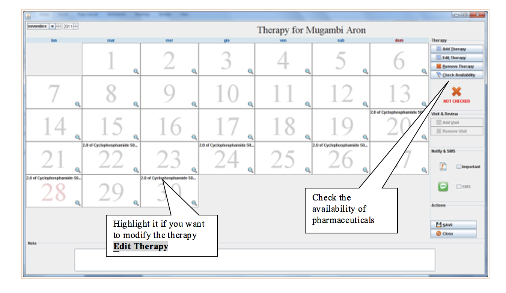

==== 10.10.2 Modify a therapy ([.underline]##E##dit Therapy) 

First of all, to modify a therapy you have to highlight one occurrence of the therapy (see box above) in the *_Therapy_* window. Once you’ve done this, press the **[.underline]##E##dit Therapy [.underline]# #**button. The *_Therapy entry form_* window will appear. You can modify all data as in the *Add a therapy* function.

See link:#10_10_1_add_a_therapy_add_therapy[Add a therapy (Add Therapy)] function for detailed description.

====  10.10.3 Remove a therapy (Remove Therapy) 

First of all, to remove a therapy you have to highlight one occurrence of the therapy (see box above) in the Therapy window. Pay attention! Once you’ve done this, pressing the *Remove Therapy* button, the therapy is removed. Therapy can be removed before or after the final saving (see *link:#8_2_1_9_save_function_save[Save function]* described below)

====  10.10.4 Check availability of the pharmaceuticals ([.underline]##C##heck availability) 

When you have entered the therapy plan (all the therapies of a patient) you can check the availability of the related pharmaceuticals in the hospital. If the pharmaceutical/s checked is/are present in the quantity requested by the therapy plan on the button panel on the right side of the *_Therapy_* window you see in green colour the text ”OK”

image:extracted-media/media/image112.png[Therapy_available.PNG,width=168,height=82]

otherwise the application shows the small window showed below, called *_Therapy not available:_*

image:extracted-media/media/image113.png[image,width=310,height=149]

This window provides you only information that the therapy is not available and does not block the input of the Therapy plan. You have to click *[.underline]##O##K* on the button to exit from the window.

After the check, on the *button panel* of the *_Therapy_* window you see in red colour the text “NOT AVAILABLE” if at least one of the involved drugs starting from today are not available or the test “AVAILABLE” otherwise.

Note: check can also be done therapy by therapy and not only at the end of the input of all the therapies.

Check function is not mandatory, you can save the therapy plan also without checking the presence of the pharmaceuticals in the hospital (see link:#8_2_1_9_save_function_save[Save function] below).

==== 10.10.5 Save function ([.underline]##S##AVE)

When you have completed the input of the therapy plan press the *[.underline]##S##AVE* button on the button panel of the *_Therapy_* window. Be aware that the therapy plan is saved when on the screen appears the *_Message_* window showed below with the message “Therapies plan saved”.

If you have not done the availability check (see link:#check-availability-of-the-pharmaceuticals-check-availability[*Check availability function*]) the *_Not checked_* window showed below appears.

On the *Buttons Panel* you have the following choices:

* *[.underline]##O##k* to confirm the therapy plan; you have to be aware that if you press *[.underline]##O##k* you have not checked the existence of the pharmaceuticals in the hospital. The application saves the therapy plan and shows the confirmation window showed below.
* *[.underline]#Cancel#* to return to the *_Therapy_* window without saving the therapy plan.

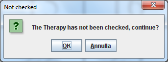

If you have done the availability check (see link:#check-availability-of-the-pharmaceuticals-check-availability[*Check availability function*]) but the pharmaceuticals requested by the therapy plan do not exists in the hospital the *_Not available_* window showed below appears.

On the *Buttons Panel* you have the following choices:

* *[.underline]##O##k* to confirm the therapy plan; you have to be aware that if you press *[.underline]##O##k* you have saved a therapy but there are not the requested pharmaceuticals in the hospital. The application saves the therapy plan and shows the confirmation window showed below.
* *[.underline]#Cancel#* to return to the *_Therapy_* window without saving the therapy plan.

image:extracted-media/media/image115.png[image,width=302,height=128]

Either you have done the availability check that the pharmaceuticals are present in the hospital or you have not done the check, when the application shows the notification window below the therapies plan is saved.

image:extracted-media/media/image116.png[image,width=278,height=128]

Press *[.underline]##O##K* to finish.

====  10.10.6 Close function (Close)

Close function allows you to exit from the *_Therapy window._* Press the *Close* button to access the Close function. The *_Select an option_* *_window_* showed below appears. On the *Button panels* you have the following choices:

* *[.underline]##S##i:* this function is the same as the *Save function ([.underline]##S##AVE)* described above
* *[.underline]##N##o* to return to the *_Therapy window_* without saving the therapy plan
* *[.underline]#Cancel#:* to stop the function and return to the *_Therapy window_* without apply any change

image:extracted-media/media/image117.png[image,width=379,height=128]

==== 10.10.7 Notify & SMS 

image:extracted-media/media/image118.png[image,width=170,height=131]With these two checkboxes you can set the therapies plan for this patient as important (not implemented yet) and notifiable via SMS. Briefly:

* therapies: will be notified to the patient with an SMS at 8:00am, with text “REMINDER: “ + therapy details
* visits: will be notified to the patient with an SMS 24 hours before the scheduled date and time, with the text “REMINDER VISIT: “ + visit details

=== 10.11 Merge function ([.underline]##M##erge)

You can use this function to merge two patients’ histories in case of wrong double registration when she/he is admitted in the Hospital.

First of all, to merge data of two patients you have to highlight them in the *_Patient browser_* window.

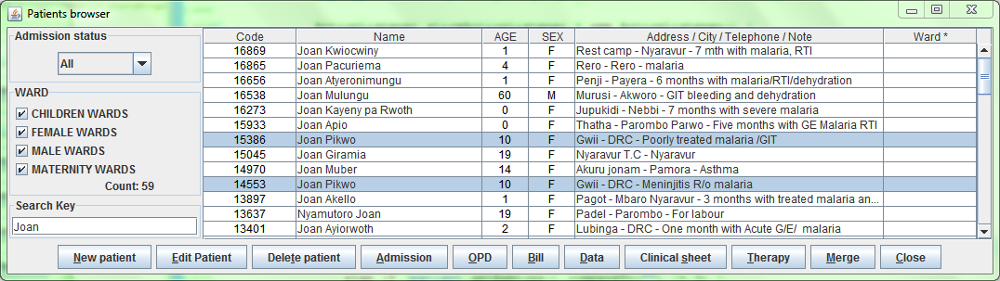

Once you’ve done this, press the *[.underline]##M##erge* button. The *_Merge_* window showed below appears:

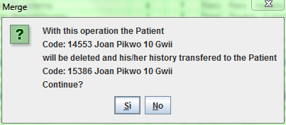

By pressing Yes, the patient with smaller Code will be deleted and all his/her history transferred to the other one, it’s to say:

* Admission History
* Height & Weight History
* Laboratory History
* OPD History
* Bills History
* Pharmaceuticals Stock Ward History
* Therapy History
* Visit History
* Vaccine History

The old patient will be then deleted.

==== 10.11.1 Different Names

In case you try to merge two patients with different names you will be asked to choose the final one, with the window showed below:

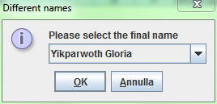

==== 10.11.2 Different Sex

In case you try to merge two patients with different sex you will be notice that the operation is not allowed, with the window showed below:

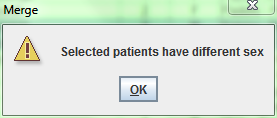

== 11 Statistics (S[.underline]##t##atistics)

=== 11.1 Main Characteristics

This functionality is the most important in order to extract data registered in previous ones.

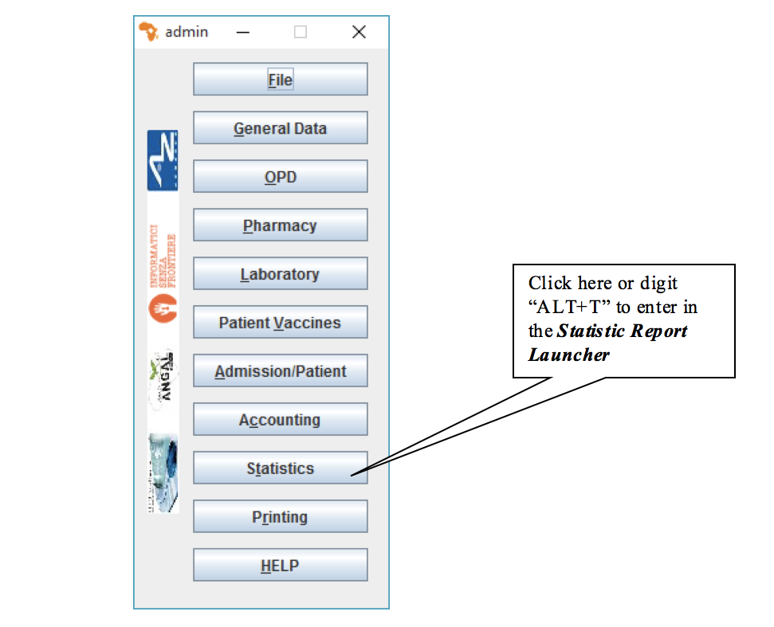

OpenHospital comes with a set of reports made for the Ugandan Ministry of Health (HMIS) and for Kenyan Ministry of Health (MOH) as well as national independent reports (OH). Anyway, all these reports can be useful for any organization and can be added or removed as explained in the Admin Manual chapter “6 – Reports”.

OpenHospital 1.8.4 comes with this set of reports:

* OH001 - Registered Patients
* OH003 - Registered patients by Age and Sex
* OH002 - Patients registered by origin
* OH004 - All incomes by price codes
* OH005 - Count outpatient
* OH006 - Count outpatient diagnosis
* OH007 - Lab monthly basic
* OH008 - Lab summary for OPD
* OH009 – InPatient Report
* OH010 – OutPatient Report
* HMIS 108 - page 1 - 1. census info
* HMIS 108 - page 1 - 2. referrals
* HMIS 108 - page 1 - 3. operations
* HMIS 108 - In Patient (diagnosis In)
* HMIS 108 - In Patient (diagnosis Out)
* HMIS 105 - Opd attendance
* HMIS 105 - Opd referrals
* HMIS 105 - Opd by diagnosis
* HMIS 55b - Lab monthly formatted
* HMIS 33b - Weekly epidem. surveil.
* HMIS 33b - Weekly epidem. surveil. over 5 y.o.
* HMIS 33b - Weekly epidem. surveil. under 5 y.o.
* MOH 717 - Monthly Workload Report for Hospitals (Page1)
* MOH 717 - Monthly Workload Report for Hospitals (Page2)
* MOH 705A - Over 5 - Daily Outpatient Morbidity Summary Sheet
* MOH 705A - Under 5 - Daily Outpatient Morbidity Summary Sheet

=== 11.2 Report Launcher (Launch Report)

With this function you can produce all reports listed in previous paragraph. Once you press the *S[.underline]##t##atistics* button on the main menu the *_Report Launcher_* window showed below will appear:

image:extracted-media/media/image124.PNG[image,width=642,height=121]

To produce one report, you must operate as follow:

* Select a report from the list
* Specify the period (it could be _month-year_ or _from date-to date_ depending on the report)
* Press the *Launch Report* button for PDF or *Excel* for CSV (Comma Separated Values) format

After some instants the JasperViewer® will show the generated report as follow:

image:extracted-media/media/image125.png[Report.PNG,width=591,height=420]

_*[.underline]#NB#*: By default, an internal PDF viewer is used. You can use an external PDF reader by modifying the INTERNALVIEWER flag in the configuration file._ _Ask to your Administrator how to do it or read the Administrator’s Guide._

You can save the report as PDF by clicking on save button (image:extracted-media/media/image66.png[Report_save.PNG,width=21,height=19]) or printing it by clicking on print button (image:extracted-media/media/image67.png[Report_print.PNG,width=21,height=18]).

_*[.underline]#NB#*: A PDF copy of every report is always saved within the folders of OpenHospital._ _Ask to your Administrator how to do it or read the Administrator’s Guide._

== 12 Printing (P[.underline]##r##inting)

=== 12.1 Main Characteristics

This functionality is meant for print some information about the hospital like letterhead, list of exams, diseases, etc...

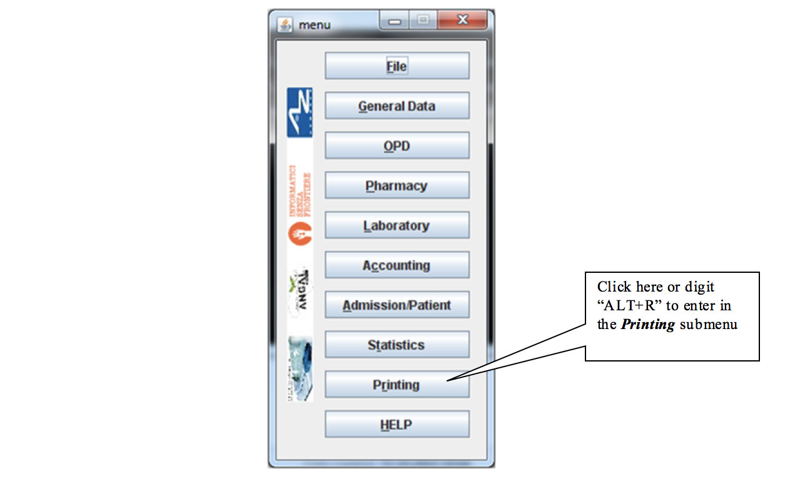

OpenHospital 1.7.0 comes at moment only with this couple of printings:

* Exams List
* Diseases List

=== 12.2 Printing

By pressing *P[.underline]##r##inting* from the main menu, you access the *_Printing_* menu. From this menu you have the following printings available: *[.underline]##E##xams List* and *[.underline]##D##isease List.*

image:extracted-media/media/image127.png[../../Screen%20Shot%202019-07-26%20at%2015.53.34.png,width=642,height=323]

====  12.2.1 Exams List ([.underline]##E##xams List)

This report will produce a report about the list of exams, divided by types, as defined in the application by the Administrator.

====  12.2.2 Disease List ([.underline]##D##isease List)

This report will produce a report about the list of diseases, divided by types, as defined in the application by the Administrator.

== 13 Communication (Co[.underline]##m##munication)

=== 13.1 Main Characteristics

Since OpenHospital version 1.7 you can use the Communication module by changing the _XMPPMODULEENABLED_ flag in the configuration file. Ask to your Administrator how to do it or read the _Administrator’s Guide_.

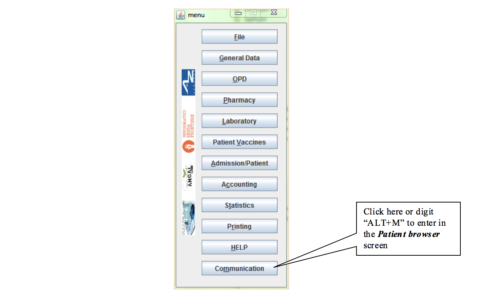

With this functionality you can chat and share information with other users logged in the system, if in turn the application has been set in [.underline]#multi-user# mode and an [.underline]#XMPP Server# is active and running (Ask to your Administrator how to do it or read the _Administrator’s Guide)._

The functionality, up to OpenHospital 1.7.0, allows following tasks:

* Chat
* Admissions notifications
* Pharmaceutical Stock critical levels notifications
* Report sharing

=== 13.2 Chat

By pressing the *Co[.underline]##m##munication* the *_Communication_* window showed below will appear:

image:extracted-media/media/image129.png[Communication.PNG,width=367,height=275]

It shows all users logged in the system. Some of them have a green circle near their names: it means that they are currently logged in the system and they are the only ones we can interact with. Others have the name close to a grey circle: it means that they logged at least one time in the past but are not using the system in this moment.

By double-clicking on an active user (i.e. Allan in the figure above) we may start a chat session with him/her, as showed in the figures below:

image:extracted-media/media/image130.png[../../Screen%20Shot%202019-07-26%20at%2015.55.17.png,width=641,height=286]

To send a message to Allan we must type it on the white box at the bottom then press “ENTER”; the message will be immediately forwarded to Allan; when Allan will do the same, his message will be immediately forwarded to us. Other users logged in (i.e. Mary in the figures above) cannot see our conversation.

=== 13.3 Admission/Discharge Notifications

As told before, with the communication module we can share some events with other users.

In the *_New Admission_* window, we will see a new box in the *Buttons Panel*, as showed below:

image:extracted-media/media/image131.png[Communication_admission.PNG,width=642,height=343]

The box will list all users logged in the system in this moment (those ones with the green circle near the name) and you can decide to send an alert or not (nobody) in the moment we press the *[.underline]##S##ave* button.

====  13.3.1 Admission Notifications

If we choose to send a notification about this new admission to user Allan, when we press the *[.underline]##S##ave* button, he will see in his *_Communication_* window a message like “new patient admission:” followed by his/her name and the related ward.

An example of Allan *_Communication_* window is shown below.

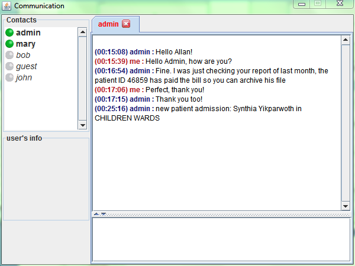

====  13.3.2 Discharge Notifications

Similarly, this would happen for discharge events. If we choose to send a notification about a discharge to user Allan, when we press the *[.underline]##S##ave* button, he will see in his *_Communication_* window a message like “discharged patient:” followed by his/her name and the related DischargeType.

An example of Allan *_Communication_* window is shown below.

image:extracted-media/media/image133.png[Communication_discharge_allan.PNG,width=377,height=285]

=== 13.4 Pharmaceuticals Critical Level Notifications

As told before, with the communication module we can share some events with other users.

In the *_Stock Movement Inserting - Discharge_* window we will see a new box at the bottom, as showed below:

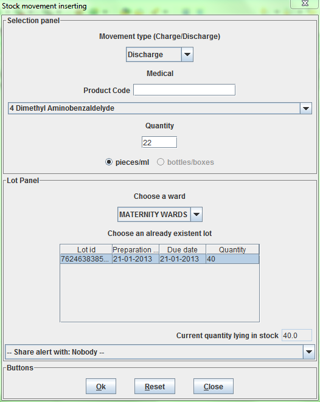

The box become active and useful only if the movement is going to reduce the selected pharmaceutical under the critical level. So, we can decide to share this event with another user logged in the system at the moment we press the *[.underline]##O##k* button.

If we choose to send a notification about this discharging movement to user Allan, when we press the *[.underline]##O##k* button, he will see in his *_Communication_* window a message like “ALERT:” followed by the pharmaceutical name and the text “is about to end” as showed below:

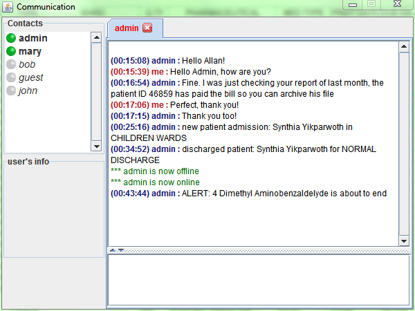

=== 13.5 Report sharing

As told before, with the communication module we can share some events with other users.

In the *_Report Launcher_* window, we will see a new box at the bottom, as showed below:

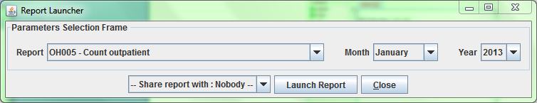

We can decide to produce and share the selected report with another user logged in the system at the moment we press the *Launch Report* button.

If we choose to share the report with user Allan, when we press the *Launch Report* button, he will see in his *_Communication_* window a message like “*** admin wants to share with you this report:” followed by the report name and a clickable icon that will link Allan to the related report. An example of this message is shown below:

image:extracted-media/media/image137.png[Communication_reports_allan.PNG,width=377,height=284]

== 14 General Data ([.underline]##G##eneral Data)

=== 14.1 Main Characteristics

One of the Administration task is the setup of OpenHospital through the *[.underline]##G##eneral Data* functionality. It allows defining all “types” and “data” that are going to be used in OpenHospital.

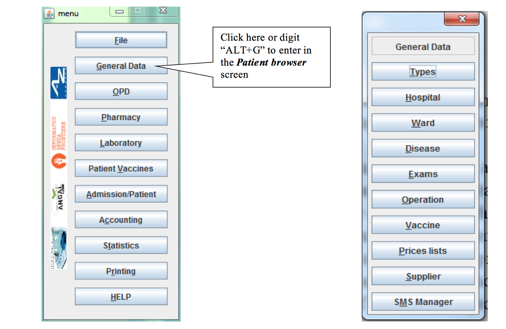

Once you’ve pressed on *[.underline]##G##eneral Data* button from the main menu you access the *_General Data_* menu. From this menu you have the following functions available:

* *[.underline]##T##ypes*: will bring to Types menu
* *[.underline]##H##ospital*: to set some Hospital information (name, address, telephone, email, etc...)
* *[.underline]##W##ard*: to define which departments are in the hospital
* *[.underline]##D##isease*: to define which diseases are diagnosed in the hospital
* *[.underline]##E##xams*: to define which laboratory exams are performed in the hospital
* *[.underline]##O##peration*: to define which surgical operations are provided by the hospital
* *[.underline]##V##accine*: to define which vaccines are given in the hospital
* *[.underline]##P##rices lists*: to define unitary costs of the services provided by the hospital
* *S[.underline]##upplier##*: to manage medicals suppliers
* *[.underline]##S##M[.underline]#S Manager#*: to send SMS or schedule SMS sending

===  14.2 Types ([.underline]##T##ypes)

Once you’ve pressed on *[.underline]##T##ypes* button from the *_General Data_* menu you access the *_Types_* menu:

image:extracted-media/media/image139.png[../../Screen%20Shot%202019-07-26%20at%2016.00.55.png,width=642,height=412]

From the *_Types_* menu you have the following functions available:

* *[.underline]##A##dmission Type*: the way the patient is admitted in the hospital +
_i.e. Ambulance, Self, Referral, etc..._
* *[.underline]##D##ischarge Type*: the way the patient is discharged from the hospital +
_i.e. Healed, Unchanged, Dead, etc..._
* *De[.underline]##l##ivery Type*: the ways the mothers are assisted in childbirth +
_i.e. Normal Delivery, Caesarean Session, etc..._
* *Delive[.underline]##r##y Result Type*: the result you are interested to track in reporting +
_i.e. Live Birth, Newborn Death, Fresh Still Birth, etc..._
* *Disease [.underline]##T##ype*: the way you need to group similar diseases +
_i.e. Epidemic, Maternal, etc..._
* *[.underline]##E##xam Type*: the way you need to group similar laboratory exams +
_i.e. Haematology, Parasitology, Serology, etc..._
* *Medical[.underline]##s## Stock Mov Type*: the kind of movements, meant as charge or discharge, you may perform in the Medical Store +
_i.e. Charge, Discharge, Donation, Correction, etc..._
* *[.underline]##M##edicals Type*: the way you need to group similar pharmaceuticals +
_i.e. Drugs, Chemical, Laboratory, etc..._
* *[.underline]##O##peration Type*: the way you need to group similar surgical operations +
_i.e. Abdominal, Obstetrical, Orthopaedic, etc..._
* *[.underline]##P##regnant Treatment*: the treatments the hospital can provide to mothers +
_i.e. First dose with SP, Second dose with SP, etc..._
* *Ot[.underline]##h##er Prices*: extra services the hospital can provide (it will be reflected in Prices lists) +
_i.e. Admission Fee, Food, POP, etc..._
* *A[.underline]##g##e Type*: the age classifications you use in the hospital +
_i.e. Newborn, Childhood, Adult, Elderly, etc..._
* *[.underline]##V##accine Type*: the way you need to group similar vaccines +
_i.e. Child, Adult, Pregnant, etc..._

====  14.2.1 Admission Types ([.underline]##A##dmission Type)

Once you’ve pressed on *[.underline]##A##dmission Type* button from the *_Types_* menu you access the *_Disease Type Browsing_* window as showed below:

image:extracted-media/media/image140.png[Admission Types.PNG,width=453,height=203]

The functions available from this window (but similarly to other windows in *_Types_* menu) are:

* *[.underline]##N##ew*: to enter a new type (cannot be used an already used code)
* *[.underline]##E##dit*: to edit an already existing type (the code must be unchanged)
* *[.underline]##D##elete*: to delete an already existing type (cannot be deleted if still used somewhere in the application)
* *[.underline]##C##lose*: to close the window

The Admission Types defined in this functionality will be reflected in the Admission function (see link:#10_5_1_start_the_admission_of_a_patient_admission[Start the admission of a patient] and link:#10_5_5_discharge_of_a_patient_admission[Discharge of a patient] in this document).

====  14.2.2 Discharge Types ([.underline]##D##ischarge Type)

Once you’ve pressed on *[.underline]##D##ischarge Type* button from the *_Types_* menu you access the *_Discharge Type Browsing_* window as showed below:

image:extracted-media/media/image141.png[Discharge Types.PNG,width=453,height=194]

The functions available from this window (but similarly to other windows in *_Types_* menu) are:

* *[.underline]##N##ew*: to enter a new type (cannot be used an already used code)
* *[.underline]##E##dit*: to edit an already existing type (the code must be unchanged)
* *[.underline]##D##elete*: to delete an already existing type (cannot be deleted if still used somewhere in the application)
* *[.underline]##C##lose*: to close the window

The Discharge Types defined in this functionality will be reflected in the Admission function (see link:#10_5_1_start_the_admission_of_a_patient_admission[Start the admission of a patient] and link:#10_5_5_discharge_of_a_patient_admission[Discharge of a patient] in this document).

====  14.2.3 Delivery Types (De[.underline]##l##ivery Type)

Once you’ve pressed on *De[.underline]##l##ivery Type* button from the *_Types_* menu you access the *_Delivery Type Browsing_* window as showed below:

image:extracted-media/media/image142.PNG[Discharge Types.PNG,width=432,height=194]

The functions available from this window (but similarly to other windows in *_Types_* menu) are:

* *[.underline]##N##ew*: to enter a new type (cannot be used an already used code)
* *[.underline]##E##dit*: to edit an already existing type (the code must be unchanged)
* *[.underline]##D##elete*: to delete an already existing type (cannot be deleted if still used somewhere in the application)
* *[.underline]##C##lose*: to close the window

The Delivery Types defined in this functionality will be reflected in the Admission function (see link:#10_5_4_insertmodify_delivery_data in this document).

====  14.2.4 Delivery Result Types (Delive[.underline]##r##y Result Type)

Once you’ve pressed on *Delive[.underline]##r##y Result Type* button from the *_Types_* menu you access the *_Delivery Result Type Browsing_* window as showed below:

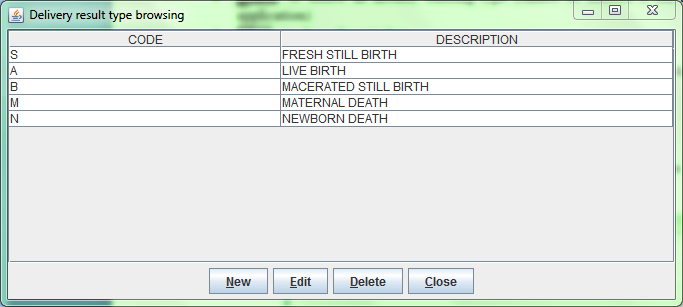

The functions available from this window (but similarly to other windows in *_Types_* menu) are:

* *[.underline]##N##ew*: to enter a new type (cannot be used an already used code)
* *[.underline]##E##dit*: to edit an already existing type (the code must be unchanged)
* *[.underline]##D##elete*: to delete an already existing type (cannot be deleted if still used somewhere in the application)
* *[.underline]##C##lose*: to close the window

The Delivery Result Types defined in this functionality will be reflected in the Admission function (see link:#10_5_4_insertmodify_delivery_data in this document).

====  14.2.5 Disease Types (Disease [.underline]##T##ype)

Once you’ve pressed on *Disease [.underline]##T##ype* button from the *_Types_* menu you access the *_Disease Type Browsing_* window as showed below:

____
image:extracted-media/media/image144.PNG[image,width=408,height=183]
____

The functions available from this window (but similarly to other windows in *_Types_* menu) are:

* *[.underline]##N##ew*: to enter a new type (cannot be used an already used code)
* *[.underline]##E##dit*: to edit an already existing type (the code must be unchanged)
* *[.underline]##D##elete*: to delete an already existing type (cannot be deleted if still used somewhere in the application)
* *[.underline]##C##lose*: to close the window

The Disease Types defined in this functionality will be reflected in the entire application, like in Disease definition or in OPD (see link:#14_5_disease_disease[Disease] and link:#5_2_2_create_a_new_patient_visit_new[Create a new patient visit] in this document).

====  14.2.6 Exam Types ([.underline]##E##xam Type)

Once you’ve pressed on *[.underline]##E##xam Type* button from the *_Types_* menu you access the *_Exam Types Browser_* window as showed below:

____
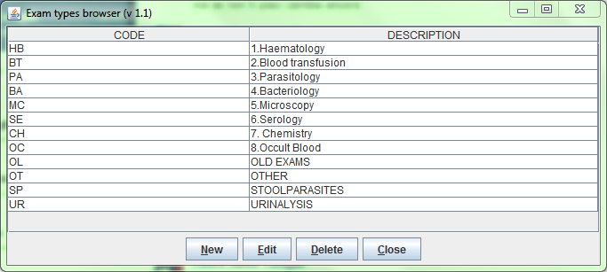
____

The functions available from this window (but similarly to other windows in *_Types_* menu) are:

* *[.underline]##N##ew*: to enter a new type (cannot be used an already used code)
* *[.underline]##E##dit*: to edit an already existing type (the code must be unchanged)
* *[.underline]##D##elete*: to delete an already existing type (cannot be deleted if still used somewhere in the application)
* *[.underline]##C##lose*: to close the window

The Exam Types defined in this functionality will be reflected in the Laboratory function (see link:#7_laboratory_laboratory[Laboratory] in this document).

====  14.2.7 Medicals Stock Movement Types (Medical[.underline]##s## Stock Mov Type)

Once you’ve pressed on *Medical[.underline]##s## Stock Mov Type* button from the *_Types_* menu you access the *_Medicals Stock Movement Types Browsing_* window as showed below:

____
image:extracted-media/media/image146.png[image,width=407,height=183]
____

The functions available from this window (but similarly to other windows in *_Types_* menu) are:

* *[.underline]##N##ew*: to enter a new type (cannot be used an already used code)
* *[.underline]##E##dit*: to edit an already existing type (the code must be unchanged)
* *[.underline]##D##elete*: to delete an already existing type (cannot be deleted if still used somewhere in the application)
* *[.underline]##C##lose*: to close the window

By pressing the *[.underline]##N##ew* button, you access the *_New_* *_Medical Stock Movement Type_* window as showed below:

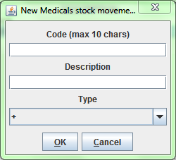

The allowed types are “+” and “-“ and this means that any kind of movements can be simplified as a charging (+) or a discharging (-) of the stock.

Examples could be:

* Positive correction (+)
* Negative correction (-)
* Donation (+)
* Lost (-)
* ...

The Medical Stock Movement Types defined in this functionality will be reflected in the Pharmaceutical Stock function (see link:#6-2-2-3-insert-stock-discharging-movement-discharge[Insert stock movement] in this document).

====  14.2.8 Medical Types ([.underline]##M##edical Type)

Once you’ve pressed on *[.underline]##M##edical Type* button from the *_Types_* menu you access the *_Medical Type Browsing_* window as showed below:

____
image:extracted-media/media/image148.png[image,width=407,height=183]
____

The functions available from this window (but similarly to other windows in *_Types_* menu) are:

* *[.underline]##N##ew*: to enter a new type (cannot be used an already used code)
* *[.underline]##E##dit*: to edit an already existing type (the code must be unchanged)
* *[.underline]##D##elete*: to delete an already existing type (cannot be deleted if still used somewhere in the application)
* *[.underline]##C##lose*: to close the window

The Medical Types defined in this functionality will be reflected in the entire application, like in Pharmacy function and Pharmaceutical Stock Ward (see link:#6-1-2-1-insert-a-new-pharmaceutical-new[Insert a new pharmaceutical] and link:#6-3-2-2-search-ward-pharmacy-movements-filter[Search Ward Pharmacy movements] in this document).

====  14.2.9 Operation Types ([.underline]##O##peration Type)

Once you’ve pressed on *[.underline]##O##peration Type* button from the *_Types_* menu you access the *_Operation Type Browsing_* window as showed below:

image:extracted-media/media/image149.png[Discharge Types.PNG,width=432,height=194]

The functions available from this window (but similarly to other windows in *_Types_* menu) are:

* *[.underline]##N##ew*: to enter a new type (cannot be used an already used code)
* *[.underline]##E##dit*: to edit an already existing type (the code must be unchanged)
* *[.underline]##D##elete*: to delete an already existing type (cannot be deleted if still used somewhere in the application)
* *[.underline]##C##lose*: to close the window

The Operation Types defined in this functionality will be reflected in the Admission function (see link:#10-5-3-insertmodify-surgery-data[Insert/modify Surgery data]  in this document).

==== 14.2.10 Pregnant Treatment Types ([.underline]##P##regnant Treatment Type)

Once you’ve pressed on *[.underline]##P##regnant Treatment Type* button from the *_Types_* menu you access the *_Pregnant Treatment Type Browsing_* window as showed below:

image:extracted-media/media/image150.png[Discharge Types.PNG,width=432,height=194]

The functions available from this window (but similarly to other windows in *_Types_* menu) are:

* *[.underline]##N##ew*: to enter a new type (cannot be used an already used code)
* *[.underline]##E##dit*: to edit an already existing type (the code must be unchanged)
* *[.underline]##D##elete*: to delete an already existing type (cannot be deleted if still used somewhere in the application)
* *[.underline]##C##lose*: to close the window

The Pregnant Treatment Types defined in this functionality will be reflected in the Admission function (see link:#10-5-4-insertmodify-delivery-data in this document).

==== 14.2.11 Other Prices (Ot[.underline]##h##er Prices)

Once you’ve pressed on *Ot[.underline]##h##er Prices* button from the *_Types_* menu you access the *_Other Prices Browser_* window as showed below:

image:extracted-media/media/image151.png[Discharge Types.PNG,width=377,height=194]

The functions available from this window (but similarly to other windows in *_Types_* menu) are:

* *[.underline]##N##ew*: to enter a new price (can be used an already used code)
* *[.underline]##E##dit*: to edit an already existing price (the code can be changed)
* *[.underline]##D##elete*: to delete an already existing price (cannot be deleted if still used somewhere in the application)
* *[.underline]##C##lose*: to close the window

By pressing the *[.underline]##N##ew* button, you access the *_New_* *_Medical Stock Movement Type_* window as showed below:

image:extracted-media/media/image152.png[New Prices.PNG,width=400,height=180]

In order to insert a New Price, you must input following data:

* *Code*: is the Price code and should be unique; anyway, there are no restriction on this field since the application will use an internal code to identify univocally this item
* *Description*: the Price description that may include the code for a fast search
* *OPD*: if the price is applicable with OPD (not yet implemented)
* *IPD*: if the price is applicable with IPD (not yes implemented)
* *Daily*: if the price should be applied for every bed-day (not yet implemented) or just once; if checked, you will be asked for “how many days?” when using this item, with follow *_Days_* window:

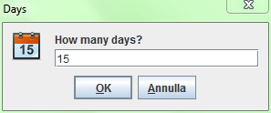

* *Discharge*: if the item has to be treated as a negative value so it will act as a discharge in the bill statement (i.e. Charge-Off, Free-of-charge, etc...).
* *Undefined*: if the item has no value in the PriceList and the amount have to be set “on the fly” while editing a bill; if checked, you will be asked for “how much is it?” with follow *_Undefined_* window:

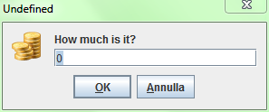

The Other Prices defined in this functionality will be reflected in the Accounting and PriceLists functions (see link:#8-2-1-insert-a-new-bill-new-bill[Insert a new bill] and link:#14-9-prices-price-lists[Prices] in this document).

==== 14.2.12 Age Types (A[.underline]##g##e Type)

Once you’ve pressed on *A[.underline]##g##e Type* button from the *_Types_* menu you access the *_Age Type Browser_* window as showed below:

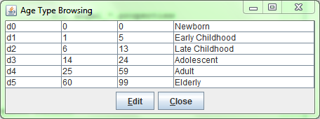

Since OpenHospital 1.7 age ranges are fixed and the Administrator can only change their values to best fit the health normative in the country.

By pressing the *[.underline]##E##dit* button, the table will allow you to modify only the age values and the button become a *[.underline]##S##ave* button now:

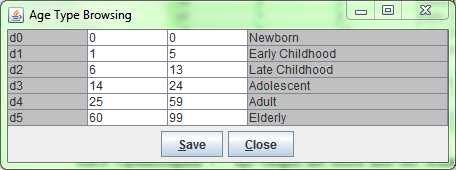

By double-clicking on each value, you can change it by typing the new value. Then by pressing the *[.underline]##S##ave* button, the new information will be stored in the system.

Only integer values are allowed and every range must be *contiguous* and not *overlapped* with the previous or with the following one:

For instance, in following case, ranges Late Childhood and Adolescent are not *contiguous* and ages 14 and 15 are not defined in any range:

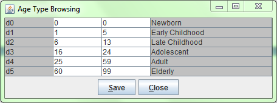

In following case instead, ranges Late Childhood and Adolescent are *overlapped* since both starts from age 6:

image:extracted-media/media/image159.png[image,width=642,height=313]

The Age Types defined in this functionality will be reflected in the Patient Extended functionality (see link:#10-4-insert-a-new-patient-extended-new-patient[Insert a new Patient Extended] in this document).

==== 14.2.13 Vaccine Types ([.underline]##V##accine Type)

Once you’ve pressed on *[.underline]##V##accine Type* button from the *_Types_* menu you access the *_Vaccine Type Browsing_* window as showed below:

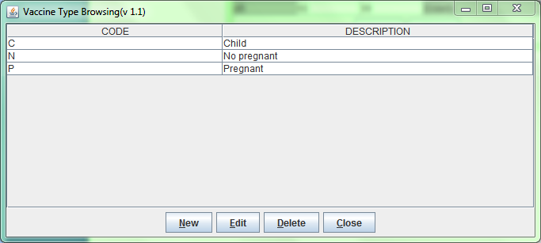

The functions available from this window (but similarly to other windows in *_Types_* menu) are:

* *[.underline]##N##ew*: to enter a new type (cannot be used an already used code)
* *[.underline]##E##dit*: to edit an already existing type (the code must be unchanged)
* *[.underline]##D##elete*: to delete an already existing type (cannot be deleted if still used somewhere in the application)
* *[.underline]##C##lose*: to close the window

The Vaccine Types defined in this functionality will be reflected in the Vaccine function (see link:#9-vaccines-patient-vaccines[Vaccines] in this document).

=== 14.3 Hospital ([.underline]##H##ospital)

Once you’ve pressed on *[.underline]##H##ospital* button from the *_General Data_* menu you access the *_Hospital information_* window as showed below:

image:extracted-media/media/image162.png[Hospital.PNG,width=282,height=254]

By pressing the *[.underline]##E##dit* button, the fields will allow you to modify the values and set the facility information where you’re installing the software:

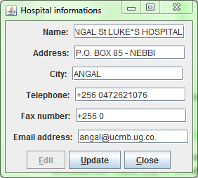

By pressing the *[.underline]##U##pdate* button, the new information will be stored in the system and will be reflected in the entire application, like in reports heading (see link:#statistics-statistics[Statistics] in this document)

=== 14.4 Ward ([.underline]##W##ard)

Once you’ve pressed on *[.underline]##W##ard* button from the *_General Data_* menu you access the *_Ward Browser_* window as showed below:

image:extracted-media/media/image164.png[Ward Browser.PNG,width=640,height=269]

The functions available from this window (but similarly to other windows in *_Types_* menu) are:

* *[.underline]##N##ew*: to enter a new ward (cannot be used an already used code)
* *[.underline]##E##dit*: to edit an already existing ward (the code must be unchanged)
* *[.underline]##D##elete*: to delete an already existing ward (cannot be deleted if still used somewhere in the application)
* *[.underline]##C##lose*: to close the window

By pressing the *[.underline]##N##ew* button, you access the *_New_* w**_ard record_** window as showed below:

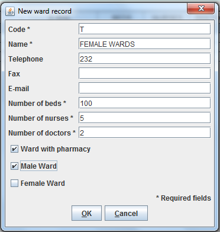

In order to insert a new Ward, you must provide following compulsive inputs:

* *Code*: the ward code (it must be unique)
* *Name*: the name of the ward
* *Number of beds*: it will be reflected in the admission module to check available beds; 0 – zero beds wards will be not shown in the admission module
* *Number of nurses*: it may be reflected in some reports (0 – zero is allowed)
* *Number of doctors*: it may be reflected in some reports (0 – zero is allowed)
* *Ward with pharmacy*: it will be reflected in Pharmaceuticals Stock; if checked we are saying that this ward can be a destination for discharging movements, otherwise it will be not shown in the list
* *Male Ward*: if it is a male Ward
* *Female Ward*: if it is a female Ward

_*[.underline]#NB#*: trough this function we may define some wards with 0 - zero beds but with pharmacy, in order to have “logic” departments (rather than physical) to manage pharmacy movements_

The Wards defined in this functionality will be reflected in the entire application, like in Admission module, Pharmaceuticals Stock and Pharmaceuticals Stock Ward (see link:#10-admissionpatient-admissionpatient[Admission/Patient], link:#6-2-pharmaceutical-stock-pharmaceutical-stock[Pharmaceutical Stock] and link:#6-3-pharmaceuticals-stock-ward-pharmaceuticals-stock-ward[Pharmaceuticals Stock Ward] in this document).

=== 14.5 Disease ([.underline]##D##isease)

Once you’ve pressed on *[.underline]##G##eneral Data* button from the *_General Data_* menu you access the *_Diseases Browser_* window as showed below:

image:extracted-media/media/image166.png[image,width=467,height=345]

The functions available from this window (but similarly to other windows in *_Types_* menu) are:

* *Selected Type*: you may filter the list by selecting only one DiseaseType
* *[.underline]##N##ew*: to enter a new disease (cannot be used an already used code)
* *[.underline]##E##dit*: to edit an already existing disease (the code and type must be unchanged)
* *[.underline]##D##elete*: to delete an already existing disease (it is set as not present in OPD neither in IPD)
* *[.underline]##C##lose*: to close the window

By pressing the *[.underline]##E##dit* button, the *_Edit Disease_* window will appear as shown below:

____
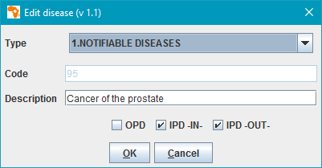
____

In editing mode, you cannot change type and code but only modify the Description and specify if the disease should appear in OPD, Admissions or both.

By removing the check from both checkboxes OPD and IPD you are performing a *[.underline]##D##elete* action, that is disabling it to not appear anymore in the application. Anyway, this can be changed anytime by editing it again.

The Diseases defined in this functionality will be reflected in the entire application, like in Admission module and OPD module (see link:#10-admissionpatient-admissionpatient[Admission/Patient] and link:#5-outpatient-department-management-opd[Outpatient Department Management] in this document).

=== 14.6 Exam ([.underline]##E##xams)

Once you’ve pressed on *[.underline]##E##xams* button from the *_General Data_* menu you access the *_Exam Browsing_* window as showed below:

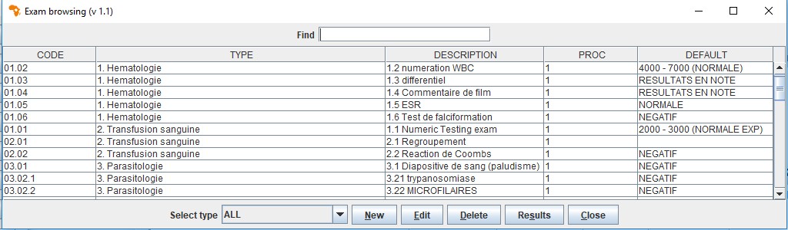

The functions available from this window (but similarly to other windows in *_Types_* menu) are:

* *Find*: you may filter the list by typing a keyword.
* *Selected Type*: you may filter the list by selecting only one ExamType
* *[.underline]##N##ew*: to enter a new exam (cannot be used an already used code)
* *[.underline]##E##dit*: to edit an already existing exam (the code and type must be unchanged)
* *[.underline]##D##elete*: to delete an already existing exam (it is set as not present in OPD neither in IPD)
* *Re[.underline]##s##ults*: to define possible results for the selected exam
* *[.underline]##C##lose*: to close the window

By pressing the *[.underline]##E##dit* button, the *_Edit Exam_* window will appear as shown below:

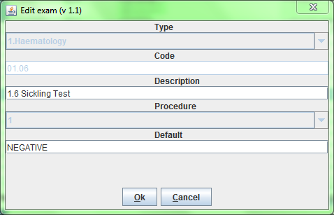

In editing mode, you cannot change type, code and procedure but only modify the Description and the default value.

By pressing the *[.underline]##N##ew* button, the *_New Exam_* window will appear as shown below:

image:extracted-media/media/image170.png[Exam Browsing_edit.PNG,width=373,height=240]

In order to insert a new Exam, you must input the following data:

* *Type*: is the Exam Type (see link:#14-2-6-exam-types-exam-type[Exam Types] in this document)
* *Code*: you cannot use an already used code; a warning window will appear in case
* *Description*: is the exam name
* *Procedure*: the kind of results for this exam (see link:#14-6-1-results-results[Results] in this document)
* *Default*: a default value among the result we are going to define (see link:#14-6-1-results-results[Results] in this document)

====  14.6.1 Results (Re[.underline]##s##ults)

Once you’ve inserted a new exam you may define the set of results it can allow by first selecting the exam in the *_Exam Browsing_* window and then by pressing on the *Re[.underline]##s##ults* button.

In OpenHospital 1.7 you can define two kind of set of results, called “Procedure”:

* *Procedure 1*: a set of values as description; only one will be selectable as exam *Single Result*
* *Procedure 2*: a set of Positive/Negative values; all of them will figure as exam *Multiple Results*

The difference between *Procedure1* and *Procedure2* will be seen in the Laboratory module (see link:#7-2-2-create-a-new-laboratory-exam-new[Create a new laboratory exam] and link:#7-3-3-laboratory-multiple-insert[Laboratory Multiple Insert] in this document)

So, the two possibilities are showed below:

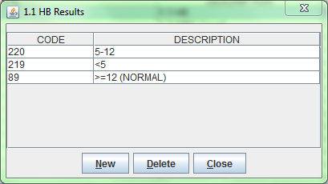

The functions available from both windows are:

* *[.underline]##N##ew*: to enter a new result
* *[.underline]##D##elete*: to delete an already inserted result
* *[.underline]##C##lose*: to close the window

=== 14.7 Operations ([.underline]##O##peration)

Once you’ve pressed on *[.underline]##O##peration* button from the *_General Data_* menu you access the *_Operation Browser_* window as showed below:

image:extracted-media/media/image173.png[image,width=596,height=337]

The functions available from this window (but similarly to other windows in *_Types_* menu) are:

* *Selected Type*: you may filter the list by selecting only one OperationType
* *[.underline]##N##ew*: to enter a new operation (cannot be used an already used code)
* *[.underline]##E##dit*: to edit an already existing operation (the code and type must be unchanged)
* *[.underline]##D##elete*: to delete an already existing operation (it is set as not present in OPD neither in IPD)
* *[.underline]##C##lose*: to close the window

By pressing the *[.underline]##E##dit* button, the *_Editing operation record_* window will appear as shown below:

____
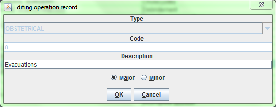
____

In editing mode, you cannot change type and code but only modify the Description and specify if the operation concerns Major or Minor surgery for statistical purpose (not yet implemented).

The Operations defined in this functionality will be reflected in the entire application, like in Admission module (see link:#10-5-3-insertmodify-surgery-data[Insert/modify Surgery data]  in this document).

=== 14.8 Vaccine ([.underline]##V##accine)

Once you’ve pressed on *[.underline]##V##accine* button from the *_General Data_* menu you access the *_Vaccine Browser_* window as showed below:

image:extracted-media/media/image175.png[image,width=597,height=168]

The functions available from this window (but similarly to other windows in *_Types_* menu) are:

* *Selected Type*: you may filter the list by selecting only one VaccineType
* *[.underline]##N##ew*: to enter a new vaccine (cannot be used an already used code)
* *[.underline]##E##dit*: to edit an already existing vaccine (the code and type must be unchanged)
* *[.underline]##D##elete*: to delete an already existing vaccine (it is set as not present in OPD neither in IPD)
* *[.underline]##C##lose*: to close the window

By pressing the *[.underline]##E##dit* button, the *_Edit vaccine record_* window will appear as shown below:

____
image:extracted-media/media/image176.png[image,width=286,height=204]
____

In editing mode, you cannot change type and code but only modify the Description.

The Vaccines defined in this functionality will be reflected in the entire application, like in Vaccine module (see link:#9-vaccines-patient-vaccines[Vaccines] in this document).

=== 14.9 Prices ([.underline]##P##rice Lists)

Once you’ve pressed on *[.underline]##P##rice Lists* button from the *_General Data_* menu you access the *_Prices Browser_* window as showed below:

image:extracted-media/media/image177.png[Prices Browser.PNG,width=550,height=373]

The functions available from this window are:

* *[.underline]##S##AVE*: to save any modification made to the pricelist
* *[.underline]#Printing#*: to print the current Price List
* *[.underline]##C##ancel*: to close the window
* Switch pricelist: you can focus on a different pricelist by selecting it on the upper-left corner of the window
* *Manage Lists*: you can define how many and which pricelist will be available in the application (see link:#14-9-1-pricelists-manage-lists[Pricelists] in this document)

The *_Prices Browser_* window shows the list of all prices in the selected pricelists; the system automatically creates a price for every Exam (see link:#14-6-exam-exams[Exam]), Operation (see link:#14-7-operations-operation[Operations]) and Medical (see link:#6-1-pharmaceuticals-pharmaceuticals[Pharmaceuticals]) defined in the system, plus other prices defined in Other Prices module (see link:#14-2-11-other-prices-other-prices[Other Prices])

In order to modify a price just double-click on it and type the new price.

_*[.underline]#NB#*: if a price has been defined as “undefined” (see link:#14-2-11-other-prices-other-prices[Other Prices]) it will look as 0 – zero and cannot be modified._

_*NB*: Exams, Operations and Medicals prices are automatically created as OPD, IPD, not “daily”, not “undefined”, not “discharge”; see link:#14-2-11-other-prices-other-prices[Other Prices] for more information._

When all modifications have been made, you can store them permanently in the system by pressing *[.underline]##S##AVE* button. After some instants a confirmation message will inform you about the success of the operation:

image:extracted-media/media/image178.png[Prices Browser_saved.PNG,width=268,height=118]

====  14.9.1 Pricelists (_Manage Lists_)

Once you’ve pressed on *_Manage Lists_* button from the *_Prices Browser_* window you access the *_List Browser_* window as showed below:

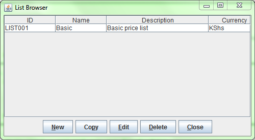

The functions available from this window (but similarly to other windows in *_Types_* menu) are:

* *[.underline]##N##ew*: to enter a new pricelist
* *Co[.underline]##p##y*: to create a new pricelist as a copy of another one
* *[.underline]##E##dit*: to edit an already existing pricelist
* *[.underline]##D##elete*: to delete an already existing pricelist
* *[.underline]##C##lose*: to close the window

By pressing the *Co[.underline]##p##y* button, the application will guide you step by step by asking:

[arabic]
. a *Name* of the new pricelist
. a *Multiplier* for all prices in the selected pricelist
. a *Rounding factor* for all prices in the new pricelist

Depending on the size of the selected pricelist, after some instants a confirmation message will inform you about the success of the operation:

image:extracted-media/media/image180.png[List Browser_copy.PNG,width=317,height=118]

By default, the new list is created with following information:

*ID*: “aCode”

*Name*: the name you provided in the step by step copying procedure

*Description*: “aDescription”

*Currency*: the same of the selected pricelist

Once the copy has been created you may want to change default information by editing the pricelist just created.

By pressing the *[.underline]##E##dit* button, the *_Edit list_* window will appear as shown below:

____
image:extracted-media/media/image181.png[image,width=224,height=204]
____

In editing mode, you can change all data related to the list.

The Lists defined in this functionality will be reflected in the Accounting module (see link:#8-2-1-insert-a-new-bill-new-bill[Insert a new bill] in this document).

=== 14.10 Supplier ([.underline]#Supplier#)

Once you’ve pressed on *S[.underline]##upplier##* button from the *_General Data_* menu you access the *_Supplier Browser_* window as showed below:

image:extracted-media/media/image182.png[Prices Browser.PNG,width=550,height=231]

The functions available from this window are:

* *[.underline]##N##ew*: to insert a new supplier
* *[.underline]##E##dit*: to edit an existing supplier
* *[.underline]##D##elete*: to delete a supplier
* *[.underline]##C##lose*: to close the window

The *_Supplier Browser_* window shows the list of all suppliers in the system.

In order to add a supplier, click the *[.underline]##N##ew* button to access the *_New supplier_* window as shown below

image:extracted-media/media/image183.png[new Supplier.PNG,width=423,height=434]

In order to insert a new Supplier, you must input the following data:

* *Name*: is the Supplier name (it is the only required field)
* *Address*: is the Supplier address
* *Tax Number ID*: is the Supplier tax number
* *Telephone*: is the Supplier phone number
* *Fax number*: is the Supplier fax number
* *Fax number*: is the Supplier fax number
* *E-mail*: is the Supplier email address
* *Note*: Additional note concerning the supplier
* *Deleted*: Check this checkbox to mark the Supplier as deleted.

Then click *[.underline]##O##K* to save the new Supplier.

In order to Edit Supplier information, in the *_Supplier browser_* highlights the Supplier and click the *[.underline]##E##dit* button to open the *_Edit Supplier_* window. Perform modifications and click *[.underline]##O##k* to save.

In order to delete a Supplier, in the *_Supplier browser_* highlights the Supplier and click the *D[.underline]##elete##* button to delete the selected Supplier.

=== 14.11 SMS Manager ([.underline]#SMS Manager#)

Once you’ve pressed on *SMS Manager* button from the *_General Data_* menu you access the *_SMS Manager_* window as showed below:

image:extracted-media/media/image184.png[Prices Browser.PNG,width=438,height=327]

The functions available from this window are:

* *N[.underline]##ew##*: to send a new SMS.
* *Delete*: to delete a SMS
* *[.underline]#Close#*: to close the window

You can also filter SMS list by period.

In order to send a new SMS, click the *[.underline]##N##ew* button to access the *_New SMS_* window.

image:extracted-media/media/image185.png[new Supplier.PNG,width=423,height=284]

In order to insert a new SMS, you must input the following data:

* *Scheduled Date*: use this field to plan sending a SMS in the future. Live the current date and time to send the SMS immediately.
* *Scheduled Time*: use this field to plan sending a SMS in the future. Live the current date and time to send the SMS immediately.
* *Number*: the recipient of the SMS. You can select a patient by clicking the button 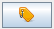. The phone number of the selected patient will be automatically inserted.
* *SMS*: type the SMS in the white space bellow

Then click *[.underline]##O##K* to save the new SMS. If the scheduled data and time is now, the SMS is immediately sent.

_*NB:* Sending SMS in OpenHospital require that the Gateway is well configured. You can use a GSM gateway or a WebApi Gateway. Ask your administrator how to do it or read the Administrator’s Guide._

In order to delete a SMS, highlights it and click the *[.underline]##D##elete* button to delete the SMS.

== 15 Users & Groups ([.underline]##F##ile -> _[.underline]##U##sers_)

The User Menu can be enabled or disabled by changing the _SINGLEUSER_ flag in the configuration file**.** Ask to your Administrator how to do it or read the _Administrator’s Guide_.

If _SINGLEUSER_ is set to NO the following login window will appear when the program starts:

image:extracted-media/media/image187.png[Login.PNG,width=305,height=148]

Once successfully logged in the system, you have been enabled by the administrator you will find the *_[.underline]##U##sers_* button in the *_File_* submenu.

Once you’ve pressed on *_[.underline]##U##sers_* button from the *_File_* submenu you access the *_Users_* submenu as showed below:

image:extracted-media/media/image188.png[Users & Groups.PNG,width=153,height=136]

OpenHospital allows the management of users organized into groups; each group is characterized by different permissions assigned by the Administrator.

Before to register a new user in the system, we should ensure there is a group with its related rights, where the user can be added to.

=== 15.1 Groups ([.underline]##G##roups)

Once you’ve pressed on *[.underline]##G##roups* button from the *_Users_* submenu you access the *_Groups Browser_* window as showed below:

image:extracted-media/media/image189.png[Groups Browser.PNG,width=642,height=180]

The functions available from this window are:

* *[.underline]##E##dit*: to edit an already existing group (only description can be changed)
* *[.underline]##N##ew*: to enter a new group
* *Group[.underline]##M##enu*: to define rights and permission on a selected group
* *[.underline]##D##elete*: to delete an already existing group
* *[.underline]##C##lose*: to close the window

By pressing the *Group[.underline]##M##enu* button, the *_Menu Item Browser_* window will appear as shown below:

____
image:extracted-media/media/image190.png[image,width=280,height=350]
____

The window shows the full set of function of OpenHospital in a tree format:

* main is the “trunk”: the main menu
* *Blue* nodes are the “branches”: menus and windows
* *Black* nodes are the “leaves”: buttons and functions

By double-clicking on each branch or leaves we can enable or disable that function or set of functions for the selected group.

For instance, the group “Registration Office” and the group “Cashiers” may have the following group permission configurations:

image:extracted-media/media/image191.png[../../Screen%20Shot%202019-07-26%20at%2016.07.17.png,width=641,height=708]

So, the Registration Office group can only use the Admission/Patient module to insert and edit patients, while the Cashiers group can only use the Accounting module in order to produce bills. Both can run HELP (this guide) and Communication module.

So, the “main menu” for each user registered in Registration Office group and for each one in Cashiers group will appears like following:

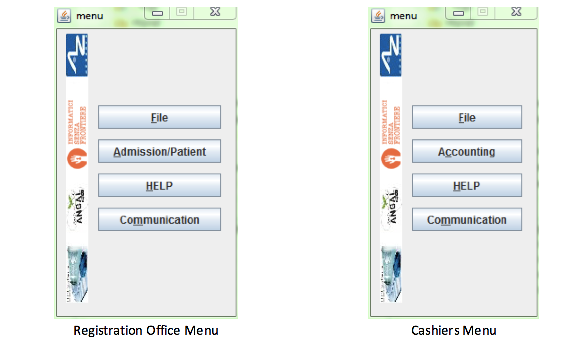

=== 15.2 Users ([.underline]##U##sers)

Once you’ve pressed on *[.underline]##U##sers* button from the *_Users_* submenu you access the *_Users Browser_* window as showed below:

image:extracted-media/media/image195.png[image,width=621,height=305]

The functions available from this window are:

* *Selected group*: you may filter the list by selecting only one Group
* *[.underline]##E##dit*: to edit an already existing user (the group must be unchanged)
* *[.underline]##N##ew*: to enter a new user (cannot be used an already used name)
* *[.underline]##D##elete*: to delete an already existing user
* *[.underline]##C##lose*: to close the window

By pressing the *[.underline]##E##dit* button, the *_Editing user record_* window will appear as shown below:

____
image:extracted-media/media/image198.png[image,width=305,height=309]
____

In editing mode, you cannot change the type (group) and the name but only the password, that is in visible in this window.

Each user is so identified by a name, a description and a *password* that can be modified in any moment by the Administrator.
